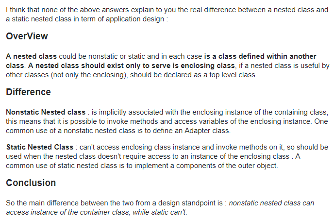

## 内部类 VS 静态内部类

### 静态内部类与内部类的使用区别：
	静态内部类仅作为外部类的一个组件，它不可以持有外部类的引用，也不能访问外部类的成员字段和方法。
	如果内部类需要持有外部类的引用，访问外部类的字段或方法，那就不能声明为静态的。

> A static nested class is just one which doesn't implicitly have a reference to an instance of the outer class.

https://stackoverflow.com/questions/70324/java-inner-class-and-static-nested-class#

