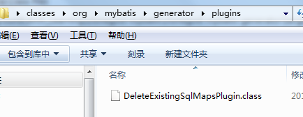
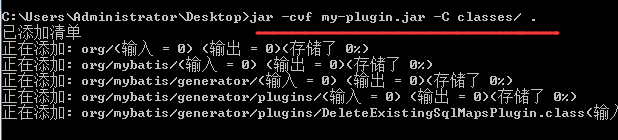

# jar命令生成jar包

示例：将org.mybatis.generator.plugins.DeleteExistingSqlMapsPlugin单独打包为一个jar文件。

1、将eclipse中生成的DeleteExistingSqlMapsPlugin.class的完整包路径复制到一个独立目录下。

比如在桌面新建一个classes目录。然后拷贝全路径类名对应的目录结构到这个classes目录下。

2、命令行进入classes目录。

3、使用 jar命令将指定目录下的文件打包。

	-c 创建新jar
	-f 要生成的目标文件名称
	-C 指定目录，这个目录下的所有文件和子目录都被打包（不包含当前所在目录）

