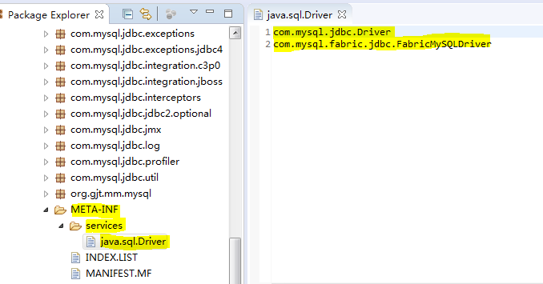

# Java SPI的约定

当服务的提供者，提供了服务接口的一种实现之后，在jar包的META-INF/services/目录里同时创建一个以服务接口命名的文件。

该文件里就是实现该服务接口的具体实现类。而当外部程序装配这个模块的时候，就能通过该jar包META-INF/services/里的配置文件找到具体的实现类名，并装载实例化，完成模块的注入。

基于这样一个约定就能很好的找到服务接口的实现类，而不需要再代码里指定，将接口与具体实现进行了解耦，可以灵活的使用各种不同的实现。

**jdk提供了一个工具类，可以方便的查找接口服务的实现类：java.util.ServiceLoader**

JDBC的驱动的MySQL实现类的配置，可以看到，对于Java.sql.Driver接口的实现类MySQL，配置了相应的实现类的类路径。

# java中是如何加载MySQL提供的Driver实现类的？
	public class Driver extends NonRegisteringDriver implements java.sql.Driver {
	    //
	    // Register ourselves with the DriverManager
	    //
	    static {
	        try {
	        		// 将com.mysql.jdbc.Driver注册到java.sql.DriverManager中！
	            java.sql.DriverManager.registerDriver(new Driver());
	        } catch (SQLException E) {
	            throw new RuntimeException("Can't register driver!");
	        }
	    }
	
	    /**
	     * Construct a new driver and register it with DriverManager
	     * 
	     * @throws SQLException
	     *             if a database error occurs.
	     */
	    public Driver() throws SQLException {
	        // Required for Class.forName().newInstance()
	    }
	}
