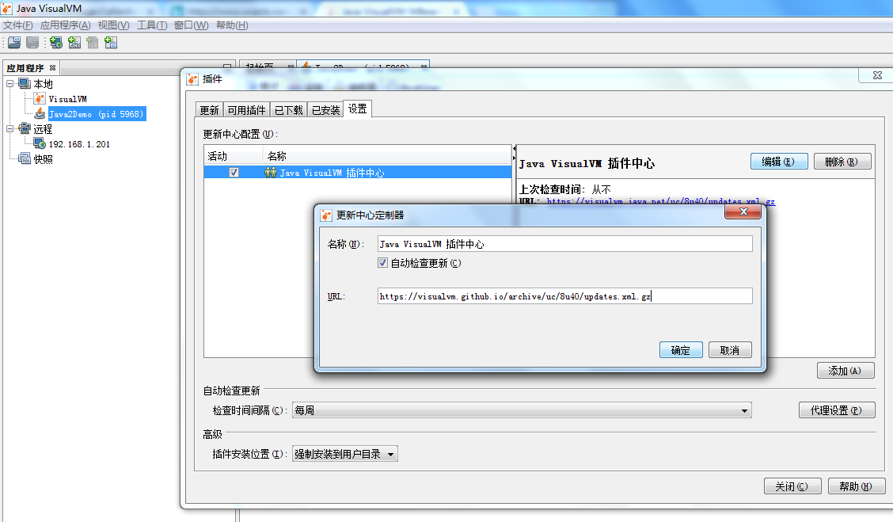
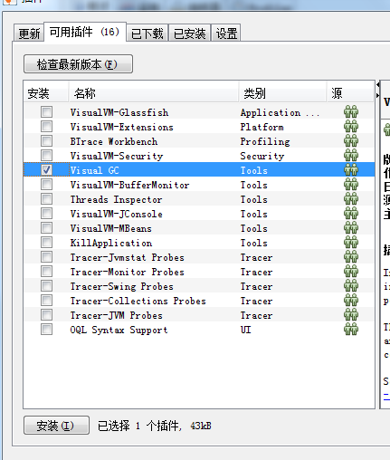

## 安装 Java VisualVM plugin - Visual GC

## 插件地址已失效
When accessing https://visualvm.java.net I get redirected to http://www.oracle.com/splash/java.net/maintenance/index.html which states that the page has been closed.

## [解决办法-更新插件地址]
It appears the visualvm site has moved to github.io, so the links are broken. 

I just updated mine to the correct one on found on [here](https://visualvm.github.io/pluginscenters.html)

In VisualVM go to Tools -> Plugins -> Settings, Edit Java VisualVM Plugins Center, and change the URL to the correct URL for your VisualVM, 

ex:
https://visualvm.github.io/archive/uc/8u40/updates.xml.gz
After this I was able to update & install plugins using the UI again.

