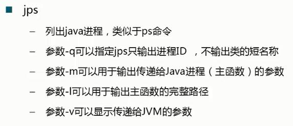
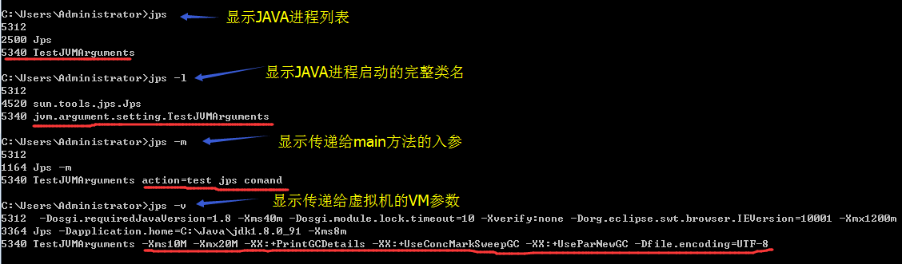

## jps -Java Virtual Machine Process Status Tool

JVM Process Status Tool - Lists instrumented HotSpot Java virtual machines on a target system.

[参考文档](https://docs.oracle.com/javase/8/docs/technotes/tools/unix/jps.html)

---

### 使用jps查看java进程的pid

