## jstat - 监视虚拟机运行时状态信息

JVM Statistics Monitoring Tool，是用于监视虚拟机运行时状态信息的命令，它可以显示出虚拟机进程中的类装载、内存、垃圾收集、JIT编译等运行数据。

[参考文档](https://docs.oracle.com/javase/8/docs/technotes/tools/unix/jstat.html)

JVM Statistics Monitoring Tool - Attaches to an instrumented HotSpot Java virtual machine and collects and logs performance statistics as specified by the command line options. 

#### Usage: jstat -help|-options

       jstat -<option> [-t] [-h<lines>] <vmid> [<interval> [<count>]]

#### 支持的option:
##### -statOption
Determines the statistics information the jstat command displays. The following lists the available options. 

Use the -options general option to display the list of options for a particular platform installation. See Stat Options and Output.

	class: 
		Displays statistics about the behavior of the class loader.
		类加载的行为统计。

	compiler: 
		Displays statistics about the behavior of the Java HotSpot VM Just-in-Time compiler.
		HotSpt JIT编译器行为统计。

	gc: 
		Displays statistics about the behavior of the garbage collected heap.
		显示堆内存的GC行为统计	

	gccapacity: 
		Displays statistics about the capacities of the generations and their corresponding spaces.
		显示JVM分代中各个代的内存情况

	gccause: 
		Displays a summary about garbage collection statistics (same as -gcutil), with the cause of the last and current (when applicable) garbage collection events.
		垃圾收集统计概述（同-gcutil），以及最近两次垃圾回收事件的原因。

	gcnew: 
		Displays statistics of the behavior of the new generation.
		显示新生代的gc统计信息

	gcnewcapacity: 
		Displays statistics about the sizes of the new generations and its corresponding spaces.
		显示新生代的内存大小和相关空间的统计信息

	gcold: 
		Displays statistics about the behavior of the old generation and metaspace statistics.
		显示老年代的gc行为和元数据区的行为统计

	gcoldcapacity: 
		Displays statistics about the sizes of the old generation.
		显示老年代的内存使用情况

	gcmetacapacity: 
		Displays statistics about the sizes of the metaspace.
		显示metaspace区的内存统计信息

	gcutil: 
		Displays a summary about garbage collection statistics.
		垃圾回收统计概述（百分比）。

	printcompilation: 
		Displays Java HotSpot VM compilation method statistics.
		显示Hot Spot对热点方法进行编译的统计信息

##### -t
Displays a timestamp column as the first column of output. The time stamp is the time since the start time of the target JVM.

----

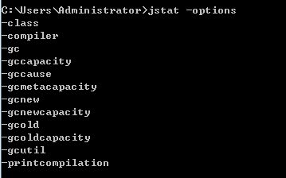
	
	// 测试 jstat 命令，配置JVM参数如下：
	// 堆内存最小20M，最大20M
	// 新生代10M(eden 8M，survivor0 1M, survivor 1M)
	// 老年代10M
	// -verbose:gc -Xms20m -Xmx20m -Xmn10m -XX:SurvivorRatio=8
 
	public class TestJVMCommand {
		
		public static void main(String[] args) throws Exception {
			while(true) {
				MakeGCBusy.start();
				Thread.sleep(100);
			}
		}
		
		private static class MakeGCBusy {	
			private static final Collection<Object> leak = new ArrayList<Object>();
			
			public static void start() {
				for (int i=0; i<100; i++) {
					try {
						Date date = new Date();
						leak.add(date);
						System.out.println(
								MessageFormat.format("{0,date,yyyy-MM-dd HH:mm:ss.SSS},{1}", date,
										Thread.currentThread().getName())
								);
					} catch (OutOfMemoryError e) {
						leak.clear();
					}
				}
			}
		}
	}

## jstat -class<pid> 	显示加载class的数量，占用内存等信息。

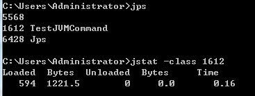

各列的含义

	Loaded		装载的类的数量
	Bytes		class字节大小
	Unloaded	卸载类的数量
	Bytes		卸载类的字节数
	Time		装载和卸载类所花费的时间

## -compiler <pid>  输出JIT编译过的方法数量耗时等
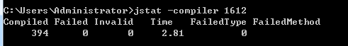

各列含义

	Compiled		编译任务执行数量
	Failed			失败数量
	Invalid			无效数量
	Time			编译耗时
	FailedType		编译失败任务的类型（最后一个）
	FailedMethod	编译失败任务所在的类及方法（最后一个）

## -gc <pid> 当前分配多少、已使用多少、GC次数

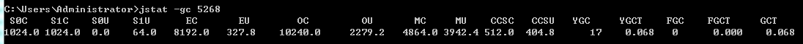

> ####C即Capacity 总容量，U即Used 已使用的容量

各列含义(单位：KB)
	
	S0C				survivor 0区当前分配的容量 1024 KB
	S1C				survivor 1区当前分配的容量 1024 KB
	S0U				survivor 0区已使用的容量 0 KB
	S1U				survivor 1区已使用的容量 64 KB
	EC				Eden区的当前分配容量 8192 KB 
	EU				Eden区已使用的容量 327.8 KB
	OC				Old区当前分配的容量 10240.0 KB
	OU				Old区已使用的容量 2279.2 KB
	MC				Metaspace(元数据区)当前分配的容量 4864.0 KB
	MU				Metaspace(元数据区)已使用空间 3942.4 KB
	CCSC			Code Cache 缓存区容量 4864.0 KB
	CCSU			Code Cache 缓存区当前已使用空间 404.8 KB
	YGC				新生代垃圾回收次数(从应用程序启动到采样时) YGC共17次
	YGCT			新生代垃圾回收时间(从应用程序启动到采样时) YGC共耗时0.068 s
	FGC				老年代垃圾回收次数(从应用程序启动到采样时) FGC共0次 
	FGCT			老年代垃圾回收时间(从应用程序启动到采样时) FGCT共耗时0 s
	GCT				垃圾回收总消耗时间(从应用程序启动到采样时) GC总耗时0.068 s

## -gcutil <pid>	（同-gc，按百分比统计）
查看垃圾收集的统计信息，每秒输出1次，共采样3次

	jstat -gcutil -t <jvm-pid> 1000 3

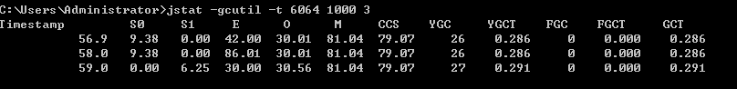

各列的含义(单位：百分比)

	S0		survivor0 已使用容量百分比 9.38%
	S1		survivor1 已使用容量百分比 0%
	E		Eden区已使用的占当前容量百分比 42%
	O		Old区已使用的占当前容量百分比 30.01%
	M		Metaspace区已使用的占当前容量百分比 81.04%
	CCS		Code Cache 已使用的占当前容量百分比 79.07%
	YGC		从应用程序启动到采样时年轻代中gc次数 YGC 26次
	YGCT	从应用程序启动到采样时年轻代中gc所用时间(s) YCT 耗时0.286s
	FGC		老年代垃圾回收次数(从应用程序启动到采样时) FGC共0次 
	FGCT	老年代垃圾回收时间(从应用程序启动到采样时) FGCT共耗时0 s
	GCT		垃圾回收总消耗时间(从应用程序启动到采样时) GC总耗时0.268 s

## -gccause <pid> 

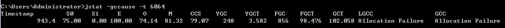

各列含义(单位：%)

	S0		S0 区当前使用百分比 75%
	S1		S1 区当前使用百分比 0%
	E		Eden 区当前使用百分比 100%
	O		Old 区当前使用百分比 74.14%
	M		Metaspace 区当前使用百分比 81.32%
	CCS		Code Cache 区当前使用百分比 79.07%
	LGCC	最近垃圾回收的原因 Allocation Failure(新生代Eden区内存空间耗尽)
	GCC		当前垃圾回收的原因(如果当前正在发生GC) Allocation Failure(新生代Eden区内存空间耗尽)

## -gccapacity <pid> 各区最小/最大分配容量、当前分配多少、已使用多少、GC次数
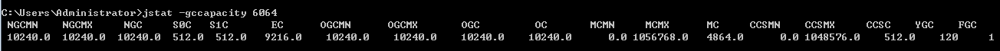

各列含义(单位：KB)

	NGCMN		新生代最小分配内存空间 10240.0 KB
	NGCMX		新生代最大分配内存 10240.0 KB
	NGC			新生代当前分配的内存空间 10240.0 KB
	S0C			survivor 0当前分配的内存大小 512.0 KB
	S1C			survivor 1当前分配的内存大小 512.0 KB
	EC			Eden区当前使用的容量 9216.0 KB
	OGCMN		老年代最小分配内存空间 10240.0 KB
	OGCMX		老年代最大分配内存空间 10240.0 KB
	OGC			老年代当前分配内存空间 10240.0 KB 
	OC			老年代当前使用内存空间 10240.0 KB 
	MCMN		Metaspace初始化(最小)的大小 0	KB
	MCMX		Metaspace的最大容量 1056768.0 KB = 1G 
	MC			Metaspace当前的容量 4864.0 KB
	CCSMN		Code Cache初始化(最小)的大小 0	KB
	CCSMX		Code Cache的最大容量 1056768.0 KB = 1G
	CCSC		Code Cache当前使用的容量 4864.0 KB 

## -gcnew <pid>  年轻代对象的信息
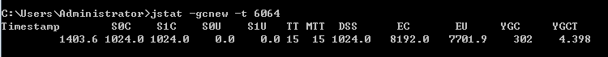

各列含义(单位: KB)

	S0C		S0 分配的内存大小 1024 KB
	S1C		S1 分配的内存大小 1024 KB
	S0U		S0 当前使用的内存大小 0 KB
	S1U		S1 当前使用的内存大小 0 KB
	TT		持有次数限制
	MTT		最大持有次数限制
	DSS 	?
	EC		Eden区分配的内存大小 8192 KB
	EU		Eden区当前使用的内存大小 7701.9 KB
	YGC		YGC发生次数 302次
	YGCT	YGC总耗时 4.398

## -gcnewcapacity<pid>: 年轻代对象的信息及其占用量
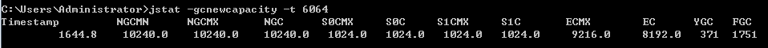

各列含义(单位: KB)
	
	NGCMN	年轻代初始大小 10240 KB
	NGCMX	年轻代最大容量 10240 KB
	NGC		年轻代当前使用的内存大小 10240 KB 
	S0CMX	survivor0 的最大容量 1024 KB
	S0C		survivor0 当前分配的容量 1024KB 
	S1CMX	survivor1 的最大容量 1024 KB
	S1C		survivor1 当前分配的容量 1024KB
	ECMX	Eden区的最大容量 9216 KB
	EC		Eden区当前分配的容量 8192 KB

## -gcold <pid>：old代对象的信息
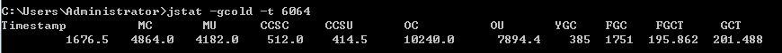

各列含义(单位：KB)
	
	MC		Metaspace 的容量 4864 KB
	MU		Metaspace 目前已使用空间 4864 KB
	CCSC	Code Cache 的容量 512 KB
	CCSU    Code Cache 的已使用内存大小 414.5 KB
	OC		Old区的容量 10240 KB
	OU		Old代目前已使用内存大小 7894.4 KB

## -gcoldcapacity <pid>: old代对象的信息及其占用量
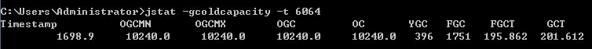

各列含义(单位：KB)

	OGCMN	Old区的最小容量 10240 KB
	OGCMX	Old区的最大容量 10240 KB
	OGC		Old区当前分配的容量 10240 KB
	OC		Old区当前使用的容量 10240 KB

## -gcmetacapacity<pid>: 元数据区的对象的信息及其占用量
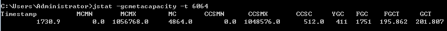

各列含义(单位：KB)

	MCMN	Metaspace初始化(最小)的大小 0 KB
	MCMX	Metaspace的最大容量 1056768 KB = 1G
	MC		Metaspace当前占用的内存大小 4864 KB
	CCSMN	Code Cache的初始容量 0 KB
	CCSMX	Code Cache的最大容量 1056768 KB = 1G
	CCSC	Code Cache当前的容量 512 KB

## -printcompilation <pid>：当前VM执行的信息
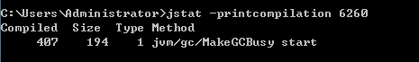

各列含义

	Compiled	被执行的编译任务的数量
	Size		方法字节码的字节数
	Type		编译类型
	Method		编译方法的类名和方法名。类名使用"/" 代替 "." 作为空间分隔符. 方法名是给出类的方法名. 

