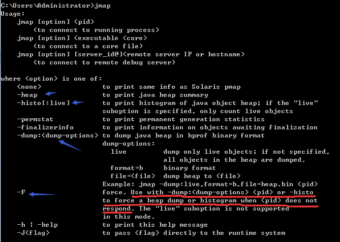
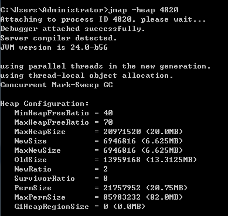
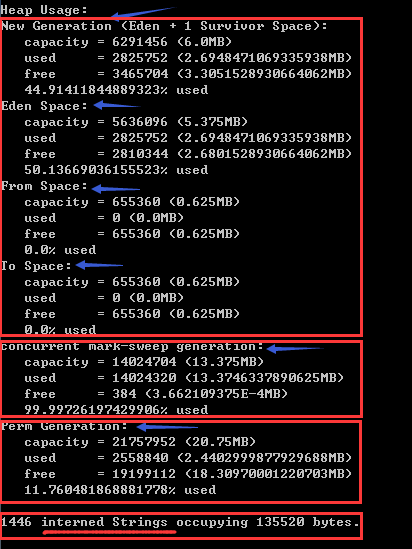
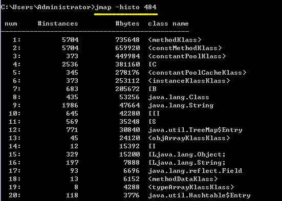
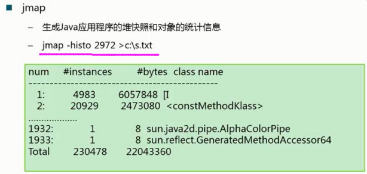
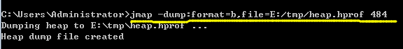
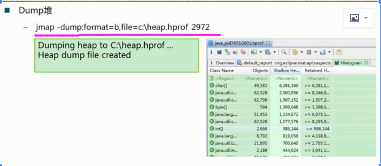
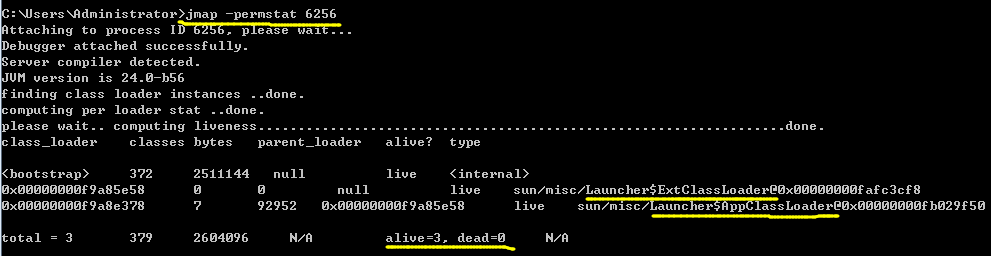

## jmap - 输出堆内存信息

Memory Map for Java - Prints shared object memory maps or heap memory details of a given process or core file or a remote debug server.

[参考文档](https://docs.oracle.com/javase/8/docs/technotes/tools/unix/jmap.html)

---
注意：执行jmap命令可能会导致正在运行的JVM产生停顿？！

## -heap 选项,打印堆内存的分配情况

新生代(Eden+From+To)、老年代（CMS）、永久区、字符串常量池

## -histo 选项，导出堆内存的直方图

## -dump 选项，指定导出格式、保存路径。

## -permstat 选项，打印永久区信息。

