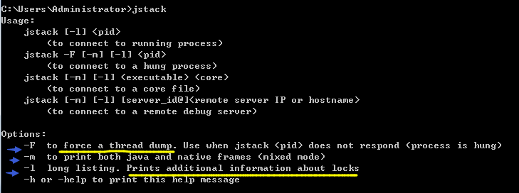
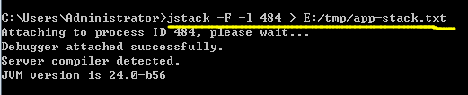
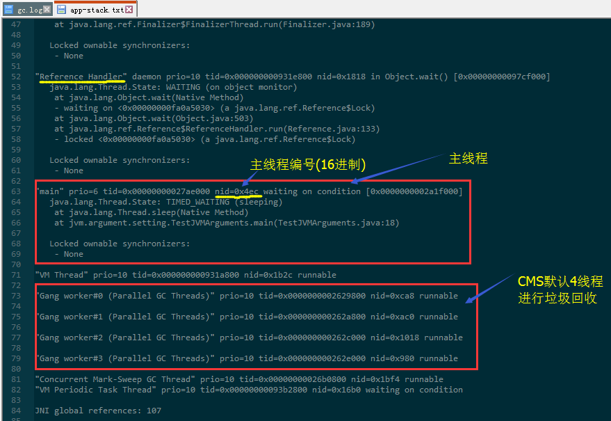
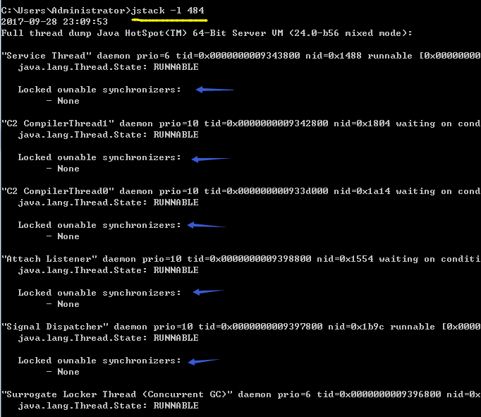
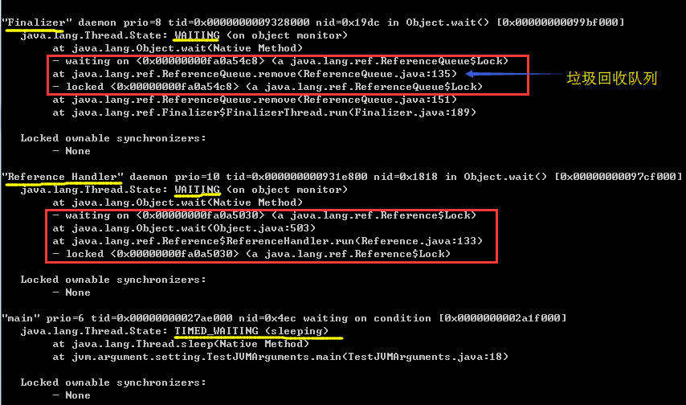
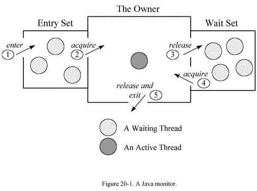

## jstack 输出线程堆栈信息

Stack Trace for Java - Prints a stack trace of threads for a given process or core file or remote debug server.

[参考文档](https://docs.oracle.com/javase/8/docs/technotes/tools/unix/jstack.html)

---

## 导出堆栈内容至文件保存

## -l选项，打印堆栈信息，并且列出"锁"相关的信息

----

## 堆栈线程分析思路

一般情况下，通过jstack输出的线程信息主要包括：jvm自身线程、用户线程等。
其中jvm线程会在jvm启动时就会存在。对于用户线程则是在用户访问时才会生成。

【jvm线程】
在线程中，有一些 JVM内部的后台线程，来执行譬如垃圾回收，或者低内存的检测等等任务，这些线程往往在JVM初始化的时候就存在，如下所示：

	"Attach Listener" daemon prio=10 tid=0x0000000052fb8000 nid=0xb8f waiting on condition [0x0000000000000000]
	java.lang.Thread.State: RUNNABLE
	
	Locked ownable synchronizers:
	- None
	destroyJavaVM" prio=10 tid=0x00002aaac1225800 nid=0x7208 waiting on condition [0x0000000000000000]
	java.lang.Thread.State: RUNNABLE
	
	Locked ownable synchronizers:
	- None

【用户级别的线程】
还有一类线程是用户级别的，它会根据用户请求的不同而发生变化。
该类线程的运行情况往往是我们所关注的重点。而且这一部分也是最容易产生死锁的地方。

	"qtp496432309-42" prio=10 tid=0x00002aaaba2a1800 nid=0x7580 waiting on condition [0x00000000425e9000]
	java.lang.Thread.State: TIMED_WAITING (parking)
	at sun.misc.Unsafe.park(Native Method)
	- parking to wait for <0x0000000788cfb020> (a java.util.concurrent.locks.AbstractQueuedSynchronizer$ConditionObject)
	at java.util.concurrent.locks.LockSupport.parkNanos(LockSupport.java:198)
	at java.util.concurrent.locks.AbstractQueuedSynchronizer$ConditionObject.awaitNanos(AbstractQueuedSynchronizer.java:2025)
	at org.eclipse.jetty.util.BlockingArrayQueue.poll(BlockingArrayQueue.java:320)
	at org.eclipse.jetty.util.thread.QueuedThreadPool$2.run(QueuedThreadPool.java:479)
	at java.lang.Thread.run(Thread.java:662)
	
	Locked ownable synchronizers:
	- None

从上述的代码示例中我们可以看到该用户线程的以下几类信息：

	Ø 线程的状态：waiting on condition(等待条件发生)
	Ø 线程的调用情况；
	Ø 线程对资源的锁定情况；

#### 线程的状态分析：
正如我们刚看到的那样，线程的状态是一个重要的指标，它会显示在线程每行结尾的地方。
那么线程常见的有哪些状态呢？线程在什么样的情况下会进入这种状态呢？我们能从中发现什么线索？

##### 》》》 Runnable

该状态表示线程具备所有运行条件，在运行队列中准备操作系统的调度，或者正在运行。 

##### 》》》Waiting condition 

该状态出现在线程等待某个条件的发生。具体是什么原因，可以结合stacktrace来分析。最常见的情况是线程在等待网络的读写，比如当网络数据没有准备好读时，线程处于这种等待状态，而一旦有数据准备好读之后，线程会重新激活，读取并处理数据。在 Java引入 NIO之前，对于每个网络连接，都有一个对应的线程来处理网络的读写操作，即使没有可读写的数据，线程仍然阻塞在读写操作上，这样有可能造成资源浪费，而且给操作系统的线程调度也带来压力。在 NIO里采用了新的机制，编写的服务器程序的性能和可扩展性都得到提高。 

如果发现有大量的线程都在处在 Wait on condition，从线程 stack看， 正等待网络读写，这可能是一个网络瓶颈的征兆。因为网络阻塞导致线程无法执行。一种情况是网络非常忙，几乎消耗了所有的带宽，仍然有大量数据等待网络读写；另一种情况也可能是网络空闲，但由于路由等问题，导致包无法正常的到达。所以要结合系统的一些性能观察工具来综合分析，比如 netstat统计单位时间的发送包的数目，如果很明显超过了所在网络带宽的限制 ; 观察 cpu的利用率，如果系统态的 CPU时间，相对于用户态的 CPU时间比例较高；

如果程序运行在 Solaris 10平台上，可以用 dtrace工具看系统调用的情况，如果观察到 read/write的系统调用的次数或者运行时间遥遥领先；这些都指向由于网络带宽所限导致的网络瓶颈。 

另外一种出现 Wait on condition的常见情况是该线程在 sleep，等待 sleep的时间到了时候，将被唤醒。 

##### 》》》Waiting for monitor entry 和 in Object.wait() 
在多线程的 JAVA程序中，实现线程之间的同步，就要说说Monitor。Monitor是Java中用以实现线程之间的互斥与协作的主要手段，它可以看成是对象或者 Class的锁。每一个对象都有，也仅有一个 monitor。下面这个图，描述了线程和 Monitor之间关系，以及线程的状态转换图： 

从图中可以看出，每个 Monitor在某个时刻，只能被一个线程拥有，该线程就是 “Active Thread”，而其它线程都是 “Waiting Thread”，分别在两个队列 “ Entry Set”和 “Wait Set”里面等候。
在 “Entry Set”中等待的线程状态是 “Waiting for monitorentry”，而在 “Wait Set”中等待的线程状态是“in Object.wait()”。

先看 “Entry Set”里面的线程。我们称被 synchronized保护起来的代码段为临界区。
当一个线程申请进入临界区时，它就进入了 “Entry Set”队列。
对应的 code就像： 

	synchronized(obj){ 
		...
	} 

这时有两种可能性： 

1、该 monitor不被其它线程拥有，Entry Set里面也没有其它等待线程。本线程即成为相应类或者对象的 Monitor的 Owner，执行临界区的代码 。此时线程将处于Runnable状态；

2、该 monitor被其它线程拥有，本线程在 Entry Set队列中等待。此时dump的信息显示“waiting for monitor entry”。线程正在外面等待监视器锁的释放。

#	
	"Thread-0" prio=10 tid=0x08222eb0 nid=0x9 waiting for monitor entry [0xf927b000..0xf927bdb8] 
	at testthread.WaitThread.run(WaitThread.java:39) 
	- waiting to lock <0xef63bf08> (a java.lang.Object) 
	- locked <0xef63beb8> (a java.util.ArrayList) 
	at java.lang.Thread.run(Thread.java:595)

临界区的设置，是为了保证其内部的代码执行的原子性和完整性。但是因为临界区在任何时间只允许线程串行通过，这和我们多线程的程序的初衷是相反的。如果在多线程的程序中，大量使用 synchronized，或者不适当的使用了它，会造成大量线程在临界区的入口等待，造成系统的性能大幅下降。如果在线程 DUMP中发现了这个情况，应该审查源码，改进程序。 

现在我们再来看现在线程为什么会进入 “Wait Set”。当线程获得了 Monitor，进入了临界区之后，如果发现线程继续运行的条件没有满足，它则调用对象（一般就是被 synchronized 的对象）的 wait() 方法，放弃了 Monitor，进入 “Wait Set”队列。只有当别的线程在该对象上调用了 notify() 或者 notifyAll() ， “ Wait Set”队列中线程才得到机会去竞争，但是只有一个线程获得对象的Monitor，恢复到运行态。在 “Wait Set”中的线程， DUMP中表现为： 
in Object.wait()，类似于： 

	"Thread-1" prio=10 tid=0x08223250 nid=0xa in Object.wait() [0xef47a000..0xef47aa38] 
	at java.lang.Object.wait(Native Method) 
	- waiting on <0xef63beb8> (a java.util.ArrayList) 
	at java.lang.Object.wait(Object.java:474) 
	at testthread.MyWaitThread.run(MyWaitThread.java:40) 
	- locked <0xef63beb8> (a java.util.ArrayList) 
	at java.lang.Thread.run(Thread.java:595)

仔细观察上面的 DUMP信息，你会发现它有以下两行： 

	² locked <0xef63beb8> (ajava.util.ArrayList) 
	² waiting on <0xef63beb8> (ajava.util.ArrayList) 

这里需要解释一下，为什么先 lock了这个对象，然后又 waiting on同一个对象呢？
让我们看看这个线程对应的代码：

	synchronized(obj){
		......... 
		obj.wait();
		......... 
	}  

线程的执行中，先用 synchronized 获得了这个对象的 Monitor（对应于 locked <0xef63beb8> ）。
当执行到 obj.wait(), 线程即放弃了 Monitor的所有权，进入 “wait set”队列（对应于 waiting on<0xef63beb8> ）。 

往往在你的程序中，会出现多个类似的线程，他们都有相似的 dump也可能是正常的。
比如，在程序中有多个服务线程，设计成从一个队列里面读取请求数据。这个队列就是 lock以及 waiting on的对象。当队列为空的时候，这些线程都会在这个队列上等待，直到队列有了数据，这些线程被notify，当然只有一个线程获得了 lock，继续执行，而其它线程继续等待。 