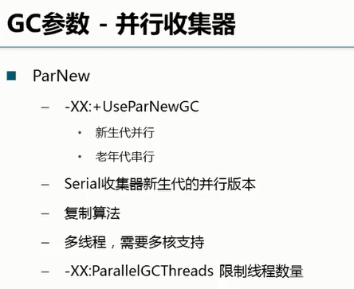
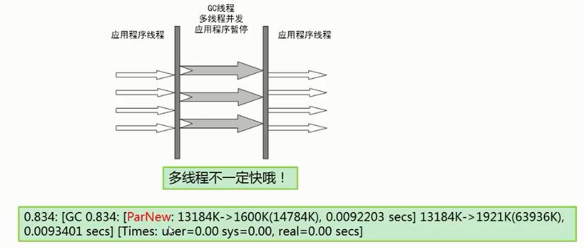

## ParNewGC 新生代并行收集器

ParNew收集器 ParNew收集器其实就是Serial收集器的多线程版本。

新生代并行，老年代串行；新生代复制算法、老年代标记-压缩

### 参数控制：

	-XX:+UseParNewGC ParNew收集器
	-XX:ParallelGCThreads 限制线程数量

对新生代使用多线程并行回收，该收集器（回收年轻代）是唯一能与CMS（回收老年代）并发收集器一起组合使用的。

	-XX:+UseParNewGC只针对新生代进行多线程垃圾回收。

	适合用于多核CPU环境下启用多线程进行垃圾回收。

	可以设置进行垃圾回收的线程数，注意线程数量不要超过CPU的核数。

