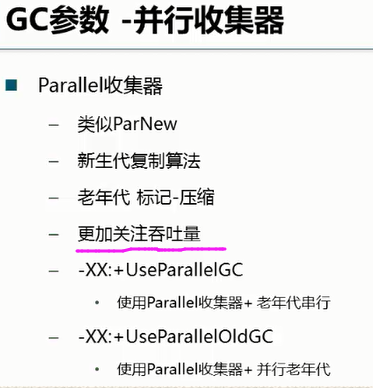
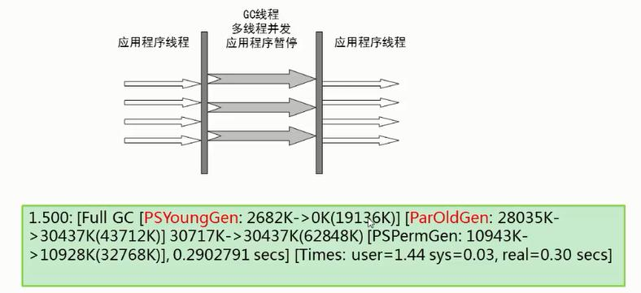
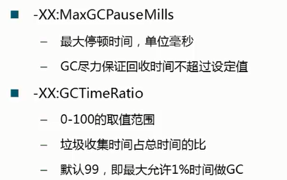

##  吞吐量回收器 UseParallelGC & UseParallelOldGC

Parallel Scavenge收集器类似ParNew收集器，Parallel收集器更关注系统的吞吐量。

可以通过参数来打开自适应调节策略，虚拟机会根据当前系统的运行情况收集性能监控信息，动态调整这些参数以提供最合适的停顿时间或最大的吞吐量；

也可以通过参数控制GC的时间不大于多少毫秒或者比例；

新生代复制算法、老年代标记-压缩

### 参数控制：
	-XX:+UseParallelGC 
	新生代使用并行回收收集器，老年代使用串行收集器

	-XX:+UseParallelOldGC 
	新生代、老年代都使用并行回收收集器。该选项会自动启用-XX:+UseParallelGC 。

#### 并行回收器可以设置2个额外参数：

--- 

## 吞吐量GC

The throughput goal is measured in terms of the time spent collecting garbage and the time spent outside of garbage collection (referred to as application time).
  
Throughput is the percentage of total time not spent in garbage collection, considered over long periods of time. (长期运行情况下，GC耗费时间的一个比例)

吞吐量，即计算得到的一个比例：

	在一段较长时间内，非GC的时间与JVM运行时间的比值。
	比值越大，则应用程序执行的时间越长，用于执行GC的时间就约少，这样吞吐量就越高。

## throughput （常见于ParallelGC + ParallelOldGC）：
	time of gc / (time of gc + time of application)

在一段时间内，CG所耗费的时间在总时间内的比例。

	比例越低，说明一段时间内执行GC的时间很少，其它时间都是应用程序在运行。
	每次GC的时间可能比较长，但是GC的次数比较少。

## low Latency（常见于CMS回收器）
	每次GC造成应用系统停顿的时间要短，以便能尽快响应客户端的请求，实现应用系统的低停顿。
	每次GC时应用停顿时间短，但是可能GC执行更频繁。
