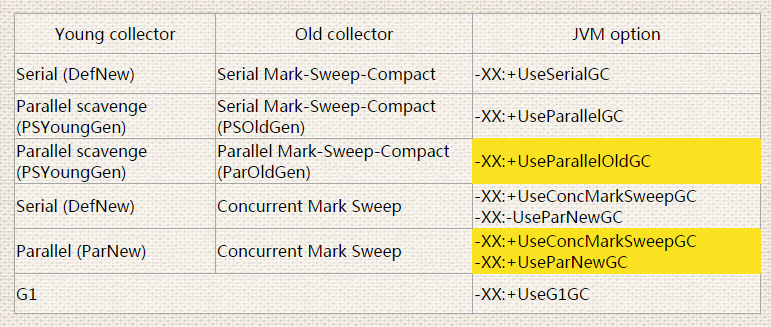
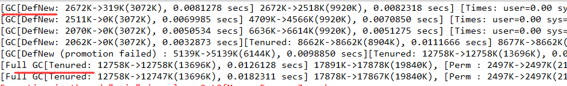
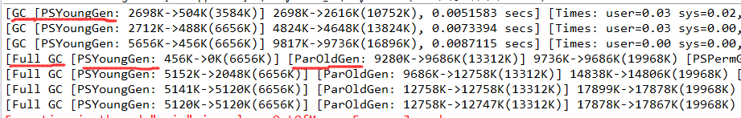
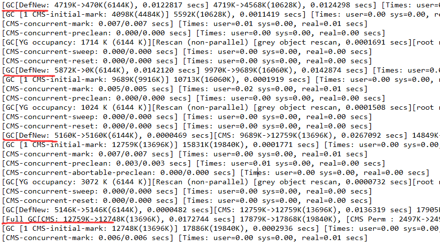
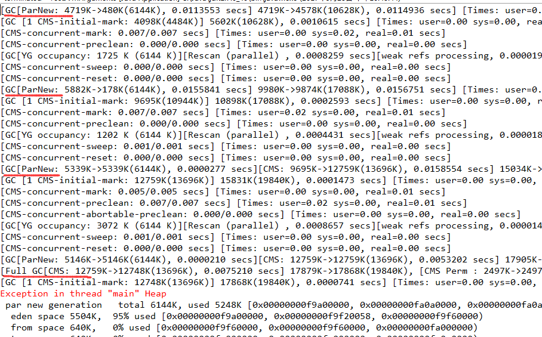
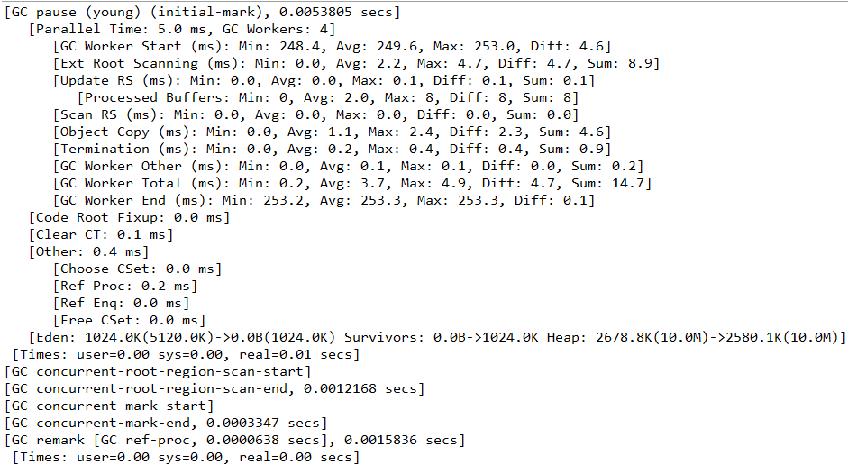

# Garbage Collection – Java Performance Tuning

JVM垃圾回收需要考虑的两个核心因素:

  	● JVM Pause – The time taken by the JVM to do the GC during which the JVM pauses。
          ■ JVM执行GC而导致应用程序停顿的时间。
  	● Throughput – The time interval between successive GC。
          ■ 两次GC之间的时间间隔---关注吞吐量。

Our goal as an application tuner is to minimize the JVM pause and maximize throughput.

## JVM调优的目标：最小化JVM暂停，最大化吞吐量。

## JVM provides four garbage collection.
	
	  ● The serial garbage collector 	串行回收器
	  ● The throughput collector 	并行/吞吐量回收器
	  ● The CMS collector  			CMS回收器
	  ● The G1 collector 			G1回收器

## 垃圾回收器的选择

Apply -XX:+UseParallelGC when you require parallel collection method over YOUNG generation ONLY, 
(but still) use serial-mark-sweep method as OLD generation collection。

	-XX:+UseParallelGC 
	新生代使用并行回收，老年代使用串行标记清除。

Apply -XX:+UseParallelOldGC when you require parallel collection method over YOUNGgeneration (automatically sets -XX:+UseParallelGC) AND OLD generation collection。

	-XX:+UseParallelOldGC 
	老年代和新生代都使用并行垃圾回收。该参数会自动设置-XX:+UseParallelGC。

Apply -XX:+UseParNewGC & -XX:+UseConcMarkSweepGC when you require parallel collection method over YOUNG generation AND require CMS method as your collection over OLD generation memory。

	-XX:+UseParNewGC & -XX:+UseConcMarkSweepGC 
	组合：老年代使用并发收集，新生代使用并行收集。

You can't apply -XX:+UseParallelGC or -XX:+UseParallelOldGC with -XX:+UseConcMarkSweepGC simultaneously, that's why your require -XX:+UseParNewGC to be paired with CMS otherwise use -XX:+UseSerialGC explicitly OR -XX:-UseParNewGC if you wish to use serial method against young generation。

当使用 -XX:+UseConcMarkSweepGC对老年代进行并发回收时，新生代的收集器只能使用-XX:+UseParNewGC，或者-XX:-UseParNewGC（回退到使用SerialGC）。

####### CMS结合不能与UseParallelGC或UseParallelOldGC结合使用，否则启动的时候会报错：
Conflicting collector combinations in option list; please refer to the release notes for the combinations allowed

---

# 垃圾回收器JVM参数配置

## Serial - 串行，单线程
	-d64 -Xms10M -Xmx20M -XX:+PrintGCDetails
	-XX:+UseSerialGC

## Parallel - 并行，高吞吐量
	-d64 -Xms10M -Xmx20M -XX:+PrintGCDetails
	-XX:+UseParallelOldGC

## CMS - 并发，低延迟
	-d64 -Xms10M -Xmx20M -XX:+PrintGCDetails
	-XX:+UseConcMarkSweepGC
	-XX:-UseParNewGC  # 关闭ParNewGC，则回退到SerialGC

	-d64 -Xms10M -Xmx20M -XX:+PrintGCDetails
	-XX:+UseConcMarkSweepGC
	-XX:+UseParNewGC

## G1 - 并发，低延迟，压缩，停顿时间可控
	-d64 -Xms10M -Xmx20M -XX:+PrintGCDetails 
	-XX:+UseG1GC 

