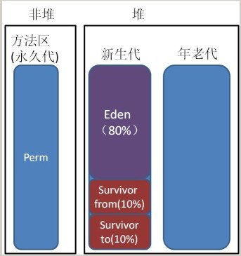
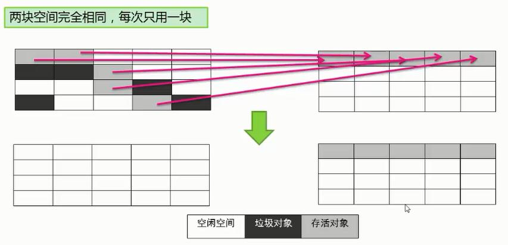
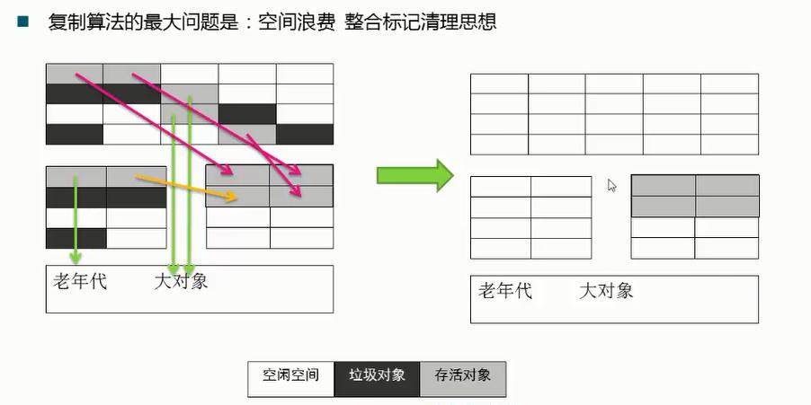
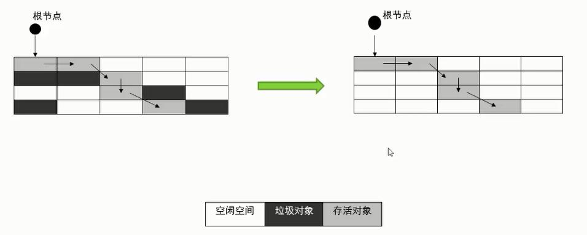
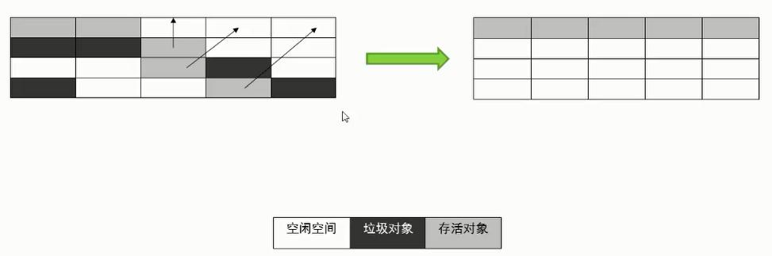
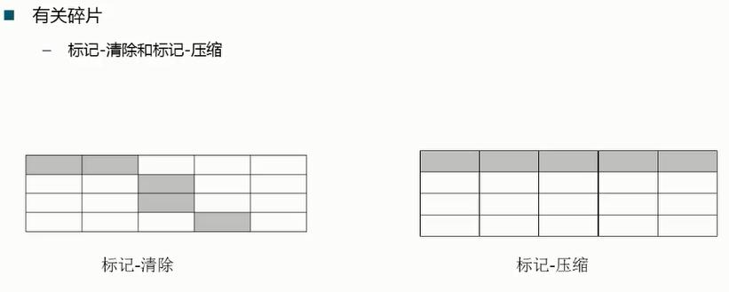

# 垃圾回收算法

如果说收集算法是内存回收的方法论，垃圾收集器就是内存回收的具体实现。

## 分代思想

分代收集算法并没有提出新的思想，只是根据对象存活周期的不同将内存划为几块。一般Java堆分为新生代和老年代，这样就可以根据各个年代的特点采用适当的收集算法。

依据对象存活周期进行分类，存活时间短的对象归为新生代，存活时间长的对象归为老年代。

根据不同代的特点，选取合适的垃圾收集算法：
	
	少量对象存活，适合采用复制算法。 新生代中Eden，Survivor(from/to)就是采用复制算法。

	大量对象存储，适合采用标记清理或标记压缩算法。 

根据内存中对象的存活周期不同，将内存划分为几块，java的虚拟机中一般把内存划分为新生代和年老代，当新创建对象时一般在新生代中分配内存空间，当新生代垃圾收集器回收几次之后仍然存活的对象会被移动到年老代内存中，当大对象在新生代中无法找到足够的连续内存时也直接在年老代中创建。

现在的Java虚拟机就联合使用了复制、标记-清除和标记-压缩算法，java虚拟机垃圾收集器关注的内存结构如下：

---
## GC 算法的总类

	1、 引用计数法
	2、 复制算法
	3、 标记清除法
	4、 标记压缩法

## 1、引用计数（未被java采用）

给对象中添加一个引用计数器，每当有一个地方引用它时，计数器值就加1；当引用失效时，计数器值就减1；任何时刻计数器都为0的对象就是不再被使用的，垃圾收集器将回收该对象使用的内存。
引用计数算法实现简单，效率很高，微软的COM技术、ActionScript、Python等都使用了引用计数算法进行内存管理，但是引用计数算法对于对象之间相互循环引用问题难以解决，因此java并没有使用引用计数算法。

## 2、复制算法	（年轻代使用-适合对少量对象进行复制）

将可用内存按容量分成大小相等的两块，每次只使用其中一块，当这块内存使用完了，就将还存活的对象复制到另一块内存上去，然后把使用过的内存空间一次清理掉。这样使得每次都是对其中一块内存进行回收，内存分配时不用考虑内存碎片等复杂情况，只需要移动堆顶指针，按顺序分配内存即可，实现简单，运行高效。

复制算法的缺点显而易见，可使用的内存降为原来一半。

survivor区中的s0和s1是两块大小完全相同的内存空间，用来暂存新生代gc后存活的对象。

在进行复制算法时，系统总会保留1块干净的空间用来存放复制后的对象，复制完成后，会清除原来的s0区。

然后，交换s0和s1的角色。

>>> 下图所示：

将eden区和s0区的存活对象复制到s1区。

注意：大对象将直接移动到老年代，因为大对象不适合放入survivor区（一是survivor区内存有限，二是大对象复制耗时）。

1次GC后，部分对象进入survivor区，部分对象直接进行老年代。

## 标记清除（老年代使用）
标记-清除算法：

最基础的垃圾收集算法，算法分为“标记”和“清除”两个阶段：首先标记出所有需要回收的对象，在标记完成之后统一回收掉所有被标记的对象。

标记-清除算法的缺点有两个：首先，效率问题，标记和清除效率都不高。其次，标记清除之后会产生大量的不连续的内存碎片，空间碎片太多会导致当程序需要为较大对象分配内存时无法找到足够的连续内存而不得不提前触发另一次垃圾收集动作。

一种可能的实现方式，首先通过CGRoots，标记所有从根节点开始的可达对象。因此，未被标记的对象就是未被引用的垃圾对象。然后在清理阶段，回收所有未标记的对象，完成垃圾回收。

## 4、标记压缩（老年代使用）
标记压缩算法适合存活对象多的场合。比如老年代就可以使用标记压缩。

标记压缩在标记清除的基础上进行了优化，和标记清除一样，首先从GCRoots开始标记所有的可达对象，
然后将存活的对象压缩到内存的一端，最后清理边界之外的所有对象。

标记-压缩算法在标记-清除算法基础上做了改进，标记阶段是相同的标记出所有需要回收的对象，在标记完成之后不是直接对可回收对象进行清理，而是让所有存活的对象都向一端移动，在移动过程中清理掉可回收的对象，这个过程叫做整理。

标记-整理算法相比标记-清除算法的优点是内存被整理以后不会产生大量不连续内存碎片问题。
复制算法在对象存活率高的情况下就要执行较多的复制操作，效率将会变低，而在对象存活率高的情况下使用标记-整理算法效率会大大提高。

将存活对象压缩到内存的连续区间存放，可以解决内存碎片的问题，可提高内存分配和使用的效率。

	注意：CMS无法使用标记压缩，因为用户线程与GC线程并发运行，不能移动对象的地址空间，否则应用程序将无法正常执行。

