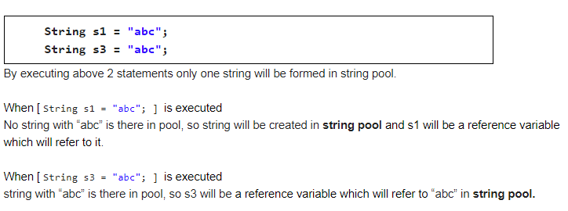
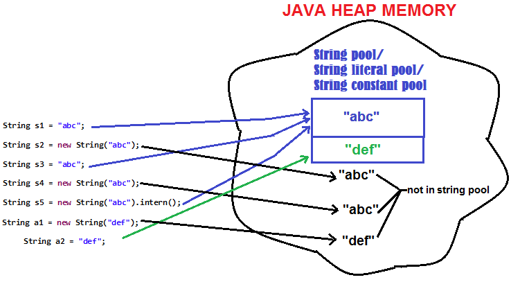
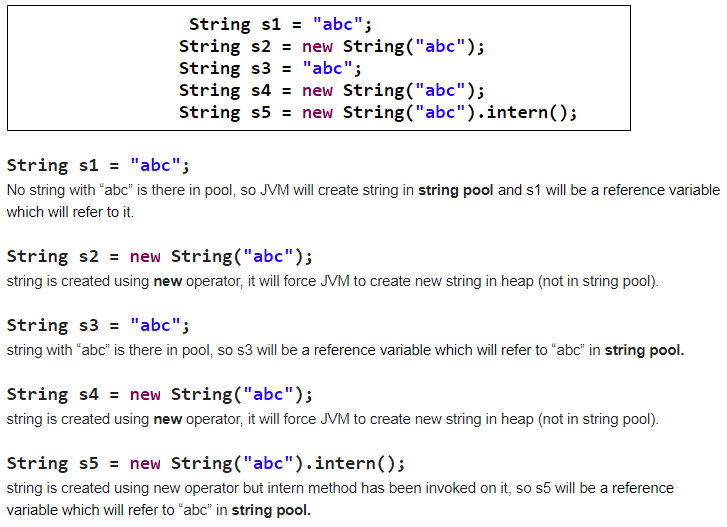

## String-String constant pool in java

### What is the String Pool in java? Advantages of string pool in java?
When a string is created without using new operator and if it already exists in the pool, then instead of creating new string the existing string from the pool is returned.

### Where does String Pool resides in memory?
From java 7 String pool is a storage area in java heap memory, where all the other objects are created. 

Prior to Java 7 String pool was created in permgen space of heap.   

> About String pool from JDK docs
	
	从JDK7开始，字符串常量池从Perm区移到堆区，这样Perm区就不容易发生溢出了。
	这样，会导致堆内存消耗更多。
	字符串在堆内存中以两种形式存在：
		1、 string.intern()生成的字符串，放到字符串常量池。
		2、 new　String() 生成的字符串，放到堆的新生代中。
	
	In JDK 7, interned strings are no longer allocated in the permanent generation of the Java heap, but are instead allocated in the main part of the Java heap (known as the young and old generations), along with the other objects created by the application. 
	
	This change will result in more data residing in the main Java heap, and less data in the permanent generation, and thus may require heap sizes to be adjusted. 

	Most applications will see only relatively small differences in heap usage due to this change, but larger applications that load many classes or make heavy use of the String.intern() method will see more significant differences.

### Diagram to demonstrate String pool in java

Let’s discuss step-by-step what will happen when below 5 statements will be executed >

---
### About intern method in java
Method is found in java.lang.String class
When the intern method is invoked, if the string pool already contains a string equal to this String object as determined by the equals(Object) method, then the string from the pool is returned. 

Otherwise, this String object is added to the string pool and a reference to this String object is returned.

Example in java -

	String s1 = "abc";    
	"abc" is created in string pool i.e. String object is added to the string pool.

#
	String s5 = new String("abc").intern();   
What happens internally When above statement is executed ?   

When the intern method is invoked, if the string pool already contains a string equal to this String object will be determined by the equals(Object) method.

As “abc” already exists in string pool (Because of  String s1 = "abc").
So, "abc".equals("abc") will return true and s5 will be a reference variable which will refer to "abc" in string pool.

So, s1 == s5 will always return true.

---

### Why String pool in java?
Strings are widely used in java code. 

字符串使用非常频繁，因此借助字符串常量池来提供缓存功能，可提高程序性能。

And they are immutable which allows them to be cached in memory to save memory and increase performance. 

Less number of strings are created in java heap and hence leaving less work for garbage collector to be done.

## How many String will be formed in following operation in java？
	String str = "abc" ; 
	str = str + "def";

SOLUTION >

	String str = "abc" ; 
	JVM will create one string string pool. (FIRST STRING IN POOL)

Now, here comes the tricky part> 

	str = str + "def";
	Internally + operator uses StringBuffer for concatenating strings.
	
	Internally, 
	String str = new StringBuilder(str).append("def").toString(); ["def" will be SECOND STRING IN POOL]
	
	Now, 
	str="abcdef" [ "abcdef" will be THIRD STRING IN POOL]