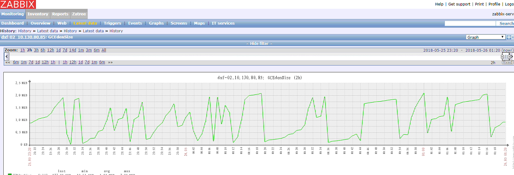

# 生产环境实践 - 高并发导致Old区内存无法被GC有效回收的现象

## 场景：
系统在高并发请求下，老年代内存耗尽（GC无法正常回收内存），导致系统功能受到影响，成功率严重下降。

## 现象 --- GC频繁，CPU利用率很高
	新生代Eden区：GC频繁，内存回收正常，到达峰值（2G）后可快速降下来。
	老年代Old区：GC效果差，内存占用一直处于峰值（2G），无明显回落，GC几乎没有什么效果。此时应该在进行频繁GC，而且应用程序的线程处于STW状态。
	CPU：Old区内存处于峰值的时候，cpu使用率急速上升，达到80%多（空闲时只有10%几）。

## 影响因素：
	1、并发量大，超过系统的处理能力；
	2、未做限流控制；
	3、系统产生很多大对象，这些对象的生命周期都比较长；
	3、第三方网站响应速度慢，导致请求无法快速返回，线程所执行的任务不能尽快结束，大量对象存活在内存中；

## 可能的措施：
	1、对每台服务器进行限流
	2、增加服务器，分摊负载
	3、优化程序，尽量不要产生太多生命周期长，而且占用内存大的对象（尽量不适用Page对象执行javascript）

---

>>> ZABBIX监控

#### Eden区内存回收（正常）：
新生代Eden区，内存使用达到2G时，触发MinorGC，能正常回收内存

#### Old区内存回收（不正常）：
老年代Old区，内存使用达到2G时，触发MajorGC，在一段较长时间内不能快速回收内存。

问题原因：
客户端并发请求量很高，峰值达到70个左右，而且程序运行过程中产生很多大对象，这些对象的生命周期都比较长，最终导致Old区的对象无法快速的被回收掉。但是，为什么没有抛出OutOfMemoryError呢？

