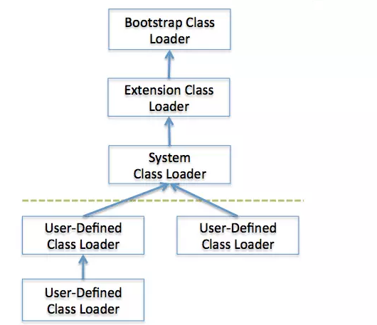
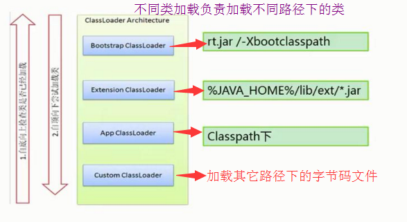
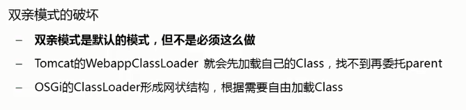
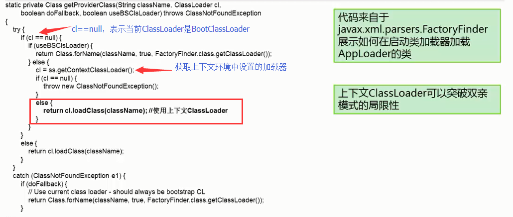

## 双亲委派模式

从JDK1.2开始，java虚拟机规范推荐开发者使用双亲委派模式(ParentsDelegation Model)进行类加载，其加载过程如下：

	(1).如果一个类加载器收到了类加载请求，它首先不会自己去尝试加载这个类，而是把类加载请求委派给父类加载器去完成。
	(2).每一层的类加载器都把类加载请求委派给父类加载器，直到所有的类加载请求都应该传递给顶层的启动类加载器。
	(3).如果顶层的启动类加载器无法完成加载请求，子类加载器尝试去加载，如果连最初发起类加载请求的类加载器也无法完成加载请求时，将会抛出ClassNotFoundException，而不再调用其子类加载器去进行类加载。

双亲委派 模式的类加载机制的优点是java类它的类加载器一起具备了一种带优先级的层次关系，越是基础的类，越是被上层的类加载器进行加载，保证了java程序的稳定运行。

## 双亲委派模型（Parent Delegation Model）？
解析：类的加载过程采用双亲委派机制，这种机制能更好的保证 Java 平台的安全性

答：类加载器 ClassLoader 是具有层次结构的，也就是父子关系，其中，Bootstrap 是所有类加载器的父亲，如下图所示：

该模型要求除了顶层的 Bootstrap class loader 启动类加载器外，其余的类加载器都应当有自己的父类加载器。

子类加载器和父类加载器不是以继承（Inheritance）的关系来实现，而是通过组合（Composition）关系来复用父加载器的代码。

每个类加载器都有自己的命名空间（由该加载器及所有父类加载器所加载的类组成，在同一个命名空间中，不会出现类的完整名字（包括类的包名）相同的两个类；在不同的命名空间中，有可能会出现类的完整名字（包括类的包名）相同的两个类）

##### 面试官：双亲委派模型的工作过程？

答：

1.当前 ClassLoader 首先从自己已经加载的类中查询是否此类已经加载，如果已经加载则直接返回原来已经加载的类。
每个类加载器都有自己的加载缓存，当一个类被加载了以后就会放入缓存，
等下次加载的时候就可以直接返回了。

2.当前 ClassLoader 的缓存中没有找到被加载的类的时候，委托父类加载器去加载，父类加载器采用同样的策略，首先查看自己的缓存，然后委托父类的父类去加载，一直到 bootstrap ClassLoader.
当所有的父类加载器都没有加载的时候，再由当前的类加载器加载，并将其放入它自己的缓存中，以便下次有加载请求的时候直接返回。

##### 面试官：为什么这样设计呢？

解析：这是对于使用这种模型来组织类加载器的好处？

答：主要是为了安全性，避免用户自己编写的类动态替换 Java 的一些核心类，比如 String，同时也避免了重复加载，因为 JVM 中区分不同类，不仅仅是根据类名，相同的 class 文件被不同的 ClassLoader 加载就是不同的两个类，如果相互转型的话会抛java.lang.ClassCaseException.

---

## 反“双亲模式”
类加载器双亲委派模型是从JDK1.2以后引入的，并且只是一种推荐的模型，不是强制要求的。

不遵循双亲委派模型的特例：

##### loadClass() VS findClass()
(1).在JDK1.2之前，自定义类加载器都要覆盖loadClass方法去实现加载类的功能，JDK1.2引入双亲委派模型之后，loadClass方法用于委派父类加载器进行类加载，只有父类加载器无法完成类加载请求时才调用自己的findClass方法进行类加载，因此在JDK1.2之前的类加载的loadClass方法没有遵循双亲委派模型，因此在JDK1.2之后，自定义类加载器不推荐覆盖loadClass方法，而只需要覆盖findClass方法即可。

##### SPI - Service Provider Interfaces
(2).双亲委派模式很好地解决了各个类加载器的基础类统一问题，越基础的类由越上层的类加载器进行加载，但是这个基础类统一有一个不足，当基础类想要调用回下层的用户代码时无法委派子类加载器进行类加载。为了解决这个问题JDK引入了ThreadContext线程上下文，通过线程上下文的setContextClassLoader方法可以设置线程上下文类加载器。
JavaEE只是一个规范，sun公司只给出了接口规范，具体的实现由各个厂商进行实现，因此JNDI，JDBC,JAXB等这些第三方的实现库就可以被JDK的类库所调用。线程上下文类加载器也没有遵循双亲委派模型。

##### 热替换/OSGi技术
(3).近年来的热码替换，模块热部署等应用要求不用重启java虚拟机就可以实现代码模块的即插即用，催生了OSGi技术，在OSGi中类加载器体系被发展为网状结构。OSGi也没有完全遵循双亲委派模型。

---
#### 双亲模式下引入ContextClassLoader，解决“上层无法加载下层ClassLoadr中的类"的问题

