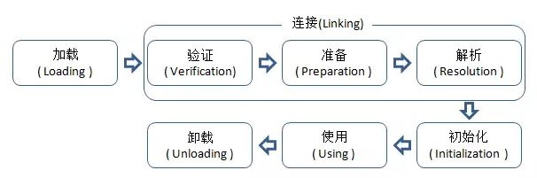

##  类加载器是有了解吗？

解析：底层原理的考察，其中涉及到类加载器的概念，功能以及一些底层的实现。

答：顾名思义，类加载器（class loader）用来加载 Java 类到 Java 虚拟机中。一般来说，Java 虚拟机使用 Java 类的方式如下：Java 源程序（.java 文件）在经过 Java 编译器编译之后就被转换成 Java 字节代码（.class 文件）。

类加载器负责读取 Java 字节代码，并转换成 java.lang.Class类的一个实例。每个这样的实例用来表示一个 Java 类。通过此实例的 newInstance()方法就可以创建出该类的一个对象。实际的情况可能更加复杂，比如 Java 字节代码可能是通过工具动态生成的，也可能是通过网络下载的。

#### 面试官：Java 虚拟机是如何判定两个 Java 类是相同的？

》》》答：

Java 虚拟机不仅要看类的全名是否相同，还要看加载此类的类加载器是否一样。只有两者都相同的情况，才认为两个类是相同的。即便是同样的字节代码，被不同的类加载器加载之后所得到的类，也是不同的。

比如一个 Java 类 com.example.Sample，编译之后生成了字节代码文件 Sample.class。两个不同的类加载器 ClassLoaderA和 ClassLoaderB分别读取了这个 Sample.class文件，并定义出两个 java.lang.Class类的实例来表示这个类。这两个实例是不相同的。对于 Java 虚拟机来说，它们是不同的类。试图对这两个类的对象进行相互赋值，会抛出运行时异常 ClassCastException。

---
## 类加载的重要性

C/C++等纯编译语言从源码到最终执行一般要经历：

	编译、连接和运行三个阶段，连接是在编译期间完成

而java在编译期间仅仅是将源码编译为Java虚拟机可以识别的字节码Class类文件，Java虚拟机对中Class类文件的加载、连接都在运行时执行。

虽然类加载和连接会占用程序的执行时间增加性能开销，但是却可以为java语言带来高度灵活性和扩展性。

	java的针对接口编程和类加载器机制实现的OSGi以及热部署等就是利用了运行时类加载和连接的特性。

---

## 类加载器是如何加载 class 文件的？

答：下图所示是 ClassLoader 加载一个 class 文件到 JVM 时需要经过的步骤：

##### 第1个阶段 - 加载
找到 .class 文件并把这个文件包含的字节码加载到内存中

##### 第2个阶段 - 链接 
第二阶段又可以分为三个步骤，分别是字节码验证、Class 类数据结构分析及相应的内存分配和最后的符号表的链接

##### 第3个阶段 - 初始化
第三个阶段是类中静态属性和初始化赋值，以及静态块的执行等

----
## 面试官：能详细讲讲各个阶段所做的事吗？

#### 1、加载
查找并加载类的二进制数据加载时类加载过程的第一个阶段，在加载阶段，虚拟机需要完成以下三件事情：

	1、通过一个类的全限定名来获取其定义的二进制字节流。
	2、将这个字节流所代表的静态存储结构转化为方法区的运行时数据结构。
	3、在Java堆中生成一个代表这个类的java.lang.Class对象，作为对方法区中这些数据的访问入口。

注意，这里第1条中的二进制字节流并不只是单纯地从Class文件中获取，比如它还可以从Jar包中获取、从网络中获取（最典型的应用便是Applet）、由其他文件生成（JSP应用）等。

相对于类加载的其他阶段而言，加载阶段（准确地说，是加载阶段获取类的二进制字节流的动作）是可控性最强的阶段，因为开发人员既可以使用系统提供的类加载器来完成加载，也可以自定义自己的类加载器来完成加载。

加载阶段完成后，虚拟机外部的 二进制字节流就按照虚拟机所需的格式存储在方法区之中，而且在Java堆中也创建一个java.lang.Class类的对象，这样便可以通过该对象访问方法区中的这些数据。

#### 2、连接

####### 2.1 验证：确保被加载的类的正确性、安全性

验证是连接阶段的第一步，这一阶段的目的是为了确保Class文件的字节流中包含的信息符合当前虚拟机的要求，并且不会危害虚拟机自身的安全。

验证是连接阶段的第一步，其目的是为了确保Class文件的字节流中包含的信息符合当前虚拟机的要求，并且不会危害虚拟机的安全，如果验证失败，会抛出java.lang.VerifyError异常。
验证阶段的主要工作有：

	a.文件格式验证：验证Class文件魔数、主次版本、常量池、类文件本身等等。

	b.元数据验证：主要是对字节码描述的信息进行语义分析，包括是否有父类、是否是抽象类、是否是接口、是否继承了不允许被继承的类(final类)、是否实现了父类或者接口的方法等等。

	c.字节码验证：是整个验证过程中最复杂的，主要进行数据流和控制流分析，如保证跳转指令不会跳转到方法体之外的字节码指令、数据类型转换安全有效等。

	d.符号引用验证：发生在虚拟机将符号引用转化为直接引用的时候(连接第三阶段-解析阶段进行符号引用转换为直接引用)，符号引用验证的目的是确保解析动作能正常执行，如果无法通过符号引用验证，则会抛出java.lang.NoSuchFieldError、java.lang.NoSuchMethodError等。

验证阶段对于虚拟机来说非常重要，但是不是一个必需的阶段，如果所运行的代码已经反复被使用和验证过了，可以通过`-Xverify:none`参数关闭大部分的验证措施，以加快虚拟机启动时间。

####### 2.2 准备：对类变量（静态变量）分配内存，并初始化默认值
准备阶段是正式为类变量(静态变量，注意不是实例变量)分配内存并设置类变量初始值的阶段，这些内存都将在方法区中进行分配。

对于普通非final的类变量，如public static int value = 123;在准备阶段过后的初始值是0(数据类型的零值)，而不是123，而把123赋值给value是在初始化阶段才进行的动作。

对于final的类变量，即常量，如public staticfinal int value =123;在准备阶段过程的初始值直接就是123了，不需要准备为零值。

对于该阶段有以下几点需要注意：

	● 这时候进行内存分配的仅包括类变量（static），而不包括实例变量，实例变量会在对象实例化时随着对象一块分配在Java堆中。
	● 这里所设置的初始值通常情况下是数据类型默认的零值（如0、0L、null、false等），而不是被在Java代码中被显式地赋予的值。

假设一个类变量的定义为： public static int value = 3;

那么变量value在准备阶段过后的初始值为 0，而不是 3，因为这时候尚未开始执行任何 Java 方法，而把 value 赋值为 3 的public static指令是在程序编译后，存放于类构造器 <clinit>（）方法之中的，所以把value赋值为3的动作将在初始化阶段才会执行。

###### 2.3 解析：将符号引用转换为直接引用(静态常量的处理)

解析阶段是虚拟机将常量池内的符号引用替换为直接引用的过程。

>符号引用: 就是一组符号来描述目标，可以是任何字面量。

>直接引用: 就是直接指向目标的指针、相对偏移量或一个间接定位到目标的句柄。

#### 3.初始化，执行<clinit>() - classinit

初始化是类使用前的最后一个阶段，在初始化阶段java虚拟机真正开始执行类中定义的java程序代码。

Java虚拟机规范严格规定了有且只有以下四种情况必须立即对类进行初始化：
	
	a.当虚拟机启动时，用户需要指定一个要执行的主类(包含main()方法的类)，虚拟机会先初始化这个类。
	b.遇到new、获取静态变量(final常量除外)、为静态变量赋值以及调用静态方法时，如果类没有进行过初始化，则需要先触发其初始化。
	c.使用java.lang.reflect包的方法对类进行反射调用的时候(Class.forName(…))，如果类还没有初始化，需要先触发对其的初始化。
	d.当初始化一个类的时候，如果发现其父类还没有初始化，则需要先触发对其父类的初始化。
	
初始化，为类的静态变量赋予正确的初始值，JVM负责对类进行初始化，主要对类变量进行初始化。在Java中对类变量进行初始值设定有两种方式：

初始化是类加载过程的最后一步，到了此阶段，才真正开始执行类中定义的Java程序代码。

在准备阶段，类变量已经被赋过一次系统要求的初始值，而初始化阶段是执行类构造器<clinit>()方法的过程。

这里简单说明下< clinit >（）方法的执行规则:

    1、<clinit>（）方法是由编译器自动收集类中的所有类变量的赋值动作和静态语句块中的语句合并产生的，编译器收集的顺序是由语句在源文件中出现的顺序所决定的，静态语句块中只能访问到定义在静态语句块之前的变量，定义在它之后的变量，在前面的静态语句中可以赋值，但是不能访问。

    2、<clinit>（）方法与实例构造器<init>（）方法（类的构造函数）不同，它不需要显式地调用父类构造器，虚拟机会保证在子类的<clinit>（）方法执行之前，父类的<clinit>（）方法已经执行完毕。因此，在虚拟机中第一个被执行的<clinit>（）方法的类肯定是java.lang.Object。

    3、<clinit>（）方法对于类或接口来说并不是必须的，如果一个类中没有静态语句块，也没有对类变量的赋值操作，那么编译器可以不为这个类生成<clinit>（）方法。

    4、接口中不能使用静态语句块，但仍然有类变量（final static）初始化的赋值操作，因此接口与类一样会生成<clinit>（）方法。

    5、虚拟机会保证一个类的<clinit>（）方法在多线程环境中被正确地加锁和同步，如果多个线程同时去初始化一个类，那么只会有一个线程去执行这个类的<clinit>（）方法，其他线程都需要阻塞等待，直到活动线程执行<clinit>（）方法完毕。如果在一个类的<clinit>（）方法中有耗时很长的操作，那就可能造成多个线程阻塞，在实际应用中这种阻塞往往是很隐蔽的。

#### 4、使用

当初始化完成之后，java虚拟机就可以执行Class的业务逻辑指令，通过堆中java.lang.Class对象的入口地址，调用方法区的方法逻辑。

#### 5、卸载，结束生命周期
当对象不再被使用时，java虚拟机的垃圾收集器将会回收堆中的对象，方法区中不再被使用的Class也要被卸载，否则方法区(Sun HotSpot永久代)会内存溢出。

Java虚拟机规定只有当加载该类型的类加载器实例为unreachable状态时，当前被加载的类型才被卸载.

启动类加载器实例永远为reachable状态，由启动类加载器加载的类型可能永远不会被卸载，

类型卸载仅仅是作为一种减少内存使用的性能优化措施存在的，具体和虚拟机实现有关，对开发者来说是透明的.

在如下几种情况下，Java虚拟机将结束生命周期

	● 执行了 System.exit()方法
	● 程序正常执行结束
	● 程序在执行过程中遇到了异常或错误而异常终止
	● 由于操作系统出现错误而导致Java虚拟机进程终止

