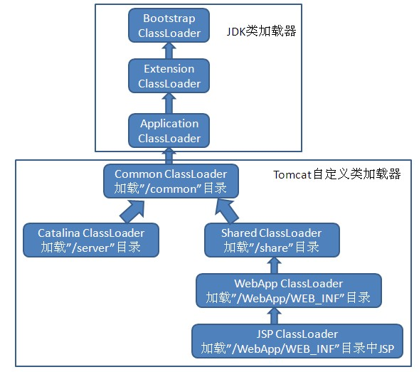
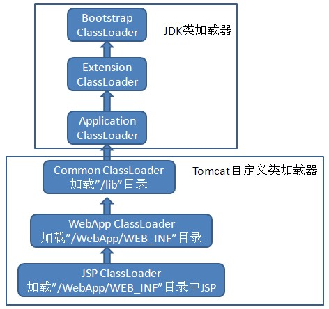

## Tomcat类加载器体系结构

Tomcat 等主流Web服务器为了实现下面的基本功能，都实现了不止一个自定义的类加载器：
	
	(1)部署在同一个服务器上的两个web应用程序所使用的java类库可以相互隔离。
	(2)部署在同一个服务器上的两个web应用程序所使用的java类库可以相互共享。
	(3)许多Web服务器本身使用java语言实现，因此服务器所使用的类库应与应用程序的类库相互独立。
	(4)支持JSP应用的Web服务器，需要支持HotSwap功能，因为JSP文件最终是被编译为java的servlet来运行的，当修改JSP文件时，不需要重启服务器就可以实现热部署。

Tomcat作为JDK推荐的双亲委派模式正统类加载器实现的代表，Tomcat5和Tomcat6类加载体系结构有较大区别：

#### Tomcat5：
	Tomcat5中可以存放java类库以及Web应用的目录如下：
	(1)./common目录：类库可以被Tomcat服务器本身和所有的Web应用程序共同使用。
	(2)./server目录：类库可以被Tomcat服务器本身使用，对应用程序不可见。
	(3)./shared目录：类库可以被所有的应用程序使用，对Tomcat服务器本身不可见。
	(4)./WebApp/WEB-INF目录：类库仅可以被应用程序使用，对其他的应用程序和Tomcat服务器不可见。

Tomcat5的类加载体系结构如下：

#### Tomcat6：
Tomcat默认把/common、/server和/shared三个目录合并成一个/lib目录，因此Tomcat6默认可以存放java类库以及Web应用的目录如下：

	(1)./lib目录：类库可以被Tomcat服务器本身和所有的Web应用程序共同使用。
	(2)./WebApp/WEB-INF目录：类库仅可以被应用程序使用，对其他的应用程序和Tomcat服务器不可见。

Tomcat6的默认类加载体系结构如下：

在Tomcat6中，可以通过指定<Tomcat安装目录>/conf/catalina.properties属性文件中的server.loader和share.loader建立和Tomcat5类似的ServerClassLoader和SharedClassLoader。
