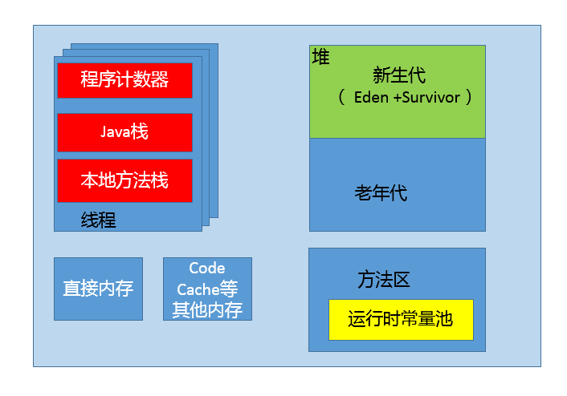
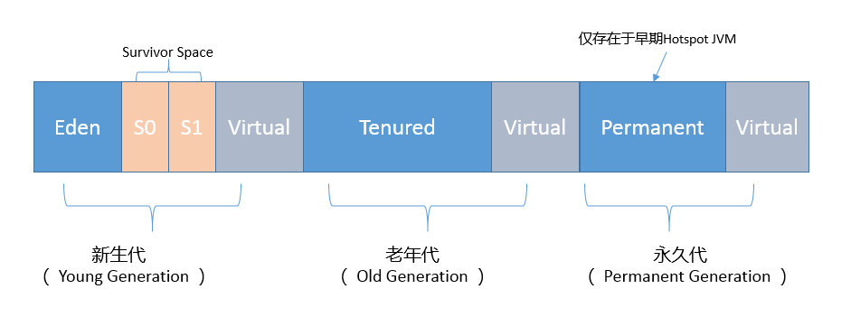
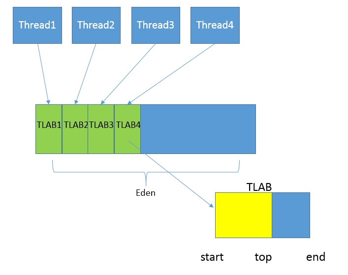
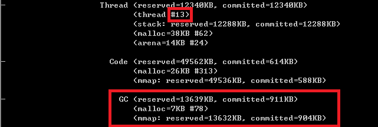

#Lesson21 | JVM内存区域、监控与诊断

---
## JVM内存区域

###### 线程私有区域：
	java栈
	本地方法栈
	程序计数器		
	
###### 线程共享区域：
	堆（新生代、老年代）--- GC重点回收区域
	方法区/永久区/PermSpace/MetaSpace
	code cache(JIT编译后的指令)
	直接内存
	

## JVM知识扩展

#### 直接内存
	直接内存（Direct Memory）区域，它是Direct Buffer 所直接分配的内存，也是个容易出现问题的地方。
	尽管，在 JVM 工程师的眼中，并不认为它是 JVM 内部内存的一部分，也并未体现 JVM 内存模型中。

#### JVM其它占用内存的线程
	JVM 本身是个本地程序，还需要其他的内存去完成各种基本任务，
	比如，JIT Compiler 在运行时对热点方法进行编译，就会将编译后的方法储存在 Code Cache 里面；
	GC 等功能需要运行在本地线程之中，类似部分都需要占用内存空间。
	这些是实现 JVM JIT 等功能的需要，但规范中并不涉及。

#### 字符串放在哪里?
	Intern 字符串的缓存和静态变量曾经都被分配在永久代上，而永久代已经被元数据区取代。
	但是，Intern 字符串缓存和静态变量并不是被转移到元数据区，而是直接在堆上分配。

---
## OOM
	OOM 如果通俗点儿说，就是 JVM 内存不够用了，
	javadoc 中对OOM的解释是，JVM没有空闲内存，并且垃圾收集器也无法提供更多内存。

#### JVM在OOM之前会做哪些补救措施？
	【清除软引用、弱引用】
	在抛出 OutOfMemoryError 之前，通常垃圾收集器会被触发，尽其所能去清理出空间，
	例如：引用机制分析中，已经提到了 JVM 会去尝试回收软引用指向的对象等。
	
	【NIO中显示调用System.gc()触发FullGC】
	java.nio.BIts.reserveMemory() 方法中，我们能清楚的看到，System.gc() 会被调用，以清理空间，
	这也是为什么在大量使用 NIO 的 Direct Buffer 之类时，通常建议不要加下面的参数，
	毕竟是个最后的尝试，有可能避免一定的内存不足问题。
		-XX:+DisableExplictGC // NIO应用场景下，不建议启用此参数

#### JVM内存的哪些区域可能发生OOM？可能是什么原因导致的？
	【堆内存溢出】
	堆内存不足是最常见的 OOM 原因之一，抛出的错误信息是“java.lang.OutOfMemoryError:Java heap space”，原因可能千奇百怪：
	1、可能存在内存泄漏问题；
	2、可能就是堆的大小不合理，比如我们要处理比较可观的数据量，但是没有显式指定 JVM 堆大小或者指定数值偏小；
	3、出现 JVM 处理引用不及时，导致堆积起来，内存无法释放等。
	
	【栈内存溢出】
	而对于 Java 虚拟机栈和本地方法栈，这里要稍微复杂一点。
	如果我们写一段程序不断的进行递归调用，而且没有退出条件，就会导致不断地进行压栈。
	类似这种情况，JVM 实际会抛出 StackOverFlowError；
	当然，如果 JVM 试图去扩展栈空间的的时候失败，则会抛出 OutOfMemoryError。

	【永久区溢出】
	老版本的 Oracle JDK，因为永久代的大小是有限的，并且 JVM 对永久代垃圾回收非常不积极，
	所以当我们不断添加新类型的时候，永久代出现 OutOfMemoryError 也非常多见，
	尤其是在运行时存在大量动态类型生成的场合；
	类似 Intern 字符串缓存占用太多空间，也会导致 OOM 问题。
	对应的异常信息，会标记出来和永久代相关：“java.lang.OutOfMemoryError: PermGen space”。

	随着元数据区的引入，方法区内存已经不再那么窘迫，所以相应的 OOM 有所改观，
	出现 OOM，异常信息则变成了：“java.lang.OutOfMemoryError: Metaspace”。
	
	【直接内存溢出】
	直接内存不足，也会导致 OOM

#### 问答：试图分配一个 100M bytes 大数组的时候发生了 OOME，但是 GC 日志显示，明明堆上还有远不止 100M 的空间，你觉得可能问题的原因是什么？
	要点：
		1、数组需要连续的内存空间
		2、JVM内存区域的划分
		3、不同GC回收器对堆内存的回收效果

	如果仅从jvm的角度来看，要看下新生代和老年代的垃圾回收机制是什么。

	如果新生代是serial，会默认使用copying算法，利用两块eden和survivor来进行处理。
	但是默认当遇到超大对象时，会直接将超大对象放置到老年代中，而不用走正常对象的存活次数记录。

	因为要放置的是一个byte数组，那么必然需要申请连续的空间，当空间不足时，会进行gc操作。
	这里又需要看老年代的gc机制是哪一种。

	如果是serial old，那么会采用mark compat，会进行整理，从而整理出连续空间，
	如果还不够，说明是老年代的空间不够，所谓的堆内存大于100m是新+老共同的结果。
	如果采用的是cms(concurrent mark sweep)，那么只会标记清理，并不会压缩，所以内存会碎片化，同时可能出现浮游垃圾。
	如果是cms的话，即使老年代的空间大于100m，也会出现没有连续的空间供该对象使用。
	

---	
## 监控JVM内存与诊断

### 如何监控和诊断 JVM 堆内和堆外内存使用？

#### 1、图形化工具
	JConsole
	JVisualVM
	JMC (Java Mission Control)

#[JConsole](https://docs.oracle.com/javase/7/docs/technotes/guides/management/jconsole.html)

#[JMC](http://www.oracle.com/technetwork/java/javaseproducts/mission-control/java-mission-control-1998576.html)
	JMC是一个非常强大的工具，不仅仅能够使用JMX进行普通的管理、监控任务，
	还可以配合Java Flight Recorder（JFR）技术，
	以非常低的开销，收集和分析 JVM 底层的 Profiling 和事件等信息。
	目前， Oracle 已经将其开源，如果你有兴趣请可以查看 OpenJDK 的Mission Control项目。

#[Java Flight Recorder](https://docs.oracle.com/javacomponents/jmc-5-4/jfr-runtime-guide/about.htm#JFRUH170)

#### 2、命令行工具
	jstate
	jstack
	jmap

### 深入JVM 内存区域

按照通常的 GC 年代方式划分，Java 堆内分为：

##### 》》新生代 Eden(TLAB) + Survivor(from+to)
新生代是大部分对象创建和销毁的区域，在通常的 Java 应用中，绝大部分对象生命周期都是很短暂的。

	【Eden】
	其内部又分为 Eden 区域，作为对象初始分配的区域；

	【Survivor】
	两个 Survivor，有时候也叫 from、to 区域，被用来放置从 Minor GC 中保留下来的对象。
	JVM 会随意选取一个 Survivor 区域作为“to”，然后会在 GC 过程中进行区域间拷贝，
	也就是将 Eden 中存活下来的对象和 from 区域的对象，拷贝到这个“to”区域。
	这种设计主要是为了防止内存的碎片化，并进一步清理无用对象。

	【TLAB】	
	从内存模型而不是垃圾收集的角度，对 Eden 区域继续进行划分，
	Hotspot JVM 还有一个概念叫做 Thread Local Allocation Buffer（TLAB），
	据我所知所有 OpenJDK 衍生出来的 JVM 都提供了 TLAB 的设计。
	
	这是 JVM 为每个线程分配的一个私有缓存区域，
	否则，多线程同时分配内存时，为避免操作同一地址，可能需要使用加锁等机制，进而影响分配速度。
	你可以参考下面的示意图。
	从图中可以看出，TLAB 仍然在堆上，它是分配在 Eden 区域内的。
	其内部结构比较直观易懂，start、end 就是起始地址，top（指针）则表示已经分配到哪里了。
	所以我们分配新对象，JVM 就会移动 top，当 top 和 end 相遇时，即表示该缓存已满，JVM 会试图再从 Eden 里分配一块儿。
	

##### 》》老年代
	放置长生命周期的对象，通常都是从 Survivor 区域拷贝过来的对象。
	当然，也有特殊情况，我们知道普通的对象会被分配在 TLAB 上；
	如果对象较大，JVM 会试图直接分配在 Eden 其他位置上；
	如果对象太大，完全无法在新生代找到足够长的连续空闲空间，JVM 就会直接分配到老年代。

##### 》》永久区
	早期 Hotspot JVM 的方法区实现方式，储存 Java 类元数据、常量池、Intern 字符串缓存，
	在 JDK 8 之后就不存在永久代了，改为了Metaspace。

##### 》》Virtual区域
	在 JVM 内部，如果 Xms 小于 Xmx，堆的大小并不会直接扩展到其上限，
	也就是说保留的空间（reserved）大于实际能够使用的空间（committed）。
	当内存需求不断增长的时候，JVM 会逐渐扩展新生代等区域的大小，
	所以 Virtual 区域代表的就是暂时不可用（uncommitted）的空间。

---
### 特定内存区域的参数调整
##### 最大堆空间
	-Xmx value

##### 初始的最小堆空间
	-Xms value

##### 按比例设置老年代和新生代的比例
默认情况下，这个数值是 2，意味着老年代是新生代的 2 倍大；换句话说，新生代是堆大小的 1/3。

	-XX:NewRatio=value
	

##### 直接设置新生代的大小
当然，也可以不用比例的方式调整新生代的大小，直接指定下面的参数，设定具体的内存大小数值。

	-XX:NewSiz=value
	
#### 设置Eden和Survivor的比例
	Eden 和 Survivor 的大小是按照比例设置的，
	如果 SurvivorRatio 是 8，那么 Survivor 区域就是 Eden 的 1/8 大小，
	也就是新生代的 1/10，因为 YoungGen=Eden + 2*Survivor，
	JVM 参数格式是
		-XX:SurvivorRatio=value

#### 设置TABL内存大小
	TLAB 当然也可以调整，JVM 实现了复杂的适应策略，如果你有兴趣可以参考这篇
	https://blogs.oracle.com/jonthecollector/the-real-thing

#### 设置永久区/元数据区大小
	-XX:MaxPermSize=value
	-XX:MaxMetaspaceSize=value (JDK8)

----
## 知识扩展

## 问答：用程序的方式而不是工具，对 Java 内存使用进行监控，有哪些技术可以做到?
	1、使用 JMX MXBean 公开出来的api
	2、使用 Sigar 进行内存监控
	3、java.lang.Runtime 可以获取内存使用情况

## 通过NTM技术来了解JVM堆外内存是如何分配的？
堆外内存：指的是JVM内部提供的相关功能所需的内存，这些内存不属于堆内存的范畴。

利用 NMT 特性对 JVM 进行分析，它所提供的详细分类信息，非常有助于理解 JVM 内部实现。

首先来做些准备工作，开启 NMT 并选择 summary 模式

	-XX:NativeMemoryTracking=summary

为了方便获取和对比 NMT 输出，选择在应用退出时打印 NMT 统计信息

	-XX:+UnlockDiagnosticVMOptions -XX:+PrintNMTStatistics

然后，执行一个简单的在标准输出打印 HelloWorld 的程序，就可以得到下面的输出	

我来仔细分析一下，NMT 所表征的 JVM 本地内存使用：

	第一部分非常明显是 Java 堆，我已经分析过使用什么参数调整，不再赘述。
#
	第二部分是 Class 内存占用，它所统计的就是 Java 类元数据所占用的空间，
	JVM 可以通过类似下面的参数调整其大小：
		-XX:MaxMetaspaceSize=value
#	
	下面是 Thread，这里既包括 Java 线程，如程序主线程、Cleaner 线程等，也包括 GC 等本地线程。
	你有没有注意到，即使是一个 HelloWorld 程序，这个线程数量竟然还有 25。
	似乎有很多浪费，设想我们要用 Java 作为 Serverless 运行时，
	每个 function 是非常短暂的，如何降低线程数量呢？
	如果你充分理解了专栏讲解的内容，对 JVM 内部有了充分理解，思路就很清晰了：
		JDK 9 的默认 GC 是 G1，虽然它在较大堆场景表现良好，
		但本身就会比传统的 Parallel GC 或者 Serial GC 之类复杂太多，
		所以要么降低其并行线程数目，要么直接切换 GC 类型；
	JIT 编译默认是开启了 TieredCompilation 的，将其关闭，那么 JIT 也会变得简单，
	相应本地线程也会减少。下面是替换了默认 GC，并关闭 TieredCompilation 的命令行

	得到的统计信息如下，线程数目从 25 降到了 17，消耗的内存也下降了大概 1/3。
	

#
	接下来是 Code 统计信息，显然这是 CodeCache 相关内存，
	也就是 JIT compiler 存储编译热点方法等信息的地方，
	JVM 提供了一系列参数可以限制其初始值和最大值等，例如：
		-XX:InitialCodeCacheSize=value
		-XX:ReservedCodeCacheSize=value

	你可以设置下列 JVM 参数，也可以只设置其中一个，进一步判断不同参数对 CodeCache 大小的影响。

	很明显，CodeCache 空间下降非常大，这是因为我们关闭了复杂的 TieredCompilation，而且还限制了其初始大小。

#
	下面就是 GC 部分了
	就像我前面介绍的，G1 等垃圾收集器其本身的设施和数据结构就非常复杂和庞大，
	例如 Remembered Set 通常都会占用 20%~30% 的堆空间。
	如果我把 GC 明确修改为相对简单的 Serial GC，会有什么效果呢？
		-XX:+UseSerialGC
	

	可见，不仅总线程数大大降低（25 → 13），而且 GC 设施本身的内存开销就少了非常多。
	据我所知，AWS Lambda 中 Java 运行时就是使用的 Serial GC，
	可以大大降低单个 function 的启动和运行开销。

#
	Compiler 部分，就是 JIT 的开销，显然关闭 TieredCompilation 会降低内存使用。

#
	其他一些部分占比都非常低，通常也不会出现内存使用问题，请参考官方文档（NMT Memory Categories）。
##[NMT Memory Categories](https://docs.oracle.com/javase/8/docs/technotes/guides/troubleshoot/tooldescr022.html#BABCBGFA)