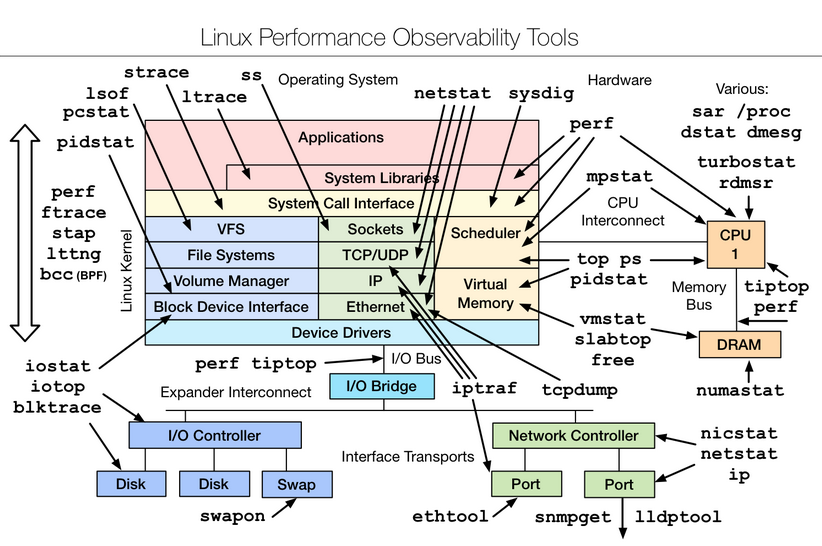

# Lesson35 - 诊断 Java 后台服务性能问题
	掌握相关工具、方法论和基础实践

## 后台服务出现明显“变慢”，谈谈你的诊断思路？

思路：
	
	首先，对系统所发生的问题要有一个精确的定义与理解:
		1、服务是突然变慢还是长时间运行后观察到变慢？类似问题是否重复出现？
		2、“慢”的定义是什么，我能够理解是系统对其他方面的请求的反应延时变长吗?

	第二，理清问题的症状，这更便于定位具体的原因，有以下一些思路：
		1、问题可能来自于 Java 服务自身，也可能仅仅是受系统里其他服务的影响。
		初始判断可以先确认是否出现了意外的程序错误，例如检查应用本身的错误日志。

		2、监控 Java 服务自身，
		例如 GC 日志里面是否观察到 Full GC 等恶劣情况出现，或者是否 Minor GC 在变长等；
		利用 jstat 等工具，获取内存使用的统计信息也是个常用手段；
		利用 jstack 等工具检查是否出现死锁等。

		3、如果还不能确定具体问题，对应用进行 Profiling 也是个办法，
		但因为它会对系统产生侵入性，如果不是非常必要，大多数情况下并不建议在生产系统进行。

		4、定位了程序错误或者 JVM 配置的问题后，就可以采取相应的补救措施，
		然后验证是否解决，否则还需要重复上面部分过程。

---
## 详细说说排查问题的步骤？

从典型性能问题出发，从症状表现到具体的系统分析、JVM 分析，系统性地整理了常见性能分析的思路；

### 1、操作系统层面的分析(top, iostat, vmstat, pidstat)
从系统、应用的不同角度、不同层次，逐步将问题域尽量缩小，隔离出真实原因。

具体步骤未必千篇一律，在处理过较多这种问题之后，经验会令你的直觉分外敏感。	

》》》系统性能分析中，CPU、内存和 IO 是主要关注项。

	对于 CPU，如果是常见的 Linux，可以先用 top 命令查看负载状况，下图是我截取的一个状态。
	

	可以看到，其平均负载（load average）的三个值（1 分钟、5 分钟、15 分钟）非常低，并且暂时看并没有升高迹象。
	如果这些数值非常高（例如，超过 50%、60%），并且短期平均值高于长期平均值，
	则表明负载很重；
	如果还有升高的趋势，那么就要非常警惕了。

##### 怎么找到最耗费 CPU 的 Java 线程，简要介绍步骤：

	利用 top 命令获取相应 pid，“-H”代表 thread 模式，你可以配合 grep 命令更精准定位。
		top –H

	然后转换成为 16 进制。
		printf "%x" your_pid

	最后利用 jstack 获取的线程栈，对比相应的 ID 即可。

#####
	当然，还有更加通用的诊断方向，利用 vmstat 之类，查看上下文切换的数量，
	比如下面就是指定时间间隔为 1，收集 10 次。
		vmstat -1 -10

	如果每秒上下文（cs，context switch）切换很高，
	并且比系统中断高很多（in，system interrupt），就表明很有可能是因为不合理的多线程调度所导致。
	当然还需要利用pidstat等手段，进行更加具体的定位。

除了 CPU，内存和 IO 是重要的注意事项，比如：

	利用 free 之类查看内存使用。

	或者，进一步判断 swap 使用情况，
	top 命令输出中 Virt 作为虚拟内存使用量，就是物理内存（Res）和 swap 求和，所以可以反推 swap 使用(swap = Virt = Res)。
	显然，JVM 是不希望发生大量的 swap 使用的。

对于 IO 问题，既可能发生在磁盘 IO，也可能是网络 IO。

例如，利用 iostat 等命令有助于判断磁盘的健康状况。

### 2、JVM层面的分析(jstat, jstack, JMC)
利用 JMC、JConsole 等工具进行运行时监控。

利用各种工具，在运行时进行堆转储分析，或者获取各种角度的统计数据

	如jstat -gcutil 分析 GC、内存分带等

# [jstat](https://docs.oracle.com/javase/7/docs/technotes/tools/share/jstat.html)

GC 日志等手段，诊断 Full GC、Minor GC，或者引用堆积等。

对于应用Profiling，简单来说就是利用一些侵入性的手段，收集程序运行时的细节，以定位性能问题瓶颈。

所谓的细节，就是例如内存的使用情况、最频繁调用的方法是什么，或者上下文切换的情况等。

不过，一般不建议生产系统进行 Profiling，大多数是在性能测试阶段进行。

但是，当生产系统确实存在这种需求时，也不是没有选择。我建议使用 JFR 配合JMC来做 Profiling，

因为它是从 Hotspot JVM 内部收集底层信息，并经过了大量优化，性能开销非常低，通常是低于 2% 的；

并且如此强大的工具，也已经被 Oracle 开源出来！

所以，JFR/JMC 完全具备了生产系统 Profiling 的能力，目前也确实在真正大规模部署的云产品上使用过相关技术，快速地定位了问题。

它的使用也非常方便，你不需要重新启动系统或者提前增加配置。

例如，你可以在运行时启动 JFR 记录，并将这段时间的信息写入文件：

	Jcmd <pid> JFR.start duration=120s filename=myrecording.jfr

然后，使用 JMC 打开“.jfr 文件”就可以进行分析了，方法、异常、线程、IO 等应有尽有，其功能非常强大。

如果你想了解更多细节，可以参考相关指南JMC.

#[JMC](https://blog.takipi.com/oracle-java-mission-control-the-ultimate-guide/)