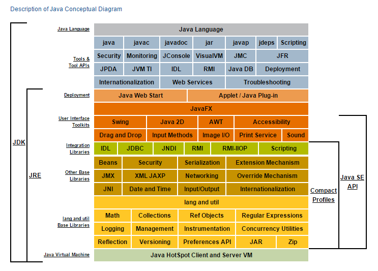

## JDK 、JRE 、 JVM

# JDK
	JDK 包含 JRE 和 JVM
	java 开发工具包，在JRE的基础上，提供了监控JVM内存的相关工具/命令。

# JRE
	JRE 包含 JVM
	为Java程序提供运行时环境，比如rt.jar等核心依赖包

# JVM
	运行在底层操作系统上，屏蔽不同平台操作系统(windows, linux)的区别，为上层提供统一的编程接口。
	JVM 为不同操作系统平台定制专门的版本，使得Java能够实现一次编写，到处运行的能力！

