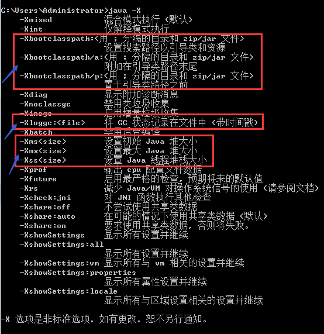

# JVM 参数配置汇总

---

## JVM标准选项设置

#### 【Synopsis-概要】
使用java命令运行Java程序有以下两种方式：

	java [ options ] class [ arguments ]                # 直接运行给定的某个class
	java [ options ] -jar file.jar [ arguments ]        # 通过jar的方式运行程序（运行MANIFEST中指定的启动类）

### options - 命令选项
	class - 被执行的启动类(全限定类名)
	file.jar - 被执行的jar文件，必须与-jar 一起使用
	arguments - 传递给main方法的参数

#### 【Description-描述】
java命令启动一个java应用程序，通过启动一个java运行时环境，并加载相关的类，最后调用目标类的main方法来完成启动。

main方法必须是public static，并且无返回值，接受一个字符串数组作为方法参数，格式如下：

	public static void main(String[] args)

java运行时环境会查找启动类，以及相关依赖到到的类，这些类的加载路径分别为：

    启动类路径(jre\lib\*.jar)
	扩展类路径(jre\lib\ext\*.jar)
	classpath类路径(appliaction classpath)

---

### Options - 选项
The launcher has a set of standard options that are supported in the current runtime environment.

####### 1、Java 虚拟机参数分类：

	【标准选项】
	   	 -d64, -server, -jar, -cp, -classpath, -D, -version

	【非标准选项1    -X】
	        -Xms, -Xmx, -Xss,  -Xloggc:/tmp/logs/heap_trace.txt

	【非标准选项2    -XX】
	        -XX:HeapDumpPath
	        -XX:+PrintGCDetails
	        -XX:+PrintGCTimeStamps	

####### 2、Standard Options - 标准选项
	-client	
		Selects the Java HotSpot Client VM. A 64-bit capable JDK currently ignores this option and instead uses the Java Hotspot Server VM.
	
	-server    
		以server模式运行，需要64位的JDK支持
		Selects the Java HotSpot Server VM. On a 64-bit capable JDK, only the Java Hotspot Server VM is supported so the -server option is implicit.
	
	-cp classpath    
		设置类路径 (技巧：可使用通配符匹配指定目录下的多个jar)
		For example, if directory mydir contains a.jar and b.JAR, then the class path element mydir/* is expanded to a A.jar:b.JAR, except that the order of jar files is unspecified. 
	
	-Dname=value	
		设置系统属性，可通过System.getProperty(name)获取到该配置。如encoding=utf-8

	-jar
		Executes a program encapsulated in a JAR file. 
		The first argument is the name of a JAR file instead of a startup class name. For this option to work, the manifest of the JAR file must contain a line in the form Main-Class: classname. 

	-verbose 或者 -verbose:class
		Displays information about each class loaded.
		打印类加载所加载的类

	-verbose:gc
		Reports on each garbage collection event. 打印到控制台，不写日志文件。

	-showversion
		Displays version information and continue. (See also -version.)

	-version
		Displays version information and exit. See also the -showversion option.

###### 3、非标准选项的设置方式：
	-XX:+xyz			#启用某个功能(bool类型参数)
	-XX:-xyz			#关闭某个功能(bool类型参数)
	-XX:name=value	#给参数指定具体值（值类型参数）

---
---
---
---
---
---
## JVM非标准选项设置 -X
#### Nonstandard Options
	-X    
		以-X开头的选项是非标准的（不能保证在所有VM实现中都支持），并且在后续版本的JDK中可能会发生更改，恕不另行通知。

Displays information about nonstandard options and exits.
执行java -X 命令，可以查看当前版本提供的非标准选项。

比如，

	-Xloggc:file    记录gc日志到文件，该选项会覆盖-verbose:gc，记录gc日志到文件中保存。
	-Xmn size or -XX:New size     设置新生代的内存大小 Sets the size of the young generation (nursery).
	-Xms n    最小堆 -Xms6291456, -Xms6144k, -Xms6m
	-Xmx n    最大堆 -Xmx83886080,-Xmx81920k,-Xmx80m
	-Xss n    栈 Sets the thread stack size.
	

## 配置JVM内存分配
###### 【堆内存分配】

》》》 Heap(Young+Old) 整个堆

	-Xms	最小堆空间 	-Xms1024M
	-Xmx	最大堆空间	 -Xmx2048M

》》》 Eden (Yong) 新生代

	-Xmn				指定新生代Eden的空间大小
	-XX:NewSize			新生代Eden最小空间
	-XX:MaxNewSize		新生代Eden最大空间
	-XX:NewRatio		按比例分配新生代的内存大小，默认值2（Old/Eden=2）
	按百分比来设置新生代（eden+s0(from)+s1(to)）和老年代（不包含永久区）的比例
	比如，2表示新生代：老年代=1:2，即年轻代占堆空间的1/3.

》》》 Survivor  幸存区(from + to)

	-XX:SurvivorRatio		设置eden区和su的比例，默认值8
	比如，8 表示每个survivor的大小是eden的1/8，可推算得到：一个Survivor占年轻代总内存大小的1/10
	比如，2 表示每个survivor的大小是eden1/2，可推算得到：一个Survivor占年轻代总内存大小的1/4
	减少survivor区的大小（在新生代内存区域不变的情况下），可以使得Eden区的空间增加，使得eden区可容纳更多新创建的对象，可以降低GC次数，而且可以让对象尽量不要进入老年代引发FullGC。

##### 【永久区内存分配】
Perm Area	永久区

	-XX:PermSize			永久区的初始空间
	-XX:MaxPermSize		永久区的最大空间
	注：使用cglib动态创建大量的代理类，可能会导致永久区内存溢出。
	
	-XX:MetaspaceSize=128m
	-XX:MaxMetaspaceSize=256m

##### 【栈内存分配】
JVM Stack  栈内存

	-Xss		栈内存一般比较小，一般几百K，不超过1M。-Xss256K
	等效于 -XX:ThreadStackSize 
	栈的内存大小决定了函数调用的深度。
	栈的内存大小还决定了系统可支持的线程数量：系统内存大小一定的情况下，栈空间越大，系统可支持的线程数越少。
	每个线程都有自己独立的线程栈，是线程私有的内存区域。
	栈包含：栈帧，局部变量表，方法入参，操作数栈，指向常量池的引用等信息。

---
---
---
---
---
---
## JVM非标准选项设置 -XX

#### [非标准参数的中文注释](http://blog.csdn.net/szzt_lingpeng/article/details/50463375)

-XX 使用-XX指定的选项不稳定，如有更改，恕不另行通知。

	  ● Boolean options are turned on with -XX:+<option> and turned off with -XX:-<option>.
	  ● Numeric options are set with -XX:<option>=<number>. Numbers can include 'm' or 'M' for megabytes, 'k' or 'K' for kilobytes, and 'g' or 'G' for gigabytes (for example, 32k is the same as 32768).
	  ● String options are set with -XX:<option>=<string>, are usually used to specify a file, a path, or a list of commands.

---
## 配置垃圾回收器

##### 【Paralle 吞吐量GC】
	-XX:+UseParallelGC
		新生代使用并行回收，多线程
	-XX:+UseParallelOldGC
		老年代使用并行回收，多线程。该参数会自动启用-XX:-UseParallelGC
	-XX:ParallelGCThreads=n
		设置并行线程数，多核下可提高gc速度
	-XX:GCTimeRation=x
		Parallel Scavenge收集器运行时间占总时间比率。
	-XX:MaxTenuringThreshold=n	
		The default value is 15 for the parallel collector and is 4 for CMS.

#
	#Example 1Tuning for Higher Throughput
	java -d64 -server  
	-XX:+AggressiveOpts -
	XX:+UseLargePages 
	-Xmn10g  -Xms26g -Xmx26g 	
	-XX:+UseParallelOldGC

##### 【CMS 并发回收】
	-XX:-UseConcMarkSweepGC	
		老年代使用CMS回收器，多线程并发（GC线程与用户线程并发执行）
	-XX:+UseParNewGC 
		新生代使用ParNewGC，并行回收。	
	-XX:+UseCMSInitiatingOccupancyOnly
		禁止CMS默认的悲观策略，仅当老年代占用超过指定比例才触发CMS。
		Enables the use of the occupancy value as the only criterion for initiating the CMS collector. 
		By default, this option is disabled and other criteria may be used.
	-XX:CMSInitiatingPermOccupancyFraction=percent
		设置老年代内存占用比例达到多少时，开始执行CMS回收器。
		Sets the percentage of the permanent generation occupancy (0 to 100) at which to start a GC. 
		This option was deprecated in JDK 8 with no replacement.
	-XX:+UseCMSCompactAtFullCollection 
		开启对旧生带的压缩
	-XX:+CMSFullGCsBeforeCompaction
		设置CMS收集器在完成垃圾收集之后是否进行一次内存整理。
	-XX:+CMSClassUnloadingEnabled
		对持久带区域也进行回收
	-XX:MaxTenuringThreshold=n	
		The default value is 15 for the parallel collector and is 4 for CMS.

#
	#dubbo分布式服务框架中CMS-JVM参数配置（参考）：
	-server -Xmx2g -Xms2g -Xmn256m -XX:PermSize=128m -Xss256k 
	-XX:+DisableExplicitGC 
	-XX:+UseConcMarkSweepGC 
	-XX:+CMSParallelRemarkEnabled 
	-XX:+UseCMSCompactAtFullCollection
	-XX:+UseCMSInitiatingOccupancyOnly 
	-XX:CMSInitiatingOccupancyFraction=70 
	-XX:LargePageSizeInBytes=128m 
	-XX:+UseFastAccessorMethods 

##### 【G1】	
	-XX:+UseG1GC
		启用G1回收器
	-XX:MaxGCPauseMillis=n
		期望每次GC停顿的时间，JVM会尽可能达到预期的设置。
	-XX:InitiatingHeapOccupancyPercent=n
		整个堆内存占用多少比例时，开始启动执行垃圾回收。
		The default value is 45.
	-XX:NewRatio=n
		配置新生代的比例，默认新生代占堆内存总大小的1/3
		Ratio of old/new generation sizes. The default value is 2.
	-XX:SurvivorRatio=n
		配置survivor区在新生带中的比例，默认eden:from:to=8:1:1
		Ratio of eden/survivor space size. The default value is 8.
	-XX:MaxTenuringThreshold=n	
		The default value is 15.
	-XX:ConcGCThreads=n
		GC并行线程数
	-XX:G1ReservePercent=n
		为防止发生promotion failure，G1需要保留多少比例的空闲region。
	-XX:G1HeapRegionSize=n
		设置region的大小。
		The default value of this parameter is determined ergonomically based upon heap size. 
		The minimum value is 1Mb and the maximum value is 32Mb.
	
#
	# Example 2Tuning for Lower Response Time	
	java -d64 -XX:+UseG1GC -Xms26g -Xmx26g -XX:MaxGCPauseMillis=500 -XX:+PrintGCTimeStamps 

--- 
## 重要调优参数
	-XX:+AggressiveOpts
		启用JVM开发团队最新的调优成果

	-XX:+UseAdaptiveSizePolicy
		java虚拟机动态自适应策略，动态调整年老代对象年龄和各个区域大小。仅对ParallelScavenge有效。

	-XX:+UseLargePages
		启用大内存页
	-XX:LargePageSizeInBytes=256m
		使用大内存页，可提高虚拟地址转换效率。
	
	-XX:-DisableExplicitGC
		禁用System.gc()操作，避免程序中显示触发FullGC。

	-XX:+HandlePromotionFailure
		关闭新生代收集担保，可有效避免FullGC处触发频率。

	-XX:+UseTLAB
		新生代Eden区位每个线程分配一个独占内存，避免内存争用时发生锁同步。
		Use thread-local object allocation

	-XX:+UseCompressedOops
		64为操作系统开启指针压缩功能。
		Enables the use of compressed pointers (object references represented as 32 bit offsets instead of 64-bit pointers) for optimized 64-bit performance with Java heap sizes less than 32gb.

	-XX:+UseSpinning
		启用多线程自旋锁优化。
		使用场景：持有锁的线程能快速执行同步代码并释放锁，否则其它自旋的线程会做大量无用功。
	-XX:PreBlockSpin=10
		控制多线程自旋锁优化的自旋次数。
		
	-XX:+UseBiasedLocking
		启用偏向锁优化。
		使用场景：没有其它线程竞争锁，单个线程独享锁，可将锁优化为无锁操作，避免同步。
	
	-XX:-PrintConcurrentLocks
		打印多线程并发时的锁情况 ，同 jstack -l

	-XX:-UseSplitVerifier	
		关闭字节码校验
	-Xverify:none 
		关闭字节码校验
	-noverify
		关闭字节码校验，java -noverify -jar your_file.jar.
		
---
## 配置 GC 日志

##### 记录GC日志
	-XX:+PrintGC				
		打印GC简单信息
	-XX:+PrintGCDetails		
		打印GC详细信息
	-XX:+PrintGCTimeStamps	
		打印GC发生的时间（相对于应用启动后的时间）
	-XX:+PrintGCDateStamps	
		打印GC发生的日期（便于排查问题，根据时间定位GC日志）
	-XX:+PrintGCApplicationStoppedTime		
		每次GC使程序停顿的时间
	-XX:+PrintGCApplicationConcurrentTime	
		打印每次GC时，应用程序已经运行的时长，当GC后时间置为0.
	-XX:+PrintHeapAtGC		
		每一次执行GC时，都分别打印出GC前、后堆的使用情况（可用jinfo来临时开启，关闭）
	
	-Xloggc:/tmp/logs/gc.log		
		重定向GC log到文件，便于分析GC日志（该选项会覆盖-verbose:gc）
		注意：logs目录需要提前创建好，如果目录不存在，gc日志会写入失败！
	-XX:-UseGCLogFileRotation
		Enabled GC log rotation, requires -Xloggc.	
	-XX:NumberOfGClogFiles=1
		Set the number of files to use when rotating logs, must be >= 1. 
	-XX:GCLogFileSize=8K
		The size of the log file at which point the log will be rotated, must be >= 8K.
	

##### 异常时记录GC日志 

##### OOM时dump堆内存
	下面2个参数必须联合使用：
	-XX:+HeapDumpOnOutOfMemoryError	
		当java进程因OOM或crash被OS强制终止后，会生成一个hprof（Heap PROFling）格式的堆内存快照文件。该文件用于线下调试，诊断，查找问题。
	-XX:HeapDumpPath	
		指定OOM导出的文件路径，注意-XX:后面没有加号”+“
		比如：-Xms5M -Xmx20M -XX:+HeapDumpOnOutOfMemoryError -XX:HeapDumpPath=/var/a.dump

##### OOM时执行脚本
	-XX:OnOutOfMemoryError	
		在OOM时，执行一个脚本"-XX:OnOutOfMemoryError=E:/tmp/printstack.bat”  
		当程序发生OOM时，会自动执行脚本printstack.bat
		比如，脚本中可以调用jstack命令输出线程信息：“d:/tools/jdk1.7/jstack -F %1 > D:/stack.txt”
		当程序发生OOM时，被执行脚本可以做任何事：可以发生邮件，甚至是重启程序。

---
## 跟踪、调试相关选项

##### 【调试类选项】
	-XX:PrintFlagsInitial 	
		查看JVM配置参数的初始默认值

	-XX:+PrintFlagsFinal	
		查看JVM运行时最终应用的参数的值，结合 jinfo -flags [pid]。

	-XX:+PrintCommandLineFlags 
		显示JVM使用ergonomically所选择的VM参数，默认关闭。

	-XX:+PrintVMOptions		
		打印出JVM接受到的显式（主动配置的）命令行参数---显示用户主动配置的选项

	-XX:+PrintCommandLineFlags	
		打印出显式（主动配置）和隐式（JVM自行设置）---JVM应用了哪些非默认值的选项
	
	-XX:+TraceClassLoading		
		打印JVM加载的所有类（可对JDK进行瘦身）（等效于-verbose:class）

	-XX:+TraceClassUnloading	
		监控类的卸载
	
	-XX:+PrintClassHistogram	
		打印类使用情况的直方图：实例数量、总大小、类型（需Ctrl+Break手动触发） 
		The jmap -histo command provides equivalent functionality.
		在Windows下, 按ctrl-break或Linux下是执行kill -3（发送SIGQUIT信号）时，打印class柱状图。
