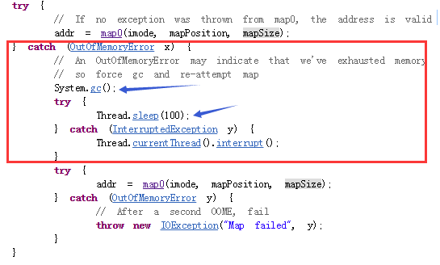

### java.ext.dirs 配置扩展类加载路径的陷阱 

这两天由于现场需求，需要把ES索引写入插件改造成带安全认证的方式，加密算法是由java.security相关类实现的。在DEMO中测试了若干次都没问题，但是放到生成环境中就是报NoSuchAlgorithmException的错误。

这个问题困扰了好久，经过多方面的排查，其中细节不一一描述，最终发现是生产环境下的启动指令属性-Djava.ext.dirs出现了问题。

-Djava.ext.dirs会覆盖Java本身的ext设置，java.ext.dirs指定的目录由ExtClassLoader加载器加载，如果您的程序没有指定该系统属性，那么该加载器默认加载$JAVA_HOME/jre/lib/ext目录下的所有jar文件。

###### 但如果你手动指定系统属性且忘了把$JAVA_HOME/jre/lib/ext路径给加上，那么ExtClassLoader不会去加载$JAVA_HOME/lib/ext下面的jar文件，这意味着你将失去一些功能，例如java自带的加解密算法实现。

OK问题分析到这儿，什么原因已经很明朗，解决方案也很简单，只需在改路径后面补上ext的路径即可！

linux环境下：

    -Djava.ext.dirs=./plugin:"$JAVA_HOME/jre/lib/ext"

windows环境下运行程序，应该用分号替代冒号来分隔:

	-Djava.ext.dirs=./plugin;"$JAVA_HOME/jre/lib/ext"

### 缺少-XX:+UseCMSInitiatingOccupancyOnly
由于我们的Java应用的heap基本都是大于4G的，所以都是用的CMS，当时我在写启动参数的时候一直犹豫要不要加上-XX:+UseCMSInitiatingOccupancyOnly这个参数，一犹豫就没加，但事实上后来碰到了不少应用由于JVM自行触发CMS GC的机制导致CMS GC频繁，所以建议用CMS GC的场景下还是加上这个参数更稳妥。

### -XX:MaxDirectMemorySize
话说在写启动参数的时候我都压根不知道这参数（要知道Java到底有哪些启动参数可用，以及默认值是多少，最靠谱的方法是在启动参数上加-XX:+PrintFlagsFinal或用jinfo -flags [pid]来查看），后来是由于有一次出现了有应用物理内存被耗光，排查的时候才发现是Direct ByteBuffer这块默认的大小是heap size，所以在有些情况下可能会出现Direct ByteBuffer这里占用了大量的空间，但heap这边又还不到触发Full gc/CMS gc的条件，就会有可能导致物理内存被耗光。
因此对于远程交互比较多的应用，建议还是加上这个参数，合理控制大小，不要让heap size+Direct Memory Size就把物理内存给耗光了。

### -XX:+DisableExplicitGC
Java在实现RMI Server的时候会通过定时的调System.gc来强制做GC（即使程序里没用到RMI也会被启动），这个动作非常烦人。另外也是为了避免应用代码上显式去调用System.gc导致一些没必要的GC动作产生，所以当时就直接加上了这个参数。
现在来看，这个参数有个挺大的问题是，Direct ByteBuffer所占用的内存以及FileChannel.map所占用的内存当达到了他们的最大阈值时，需要依赖调用System.gc来强制释放下，如果加上了这个启动参数，就意味着这个强制的释放就无效了，这会导致的一个问题是，当old gen还没到达触发full gc/cms gc的条件，而堆外的Direct ByteBuffer/FileChannel.map占用的空间又超过了它们的最大阈值时，就会直接导致OOM，而这种情况下很有可能其实是可以借助显式调用System.gc来释放出足够的空间，不过话说我仍然觉得这是JDK设计上应该改进的一点，不应该在这个时候需要依赖System.gc来管理堆外的空间，大家可以翻下FileChannel.map的代码就会发现那里在等待System.gc执行的结果是写S的等待100ms，事实上很少有full gc/cms gc可以在100ms完成。

不过鉴于上面的状况，如果应用里有使用到不少Direct ByteBuffer或FileChannel.map的话，
建议还是不要开启-XX:+DisableExplicitGC！
如果是cms gc的，还是改为加上这个参数-XX:+ExplicitGCInvokesConcurrent
另外如果有RMI Server这种定时GC影响的，再调整下-Dsun.rmi.dgc.client.gcInterval和-Dsun.rmi.dgc.server.gcInterval这两个时间吧，时间单位是ms，也可以设置为Long.MAX_VALUE。