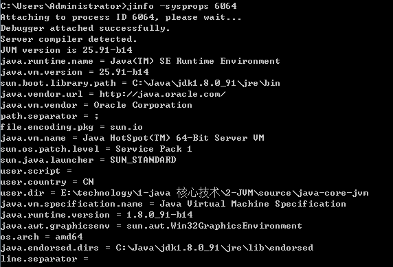
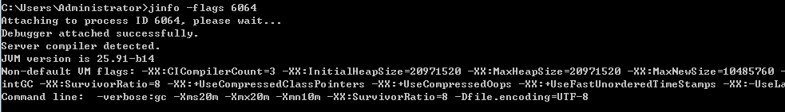
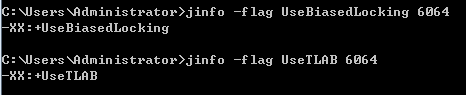
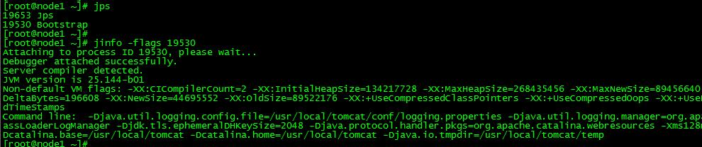
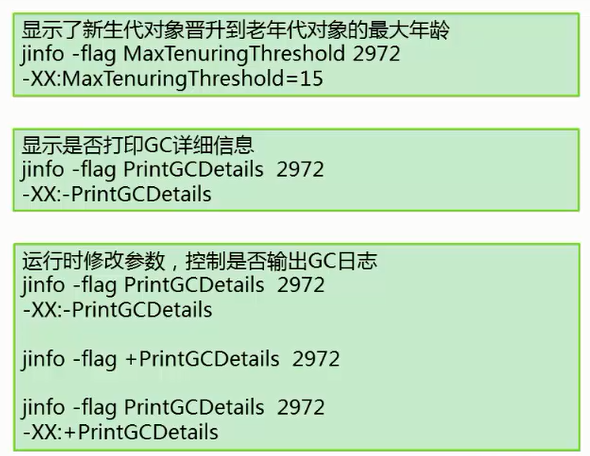

## jinfo - 查看VM运行时应用的参数 
	1、 查看JVM进程启动后生效的参数和值
	2、 支持运行时更新manageable参数

Configuration Info for Java - Prints configuration information for a given process or core file or a remote debug server.

JVM Configuration info这个命令作用是实时查看和调整虚拟机运行参数。 

`jps -v` 口令只能查看到显示设置的JVM参数，但是要查看未被显示指定的参数的值就要使用jinfo口令。

[参考文档](https://docs.oracle.com/javase/8/docs/technotes/tools/unix/jinfo.html)

---
### jinfo [option] < pid>

##### 支持的选项 option
	
	-flag <name>		 输出指定VM args参数的值
	-flag [+|-]<name>    运行时开启或关闭VM arg  (if the flag is manageable)
	-flag <name>=<value> 运行时动态设置VM arg (if the flag is manageable)
	
	-flags				输出VM参数值（JVM自动设置一部分参数、开发者指定的命令行参数）
	-sysprops			输出系统属性，等同于System.getProperties()
	<no option>			输出VM参数的值、系统属性，即 jinfo <pid> == jinfo -flags -sysprops <pid>

重要的系统参数（可通过System.getProperties()获取到的那些系统参数）

		# 当前Java程序运行的工作目录
		user.dir = E:\technology\1-java 核心技术\2-JVM\source\java-core-jvm
		
		# io读写操作使用的临时目录
		java.io.tmpdir = C:\Users\ADMINI~1\AppData\Local\Temp\
		
		# 用户的宿主目录	
		user.home = C:\Users\Administrator
		
		# 文件读写使用的编码
		file.encoding = UTF-8
		
		# JVM加载类的类路径 --- 很重要，可排查JVM运行时到底应用了哪些jar包，对解决jar包冲突的问题尤其好用！
		java.class.path = ...

		# java版本号
		java.version = 1.8.0_91
		
		# java程序的启动入口
		sun.java.command = jvm.gc.TestJVMCommand
		
		# BootStrap ClassLoader 加载的类/jar包
		sun.boot.class.path = %JAVA_HOME%/jre/lib/resources.jar,rt.jar,jce.jar,charsets.jar...
		
		# 扩展类加载器所加载的类路径
		java.ext.dirs = C:\Java\jdk1.8.0_91\jre\lib\ext;

## 查看 JVM 运行时基础信息（系统属性、VM args）

	Non-default VM flags: 列出使用了非默认值的JVM参数（由JVM根据运行时环境自动设置）

	Command line:	列出显示传递给JVM的虚拟机参数
	

### 查看 JVM 运行时某个VM参数是否被启用 或者 参数的值

有一些参数通过 `-flag` 查询不到，需要使用 `java -XX:+PrintFlagsFinal`

### 查看tomcat 启动时应用的VM参数

### 运行时禁用/启用某个VM 参数
	jinfo -flag +PrintGCDetails

	jinfo -flag -PrintGCDetails

### 运行时更新某个VM 参数值
	

