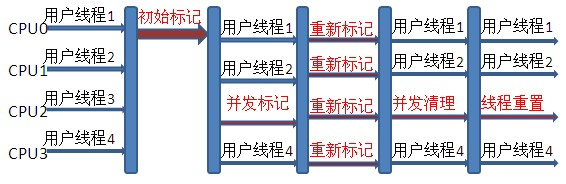
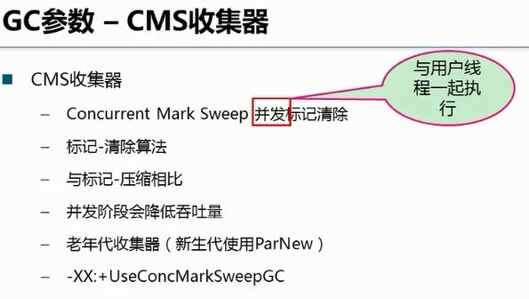
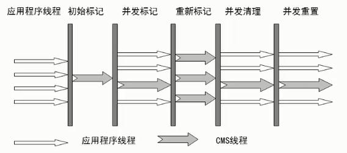
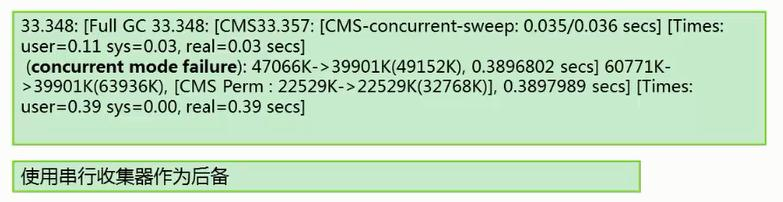
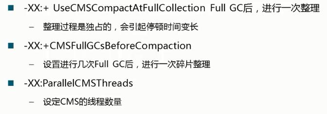

## 老年代收集器-CMS（并发标记清除） 

CMS（Concurrent Mark Sweep）收集器是一种以获取最短回收停顿时间为目标的收集器。目前很大一部分的Java应用都集中在互联网站或B/S系统的服务端上，这类应用尤其重视服务的响应速度，希望系统停顿时间最短，以给用户带来较好的体验。

### 参数控制：

	-XX:+UseConcMarkSweepGC 使用CMS收集器
	-XX:ParallelCMSThreads 设定CMS的线程数量（一般情况约等于可用CPU数量）
	-XX:+ UseCMSCompactAtFullCollection Full GC后，进行一次碎片整理；整理过程是独占的，会引起停顿时间变长
	-XX:+CMSFullGCsBeforeCompaction 设置进行几次Full GC后，进行一次碎片整理

Concurrent mark sweep(CMS)收集器是一种年老代垃圾收集器，其最主要目标是获取最短垃圾回收停顿时间，和其他年老代使用标记-整理算法不同，它使用多线程的标记-清除算法，实现了让垃圾收集线程和用户线程同时工作。

从名字（包含“Mark Sweep”）上就可以看出CMS收集器是基于“标记-清除”算法实现的，它的运作过程相对于前面几种收集器来说要更复杂一些，整个过程分为4个步骤，包括：
	
	  ● 初始标记（CMS initial mark）
	  ● 并发标记（CMS concurrent mark）
	  ● 重新标记（CMS remark）
	  ● 并发清除（CMS concurrent sweep）

其中初始标记、重新标记这两个步骤仍然需要“Stop The World”。

初始标记仅仅只是标记一下GC Roots能直接关联到的对象，速度很快，并发标记阶段就是进行GC Roots Tracing的过程，而重新标记阶段则是为了修正并发标记期间，因用户程序继续运作而导致标记产生变动的那一部分对象的标记记录，这个阶段的停顿时间一般会比初始标记阶段稍长一些，但远比并发标记的时间短。

CMS工作机制相比其他的垃圾收集器来说更复杂，整个过程分为以下4个阶段：

	a.初始标记：只是标记一下GC Roots能直接关联的对象，速度很快，仍然【需要暂停所有的工作线程】。
	b.并发标记：进行GC Roots跟踪的过程，和用户线程一起工作，【不需要暂停工作线程】。
	c.重新标记：为了修正在并发标记期间，因用户程序继续运行而导致标记产生变动的那一部分对象的标记记录，仍然【需要暂停所有的工作线程】。
	d.并发清除：清除GC Roots不可达对象，和用户线程一起工作，【不需要暂停工作线程】。

由于耗时最长的并发标记和并发清除过程中，垃圾收集线程可以和用户现在一起并发工作，所以总体上来看CMS收集器的内存回收和用户线程是一起并发地执行。

CMS收集器工作过程：

## CMS收集器的缺点	

#####  CPU负荷问题
CMS收集器对CPU资源非常敏感，其默认启动的收集线程数=(CPU数量+3)/4，在用户程序本来CPU负荷已经比较高的情况下，如果还要分出CPU资源用来运行垃圾收集器线程，会使得CPU负载加重。

##### 浮动垃圾、预留内存空间
CMS无法处理浮动垃圾(Floating Garbage)，可能会导致Concurrent ModeFailure失败而导致另一次Full GC。由于CMS收集器和用户线程并发运行，因此在收集过程中不断有新的垃圾产生，这些垃圾出现在标记过程之后，CMS无法在本次收集中处理掉它们，只好等待下一次GC时再将其清理掉，这些垃圾就称为浮动垃圾。

CMS垃圾收集器不能像其他垃圾收集器那样等待年老代机会完全被填满之后再进行收集，需要预留一部分空间供并发收集时的使用，可以通过参数`-XX:CMSInitiatingOccupancyFraction`来设置年老代空间达到多少的百分比时触发CMS进行垃圾收集，默认是68%。
如果在CMS运行期间，预留的内存无法满足程序需要，就会出现一次ConcurrentMode Failure失败，此时虚拟机将启动预备方案，使用`Serial Old`收集器重新进行年老代垃圾回收。

##### 内存碎片
CMS收集器是基于标记-清除算法，因此不可避免会产生大量不连续的内存碎片，如果无法找到一块足够大的连续内存存放对象时，将会触发因此Full GC。
CMS提供一个开关参数`-XX:+UseCMSCompactAtFullCollection`，用于指定在Full GC之后进行内存整理，内存整理会使得垃圾收集停顿时间变长，CMS提供了另外一个参数`-XX:CMSFullGCsBeforeCompaction`，用于设置在执行多少次不压缩的Full GC之后，跟着再来一次内存整理。

## 为什么CMS使用标记清除，而不使用标记压缩算法？
标记压缩算法能实现gc后内存的连续性，减少内存碎片。

虽然标记压缩算法能够减少内存碎片，但是由于CMS的目的是让gc线程和用户线程一起并行执行，所以CMS不能使用标记压缩。

若使用标记压缩，导致永久区内的对象发生移动，会导致用户线程找不到需要的对象。

而且，由于并发清除线程在进行垃圾清除时，是与用户线程一起运行的，因此，需要预留一部分空间以保障用户线程的运行，不能在空间快满时才进行并发清除，否则会发生concurrent mode failure异常，如果发生该异常，就回退到使用 SerialOldGC 继续清理老年代的垃圾！

如果CMS在并发清理垃圾的过程中出现内存不足，导致发生concurrent mode failure，则jvm会自动将CMS回退到SerialOldGc，使用串行回收器继续回收（兜底策略）。

## >>> CMS 没有采用压缩算法，那如何处理内存碎片的问题?

CMS使用标记清除而非标记压缩，所以会产生内存碎片。

对于内存碎片，可以启用相关JVM参数，在FullGC之后多少次之后进行一次内存压缩（针对老年代）。

