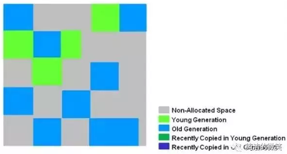
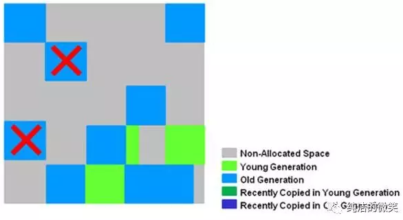
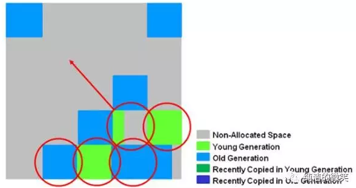
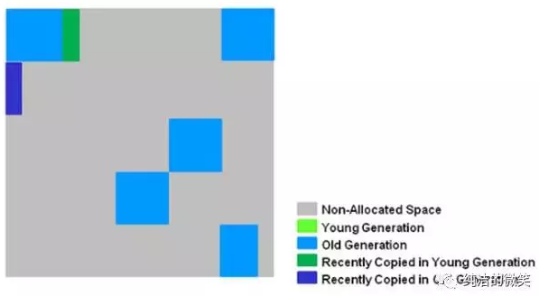

## Garbage-First Collector

G1是目前技术发展的最前沿成果之一，HotSpot开发团队赋予它的使命是未来可以替换掉JDK1.5中发布的CMS收集器。

#### G1 的特点：

1. 空间整合，G1收集器采用标记整理算法，不会产生内存空间碎片。分配大对象时不会因为无法找到连续空间而提前触发下一次GC。
 
2. 可预测停顿，这是G1的另一大优势，降低停顿时间是G1和CMS的共同关注点，但G1除了追求低停顿外，还能建立可预测的停顿时间模型，能让使用者明确指定在一个长度为N毫秒的时间片段内，消耗在垃圾收集上的时间不得超过N毫秒，这几乎已经是实时Java（RTSJ）的垃圾收集器的特征了。

3. 按region划分内存空间。
一般垃圾收集器收集的范围都是分别针对整个新生代或者老年代，而G1不再是这样。

使用G1收集器时，Java堆的内存布局与其他收集器有很大差别，它将整个Java堆划分为多个大小相等的独立区域（Region），虽然还保留有新生代和老年代的概念，但新生代和老年代不再是物理隔阂了，它们都是一部分（可以不连续）Region的集合。

---

区域划分和优先级区域回收机制，确保G1收集器可以在有限时间获得最高的垃圾收集效率。

#####G1收集器避免全区域垃圾收集，它把堆内存划分为大小固定的几个独立区域，并且跟踪这些区域的垃圾收集进度，同时在后台维护一个优先级列表，每次根据所允许的收集时间，优先回收垃圾最多的区域。

G1的新生代收集跟ParNew类似，当新生代占用达到一定比例的时候，开始出发收集。和CMS类似，G1收集器收集老年代对象会有短暂停顿。

##### 收集步骤：

1、标记阶段，首先初始标记(Initial-Mark),这个阶段是停顿的(Stop the World Event)，并且会触发一次普通Minor GC。对应GC log:GC pause (young) (inital-mark)

2、Root Region Scanning，程序运行过程中会回收survivor区(存活到老年代)，这一过程必须在young GC之前完成。

3、Concurrent Marking，在整个堆中进行并发标记(和应用程序并发执行)，此过程可能被young GC中断。在并发标记阶段，若发现区域对象中的所有对象都是垃圾，那个这个区域会被立即回收(图中打X)。同时，并发标记过程中，会计算每个区域的对象活性(区域中存活对象的比例)。

4、Remark, 再标记，会有短暂停顿(STW)。再标记阶段是用来收集 并发标记阶段 产生新的垃圾(并发阶段和应用程序一同运行)；G1中采用了比CMS更快的初始快照算法:snapshot-at-the-beginning (SATB)。

5、Copy/Clean up，多线程清除失活对象，会有STW。G1将回收区域的存活对象拷贝到新区域，清除Remember Sets，并发清空回收区域并把它返回到空闲区域链表中。

6、复制/清除过程后。回收区域的活性对象已经被集中回收到深蓝色和深绿色区域。

---
### Introduction
The Garbage-First (G1) garbage collector is fully supported in Oracle JDK 7 update 4 and later releases. 

The G1 collector is a server-style garbage collector, targeted for multi-processor machines with large memories. 

It meets garbage collection (GC) pause time goals with high probability, while achieving high throughput. 

Whole-heap operations, such as global marking, are performed concurrently with the application threads. 

This prevents interruptions proportional to heap or live-data size.

### Technical description

The G1 collector achieves high performance and pause time goals through several techniques. （高性能、低延时）

The heap is partitioned into a set of equal-sized heap regions, each a contiguous range of virtual memory. （堆被划分为一系列大小不同的region）

G1 performs a concurrent global marking phase to determine the liveness of objects throughout the heap. （并发全局标记） 

After the mark phase completes, G1 knows which regions are mostly empty. 
It collects in these regions first, which usually yields a large amount of free space. （优先处理内存消耗比例高的region，可释放大量内存空间）

This is why this method of garbage collection is called Garbage-First. 
As the name suggests, G1 concentrates its collection and compaction activity on the areas of the heap that are likely to be full of reclaimable objects, that is, garbage. 

G1 uses a pause prediction model to meet a user-defined pause time target and selects the number of regions to collect based on the specified pause time target.（根据用户所能接受的暂停时间，在Region中进行选择性回收）

The regions identified by G1 as ripe for reclamation are garbage collected using evacuation. 

G1 copies objects from one or more regions of the heap to a single region on the heap, and in the process both compacts and frees up memory. （从1个或多个region复制存活对象到一个独立的region，并进行压缩和内存释放）

This evacuation is performed in parallel on multi-processors, to decrease pause times and increase throughput.（多核并行执行，减少暂停时间，增加吞吐量） 

Thus, with each garbage collection, G1 continuously works to reduce fragmentation, working within the user defined pause times.（减少内存碎片，在用户期望的暂停时间内结束垃圾回收） 

This is beyond the capability of both the previous methods. 

CMS (Concurrent Mark Sweep ) garbage collection does not do compaction.（CMS收集过程中没有压缩机制）
 
ParallelOld garbage collection performs only whole-heap compaction, which results in considerable pause times.（ParallelOld 是对整个堆进行压缩，耗时较长）

It is important to note that G1 is not a real-time collector. It meets the set pause time target with high probability but not absolute certainty. 
Based on data from previous collections, G1 does an estimate of how many regions can be collected within the user specified target time. 
Thus, the collector has a reasonably accurate model of the cost of collecting the regions, and it uses this model to determine which and how many regions to collect while staying within the pause time target.（根据上一次回收情况，根据一个合理的计算模型，选择要回收哪些region）

### Recommended Use Cases for G1
The first focus of G1 is to provide a solution for users running applications that require large heaps with limited GC latency. （G1适合用于堆内存很大，而且要求GC延迟很小的场景）

This means heap sizes of around 6GB or larger, and stable and predictable pause time below 0.5 seconds.（堆内存6GB或更大，可预测的GC暂停时间不超过0.5秒）

Applications running today with either the CMS or the ParallelOld garbage collector would benefit switching to G1 if the application has one or more of the following traits. 

以下几种情况，使用G1可能会带来好处

	  ● More than 50% of the Java heap is occupied with live data.
	  ● The rate of object allocation rate or promotion varies significantly.
	  ● Undesired long garbage collection or compaction pauses (longer than 0.5 to 1 second)

### Future
G1 is planned as the long term replacement for the Concurrent Mark-Sweep Collector (CMS). 

Comparing G1 with CMS, there are differences that make G1 a better solution. 
One difference is that G1 is a compacting collector. 

G1 compacts sufficiently to completely avoid the use of fine-grained free lists for allocation, and instead relies on regions. 

This considerably simplifies parts of the collector, and mostly eliminates potential fragmentation issues. 

Also, G1 offers more predictable garbage collection pauses than the CMS collector, and allows users to specify desired pause targets.