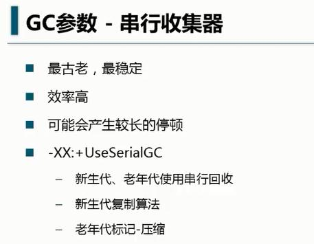
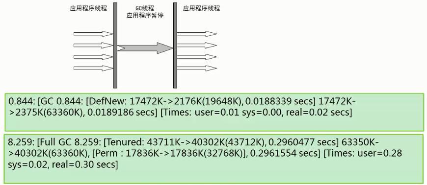

## 串行收集器 SerialGC

串行收集器是最古老，最稳定以及效率高的收集器，可能会产生较长的停顿，只使用一个线程去回收。新生代、老年代使用串行回收；新生代复制算法、老年代标记-压缩；垃圾收集的过程中会 Stop The World（服务暂停）

### 参数控制： 
	-XX:+UseSerialGC 串行收集器

适合用于单核CPU的场景下，比如客户端桌面应用程序。

### 串行回收的 GC 日志

