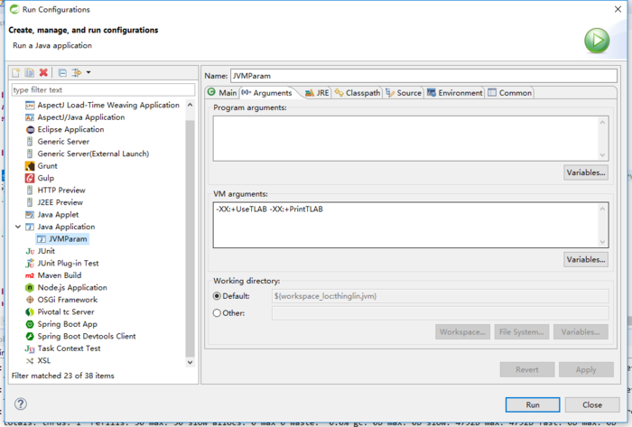
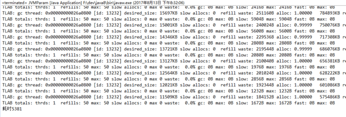
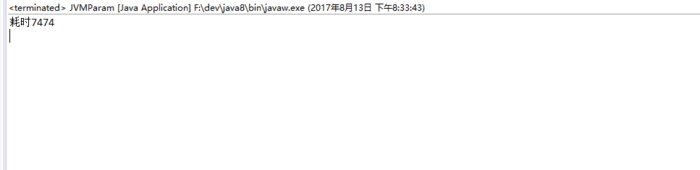

## What's TLAB

> TLAB在新生代的Eden区中，为每个线程分配一个TLAB空间，可避免线程争用同一块内存，减少同步开销。

A TLAB is a Thread Local Allocation Buffer. 

The normal way objects are allocated in HotSpot is within a TLAB. 

TLAB allocations can be done without synchronization with other threads, since the Allocation Buffer is Thread Local, synchronization is only needed when a new TLAB is fetched.

So, the ideal scenario is that as much as possible of the allocations are done in TLABs.

The TLABs are dynamically resized during the execution for each thread individually. 

So, if a thread allocates very much, the new TLABs that it gets from the heap will increase in size. 

If you want you can try to set the flag -XX:MinTLABSize to set minimum TLAB size, for example -XX:MinTLABSize=4k.

## TLAB
TLAB Thread Local Allocation Buffer，JDK1.7默认开启TLAB一般不需要去设置，TLAB极大提高程序性能，它是Java的一个优化方案。

    -XX:+UseTLAB    开启TLAB
	-XX:TLABSize=size	设置TLAB的大小，-XX:TLABSize=512k
    -XX:+PrintTLAB  打印TLAB信息
    -XX:+TLABSize   为每个线程分配的TLAB内存大小（TLAB是Eden区内存的逻辑空间）
    -XX:TLABRefillWasteFraction 设置维护进入TLAB空间单个对象大小，比例值，默认1/64，对象大于该值会去堆创建。
    -XX:ResizeTLAB  自调整TLABRefillWasteFraction 阀值，默认启用。

### 测试TLAB的效果

    public static void alloc(){
        byte[] b = new byte[100];
        byte[] b2 = new byte[100];
    }
    
    public static void main(String[] args) {
        long begin = System.currentTimeMillis();
        for(int i=0; i<200000000;i++){
            alloc();
        }
        System.out.println("耗时"+(System.currentTimeMillis() - begin));
    }

启用TLAB

	-XX:+UseTLAB -XX:+PrintTLAB

禁用TLAB

	-XX:-UseTLAB -XX:+PrintTLAB

## 结论

配置TLAB性能高很多，这和对象的安置优先选择的顺序有关系。

### 新创建对象的在内存中的存放规则（安置顺序）
创建一个对象会按以下顺序尝试分配内存：
	1、栈上分配（如果是方法内部的局部变量）
	2、不满足栈上分配条件的，尝试新生代中的Eden区中的TLAB区（每线程独占，目的是避免多线程并发申请内存时加锁），
	3、如果TLAB区分配条件不满足，则尝试分配到Eden Common区，
	4、如果都尝试失败，则直接分配到老年代。