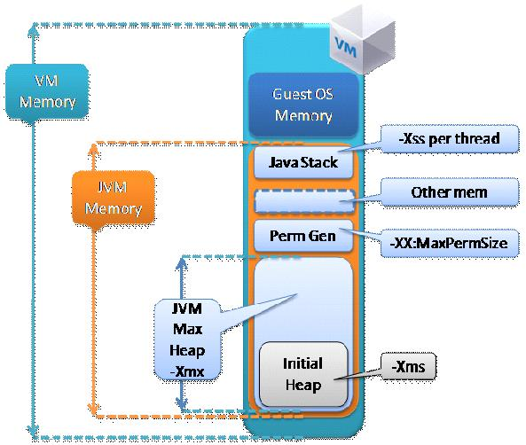
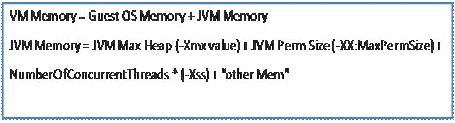
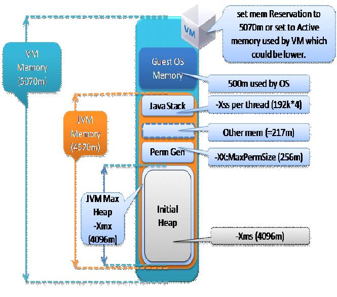

## Taking a closer look at sizing the Java process

https://blogs.vmware.com/apps/2011/06/taking-a-closer-look-at-sizing-the-java-process.html

### Figure-1 Shows a Virtual Machine (VM) with 1 HotSpot JVM.

### Figure 2 – Shows the generalized memory Sizing equation of all the memory segments shown in Figure-1

### Where:

	  ● Guest OS Memory is approx 0.5G-1G (depends on OS/other processes)
	  ● -Xmx, is the JVM max Heap Size
	  ● -Xss, is the Java Thread Stack Size, the default is OS and JVM dependent, and it can range 256k-to-1MB. 
	  	The default should be tuned down to a range that doesn’t cause StackOverflow.  
	  	I often use 128k-192k.  Since the default –Xss is high, 
		tuning it down can help save on memory used and given back to the Guest OS.
	  ● Perm Size is an area additional to the –Xmx (Max Heap) value and is not GC-ed because it contains class-level information.
	  ● “other mem” is additional mem required for NIO buffers, JIT code cache, classloaders, Socket Buffers (receive/send), JNI, GC internal info
	  ● If you have multiple JVMs (N JVMs) on a VM then:
	      ○ VM Memory = Guest OS memory + N * JVM Memory

--- 

### 内存分配示例

Let’s assume that through load testing a JVM Max heap (-Xmx) of 4096m has been determined as necessary.

You would proceed to size as follows:
		
	● Set -Xmx4096m, also set –Xms4096m

  	● Set –XX:MaxPermSize=256m, you have chosen to use –XX:MaxPermSize of 256m which a common number and depends on the memory footprint of the Class level information within your Java application code base.

  	● The other segment of NumberOfConcurrentThreads*(-Xss) depends largely on NumberOfConcurrentThreads the JVM will process, and the –Xss value you have chosen. A common range of –Xss is 128k-192k.
      ○ Note: -Xss is OS and JVM dependent; if the stack is not sized correctly you will get a StackOverflow.  As noted earlier the default value is sometimes quite large and you can benefit from sizing it down to help save on memory consumption.
      ○ If for example NumberOfConcurrentThreads is 4, then 4*192k => 768k (assuming you set –Xss to 192k)
      ○ Assume the OS has a requirement of about 500m to run as per the OS spec
      ○ Total JVM memory (Java process memory) = 4096m (-Xmx) + 256m (–XX:MaxPermSize) + 4*192k (NumberOfConcurrentThreads*-Xss) + “other mem”
          ■ Therefore JVM memory approximately = 4096m+256m+0.768m + “other mem” = 4352.768m + “other mem”
          ■ Now typically “other mem” is not significant however can be quite large if the application uses lots of NIO buffers, and socket buffers.  Otherwise assuming about 5% of the total JVM Process memory, i.e. 5% * 4352.768= 217m, should be enough, although proper load testing should be used to verify.
          ■ This now implies that JVM process memory = 4352.768m+217m=4570m
          ■ Now to determine the VM memory, assume you are using Linux with no other significant process is running on it, only this single Java process, the total configured memory for the VM translates to:
              ● VM memory =  4570m + 500m = 5070m
              ● Now next you should set the VM memory as the memory reservation, you can chose to set the memory reservation as 5070m, however over time you should monitory the Active memory used by the VM that houses this JVM Process and adjust the memory reservation to that Active memory value, which could be less than 5070m 

### NOTE: 
A common miss-conception is to assume that：

this –Xmx value is equal to the Java Process memory needed, but clearly as described by the equation in Figure-2 the JVM Memory (or Java Process Memory) is greater than JVM Max heap (greater than –Xmx) ，and this is due to the other additional segments outside the heap that make up the memory space of the total Java process such as JVM Perm Size, NumberOfConcurrentThreads*(-Xss), and the “other memory” section.

### Figure 3 – Shows Figure-1 with an actual sizing example we just discussed above, in order to illustrate amount of memory each segment has been set to.

