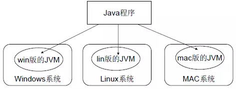
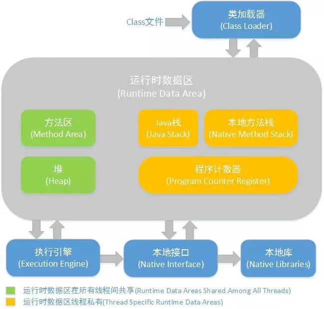
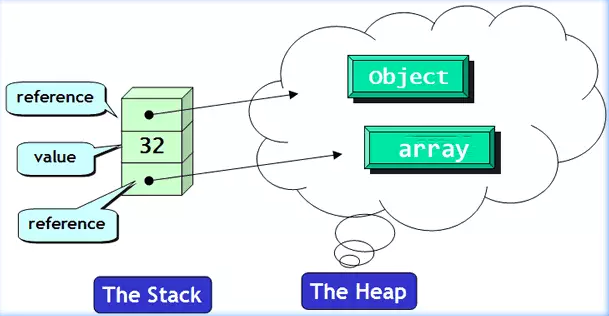

## 64 位 JVM 中，int 的长度是多数？

答：Java 中，int 类型变量的长度是一个固定值，与平台无关，都是 32 位或者 4 个字节。意思就是说，在 32 位 和 64 位 的Java 虚拟机中，int 类型的长度是相同的。

## 怎样通过 Java 程序来判断 JVM 是 32 位 还是 64 位？

答：Sun有一个Java System属性来确定JVM的位数：32或64：
	
	sun.arch.data.model=32 // 32 bit JVM
	sun.arch.data.model=64 // 64 bit JVM

	我可以使用以下语句来确定 JVM 是 32 位还是 64 位：
	System.getProperty("sun.arch.data.model")

## 32 位 JVM 和 64 位 JVM 的最大堆内存分别是多数？
答：理论上说上 32 位的 JVM 堆内存可以到达 2^32，即 4GB，但实际上会比这个小很多。不同操作系统之间不同，如 Windows 系统大约 1.5 GB，Solaris 大约 3GB。

64 位 JVM允许指定最大的堆内存，理论上可以达到 2^64，这是一个非常大的数字，实际上你可以指定堆内存大小到 100GB。甚至有的 JVM，如 Azul，堆内存到 1000G 都是可能的。

## 你能保证 GC 执行吗？

答：不能，虽然你可以调用 System.gc() 或者 Runtime.gc()，但是没有办法保证 GC 的执行。

## 怎么获取 Java 程序使用的内存？堆使用的百分比？

答：可以通过 java.lang.Runtime 类中与内存相关方法来获取剩余的内存，总内存及最大堆内存。

通过这些方法你也可以获取到堆使用的百分比及堆内存的剩余空间。

	Runtime.freeMemory()  返回当前已分配的剩余可用空间的字节数，
	Runtime.totalMemory() 返回当前已分配的总内存的字节数，
	Runtime.maxMemory()   返回JVM申请的最大内存的字节数。

## Java 是如何实现跨平台的？

Java借助不同操作系统上所安装的不同JVM虚拟机实现扩平台。

注意：跨平台的是 Java 程序，而不是 JVM。JVM 是用 C/C++ 开发的，是编译后的机器码，不能跨平台，不同平台下需要安装不同版本的 JVM

答：我们编写的 Java 源码，编译后会生成一种 .class 文件，称为字节码文件。Java 虚拟机（JVM）就是负责将字节码文件翻译成特定平台下的机器码然后运行，也就是说，只要在不同平台上安装对应的 JVM，就可以运行字节码文件，运行我们编写的 Java 程序。

而这个过程，我们编写的 Java 程序没有做任何改变，仅仅是通过 JVM 这一 “中间层” ，就能在不同平台上运行，真正实现了 “一次编译，到处运行” 的目的。

## 什么是 JVM ？

解析：不仅仅是基本概念，还有 JVM 的作用。

答：JVM，即 Java Virtual Machine，Java 虚拟机。它通过模拟一个计算机来达到一个计算机所具有的的计算功能。JVM 能够跨计算机体系结构来执行 Java 字节码，主要是由于 JVM 屏蔽了与各个计算机平台相关的软件或者硬件之间的差异，使得与平台相关的耦合统一由 JVM 提供者来实现。

## JVM 由哪些部分组成？
解析：这是对 JVM 体系结构的考察

答：JVM 的结构基本上由 4 部分组成：

	  ● 类加载器，在 JVM 启动时或者类运行时将需要的 class 加载到 JVM 中
	  ● 执行引擎，执行引擎的任务是负责执行 class 文件中包含的字节码指令，相当于实际机器上的 CPU
	  ● 内存区，将内存划分成若干个区以模拟实际机器上的存储、记录和调度功能模块，如实际机器上的各种功能的寄存器或者 PC 指针的记录器等
	  ● 本地方法调用，调用 C 或 C++ 实现的本地方法的代码返回结果

---

## Java 中堆和栈有什么区别？
答：JVM 中堆和栈属于不同的内存区域，使用目的也不同。
	栈常用于保存方法帧和局部变量，而对象总是在堆上分配。
	栈通常都比堆小，也不会在多个线程之间共享，而堆被整个 JVM 的所有线程共享。

## java 中的引用的分类？
	● 强引用：通过new出来的引用，只要强引用还存在，则不会回收。
  	● 软引用：通过SoftReference类来实现，用来描述一些有用但非必须的对象。在系统将要发生内存溢出异常之前，会把这些对象回收了，如果这次回收还是内存不够的话，才抛出内存溢出异常。
  	● 弱引用：非必须对象，通过WeakReference类来实现，被弱引用引用的对象，当执行GC时就可能会把它干掉。可能第一次GC就清除，也可能几次GC后才被清除，这是不确定的。
  	● 虚引用：通过PhantomReference类来实现，无法通过虚引用获得对象的实例，唯一作用就是在这个对象被GC时会收到一个系统通知。可以作为finalize的替代品使用，提供更灵活的操作。

## 如何判断一个对象是否已经死去？

  1. 引用计数：每个对象有一个引用计数属性，新增一个引用时计数加1，引用释放时计数减1，计数为0时可以回收。此方法简单，无法解决对象相互循环引用的问题。java垃圾回收未采用该算法。
  
  2. 可达性分析（Reachability Analysis）：从GC Roots开始向下搜索，搜索所走过的路径称为引用链。当一个对象到GC Roots没有任何引用链相连时，则证明此对象是不可用的。不可达对象。

---

## Understanding JVM Memory Allocation

> How does the JVM actually allocate memory for itself?

For the heap it allocate one large conitnous region of memory of the maximum size. Initially this is virtual memory however, over time it becomes real memory for the portions which are used, under control of the OS

> How does this relate to how the OS communicates available memory to the JVM?

The JVM has no idea about free memory in the OS.

> Or more generally, how does memory allocation for any process actually work?

In general it uses malloc and free.

> How does virtual memory come into play?

Initially virtual memory is allocated and this turns into real memory as used. This is normal for any process.

> Let's say you have a system with 32GB of physical memory and you allocate all 32GB to your Java process?

You can't. The OS need some memory and there will be memory for other purposes. 
Even within the JVM the heap is only a portion of the memory used. 
If you have 32 GB of memory I suggest as 24 GB heap max.

> Let's say that your process actually consumes all 32GB of memory?

Say you have 48 GB and you start a process which uses 32 GB of main memory.

