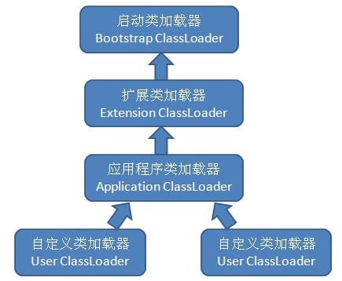

## JVM类加载器

Java虚拟机类加载过程是把Class类文件加载到内存，并对Class文件中的数据进行校验、转换解析和初始化，最终形成可以被虚拟机直接使用的java类型的过程。

在加载阶段，java虚拟机需要完成以下3件事：

	a.通过一个类的全限定名来获取定义此类的二进制字节流。
	b.将定义类的二进制字节流所代表的静态存储结构转换为方法区的运行时数据结构。
	c.在java堆中生成一个代表该类的java.lang.Class对象，作为方法区数据的访问入口。

Java虚拟机的类加载是通过类加载器实现的， Java中的类加载器体系结构如下：

## 类加载的加载的范围

### 1、BootStrap ClassLoader
BootStrap ClassLoader：启动类加载器

负责加载存放在`%JAVA_HOME%\lib`目录中的，或者通被`-Xbootclasspath`参数所指定的路径中的，并且被java虚拟机识别的(仅按照文件名识别，如rt.jar，其它名字不符合的类库，即使放在指定路径中也不会被加载)类库到虚拟机的内存中，启动类加载器无法被java程序直接引用。

### Extension ClassLoader
Extension ClassLoader：扩展类加载器

由sun.misc.Launcher$ExtClassLoader实现，负责加载`%JAVA_HOME%\lib\ext`目录中的，或者被`java.ext.dirs`系统变量所指定的路径中的所有类库，开发者可以直接使用扩展类加载器。

### Application ClassLoader
Application ClassLoader：应用程序类加载器

由sun.misc.Launcher$AppClassLoader实现，负责加载`用户类路径classpath上所指定的类库`，是类加载器ClassLoader中的getSystemClassLoader()方法的返回值，开发者可以直接使用应用程序类加载器，如果程序中没有自定义过类加载器，该加载器就是程序中默认的类加载器。

>>> 注意：上述三个JDK提供的类加载器虽然是父子类加载器关系，但是没有使用继承，而是使用了组合关系。

### 自定义类加载器：XXX ClassLoader / WebApplication ClassLoader
因为JVM自带的ClassLoader只是懂得从本地文件系统加载标准的java class文件，因此如果编写了自己的ClassLoader，便可以做到如下几点：

	1）在执行非置信代码之前，自动验证数字签名。
	2）动态地创建符合用户特定需要的定制化构建类。
	3）从特定的场所取得java class，例如数据库中和网络中。

事实上当使用Applet的时候，就用到了特定的ClassLoader，因为这时需要从网络上加载java class，并且要检查相关的安全信息，应用服务器也大都使用了自定义的ClassLoader技术。

