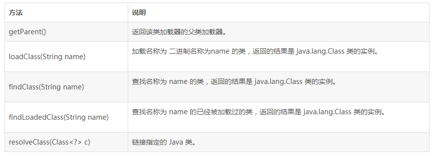
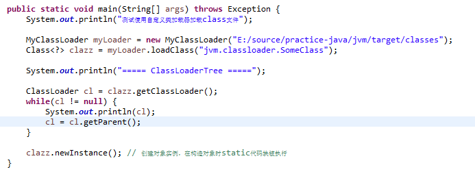
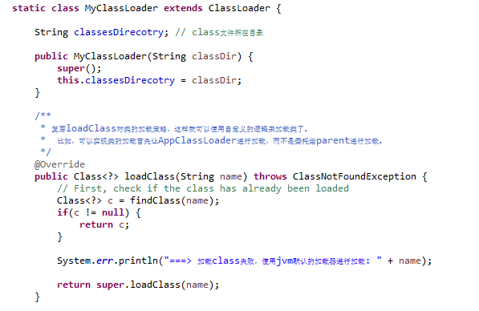
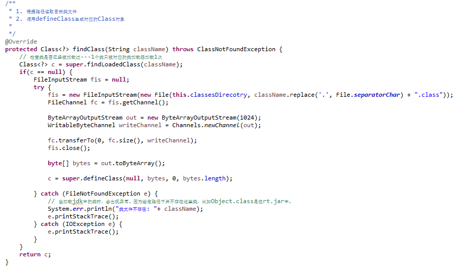
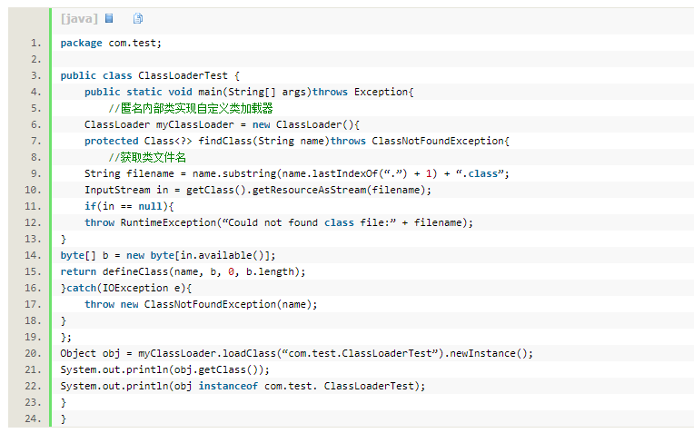

## 实现自定义类加载器

若要实现自定义类加载器，只需要继承java.lang.ClassLoader 类，并且重写其findClass()方法即可。

java.lang.ClassLoader 类的基本职责就是根据一个指定的类的名称，找到或者生成其对应的字节代码，然后从这些字节代码中定义出一个 Java 类，即 java.lang.Class 类的一个实例。

	除此之外，ClassLoader 还负责加载 Java 应用所需的资源，如图像文件和配置文件等，

ClassLoader 中与加载类相关的方法如下：

####注意：

在JDK1.2之前，类加载尚未引入双亲委派模式，因此实现自定义类加载器时常常重写loadClass方法，提供双亲委派逻辑，从JDK1.2之后，双亲委派模式已经被引入到类加载体系中，自定义类加载器时不需要在自己写双亲委派的逻辑，因此不鼓励重写loadClass方法，而推荐重写findClass方法。

#### 自定义类加载器-Demo
	loadClass() 
		-> findClass() // 使用自定义的类加载逻辑 
			-> findLoadedClass() // 如果类已经加载过，则直接返回
			-> doCustomLoadClass()	// 使用自定义的逻辑加载类 
			-> defineClass()     // 将加载到的二进制，生成为类的字节码Class对象
			-> return class // 直接返回class 
		-> super.loadClass() // 如果类没有被自定义加载器加载成功，则使用JVM类加载进行加载
	

---
#### JVM中类的唯一性问题
在Java中，任意一个类都需要由加载它的类加载器和这个类本身一同确定其在java虚拟机中的唯一性

即比较两个类是否相等，只有在这两个类是由同一个类加载器加载的前提之下才有意义，

否则，即使这两个类来源于同一个Class类文件，只要加载它的类加载器不相同，那么这两个类必定不相等(这里的相等包括代表类的Class对象的equals()方法、isAssignableFrom()方法、isInstance()方法和instanceof关键字的结果)。

例子代码如下：
	

输出结果如下：

	com.test.ClassLoaderTest
	false

之所以instanceof会返回false，是因为com.test.ClassLoaderTest类默认使用Application ClassLoader加载，而obj是通过自定义类加载器加载的，类加载不相同，因此不相等。