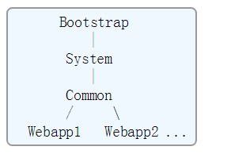

## Tomcat 中的 Class Loader

[参考文档1](https://tomcat.apache.org/tomcat-7.0-doc/class-loader-howto.html)

[参考文档2](https://www.mulesoft.com/tcat/tomcat-classpath#how-it-differs)

### Overview
In a Java environment, class loaders are arranged in a parent-child tree. 

Normally, when a class loader is asked to load a particular class or resource, it delegates the request to a parent class loader first, and then looks in its own repositories only if the parent class loader(s) cannot find the requested class or resource. 

Java的类加载机制采用“双亲委派”模式进行。

Note, that the model for web application class loaders differs slightly from this, as discussed below, but the main principles are the same.
When Tomcat is started, it creates a set of class loaders that are organized into the following parent-child relationships, where the parent class loader is above the child class loader:

对于Web应用程序的类加载器，采用的类加载机制与“双亲委派”模式基本相同，但有特殊的地方。

Tomcat的类加载器继承关系图：

---

## TOMCAT 的 Class Loader

Tomcat creates the following class loaders as it is initialized:

#### 1、Bootstrap ClassLoader — JVM虚拟机运行时所需要的核心jar包
	$JAVA_HOME/jre/lib/rt.jar	$JAVA_HOME/jre/lib/ext

This class loader contains the basic runtime classes provided by the Java Virtual Machine, plus any classes from JAR files present in the System Extensions directory ($JAVA_HOME/jre/lib/ext). 

#### 2、System ClassLoader —  Tomcat启动时的核心jar包
	$CATALINA_HOME/bin/bootstrap.jar 
Contains the main() method that is used to initialize the Tomcat server, and the class loader implementation classes it depends on.

	$CATALINA_BASE/bin/tomcat-juli.jar or $CATALINA_HOME/bin/tomcat-juli.jar 
Logging implementation classes. 

	$CATALINA_HOME/bin/commons-daemon.jar 
referenced from the manifest file of bootstrap.jar.

#### 3、Common ClassLoader — 加载Tomcat和web应用程序共享的jar包
This class loader contains additional classes that are made visible to both Tomcat internal classes and to all web applications.

	● unpacked classes and resources in $CATALINA_HOME/lib

  	● JAR files in $CATALINA_HOME/lib
	By default, this includes the following:
  		● annotations-api.jar — JavaEE annotations classes.
  		● catalina.jar — Implementation of the Catalina servlet container portion of Tomcat.
 		● catalina-ant.jar — Tomcat Catalina Ant tasks.
  		● catalina-ha.jar — High availability package.
  		● catalina-tribes.jar — Group communication package.
  		● ecj-*.jar — Eclipse JDT Java compiler.
  		● el-api.jar — EL 2.2 API.
  		● jasper.jar — Tomcat Jasper JSP Compiler and Runtime.
  		● jasper-el.jar — Tomcat Jasper EL implementation.
  		● jsp-api.jar — JSP 2.2 API.
  		● servlet-api.jar — Servlet 3.0 API.
  		● tomcat-api.jar — Several interfaces defined by Tomcat.
  		● tomcat-coyote.jar — Tomcat connectors and utility classes.
  		● tomcat-dbcp.jar — Database connection pool implementation based on package-renamed copy of Apache Commons Pool and Apache Commons DBCP.
  		● tomcat-i18n-**.jar — Optional JARs containing resource bundles for other languages. As default bundles are also included in each individual JAR, they can be safely removed if no internationalization of messages is needed.
  		● tomcat-jdbc.jar — An alternative database connection pool implementation, known as Tomcat JDBC pool. Seedocumentation for more details.
  		● tomcat-util.jar — Common classes used by various components of Apache Tomcat.
  		● tomcat7-websocket.jar — WebSocket 1.1 implementation
  		● websocket-api.jar — WebSocket 1.1 API

#### 4、Webapp ClassLoader — 每个Web应用程序独有的类和jar包
A class loader is created for each web application that is deployed in a single Tomcat instance. 

在一个单Tomcat实例中，为其中部署的每个web应用程序创建一个独立的类加载器。

All unpacked classes and resources in the `/WEB-INF/classes` directory of your web application, plus classes and resources in JAR files under the `/WEB-INF/lib` directory of your web application, are made visible to this web application, but not to other ones.

----

# 总结

As mentioned above, the web application class loader diverges from the default Java delegation model (in accordance with the recommendations in the Servlet Specification, version 2.4, section 9.7.2 Web Application Classloader). 

When a request to load a class from the web application's WebappX class loader is processed, this class loader will look in the local repositories first, instead of delegating before looking. 

####》》》 Tomcat 打破双亲委派模式的原因

为了保证让不同Web应用程序之间的类加载相互隔离，Tomcat对Web应用程序中的class不能按简单按“双亲委派”模式去加载类。

因为Tomcat中可以部署多个不同的Web应用，每个Web应用中包含的类文件可能同名，但是版本是不同的。要让每个Web应用的类都能按需加载，因此对Web下的class需要按特殊规则进行加载。

即，每个Web应用有自己的一个WebAppX类加载器，该类加载器负责加载所属Web应用下的类，对于一些特殊的类，比如JDK中的class，则仍然按“双亲委派”模式进行加载。

对于Tomcat而言，当需要加载Web应用程序下的某个类时，WebAppX class loader会先尝试自己去加载这个class文件，而不是委托给父加载去加载。

####》》》 Tomcat自定义类加载器的例外情况

There are exceptions，以下3种类不会将被WebAppX类加载器加载：

	1、Classes which are part of the JRE base classes cannot be overridden. 排除JRE核心类

	2、For some classes (such as the XML parser components in J2SE 1.4+), the Java endorsed feature can be used up to Java 8. 

	3、Last, any JAR file that contains Servlet API classes will be explicitly ignored by the classloader — Do not include such JARs in your web application. 忽略Servlet API相关的jar，tomcat已经自带了。

All other class loaders in Tomcat follow the usual delegation pattern.

Therefore, from the perspective of a web application, class or resource loading looks in the following repositories, in this order:

	● Bootstrap classes of your JVM
	● /WEB-INF/classes of your web application
	● /WEB-INF/lib/*.jar of your web application
	● System class loader classes (described above)
	● Common class loader classes (described above)

不过，也可以配置为委派模式，设置 

	<Loader delegate="true"/>

If the web application class loader is configured with <Loader delegate="true"/> then the order becomes:

	● Bootstrap classes of your JVM
	● System class loader classes (described above)
	● Common class loader classes (described above)
	● /WEB-INF/classes of your web application
	● /WEB-INF/lib/*.jar of your web application

