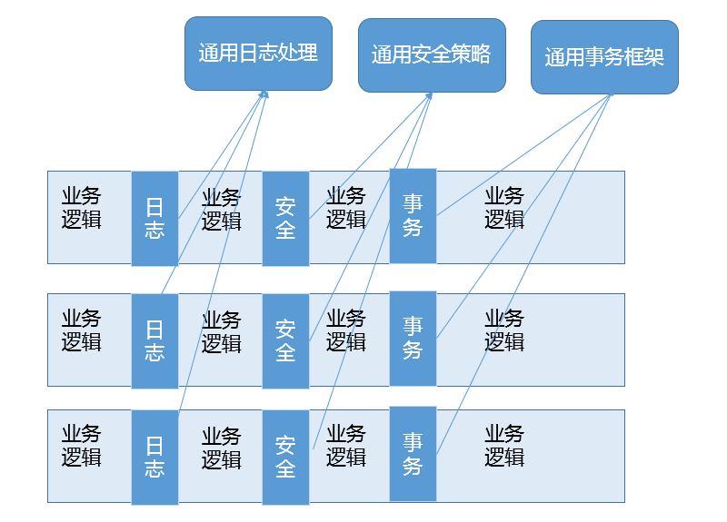

# Lesson6 | 谈谈 Java 反射机制，动态代理是基于什么原理？
	考察Java反射技术的应用，以及动态代理的应用实践
	
	> Java 是静态的强类型语言，但是因为提供了类似反射等机制，也具备了部分动态类型语言的能力。

## 反射、动态代理
	反射，它就像是一种魔法，引入运行时自省能力，赋予了 Java 语言令人意外的活力，
	通过运行时操作元数据或对象，Java 可以灵活地操作运行时才能确定的信息。
	反射机制是 Java 语言提供的一种基础功能，赋予程序在运行时自省（introspect，官方用语）的能力。
	通过反射我们可以直接操作类或者对象，比如获取某个对象的类定义，获取类声明的属性和方法，
	调用方法或者构造对象，甚至可以运行时修改类定义。
	
	而动态代理，则是延伸出来的一种广泛应用于产品开发中的技术，很多繁琐的重复编程，都可以被动态代理机制优雅地解决。
	动态代理是一种方便运行时动态构建代理、动态处理代理方法调用的机制，很多场景都是利用类似机制做到的，
	比如用来包装 RPC 调用、面向切面的编程（AOP）。

	实现动态代理的方式很多，
	比如 JDK 自身提供的动态代理，就是主要利用了上面提到的反射机制。
	比如利用更高性能的字节码操作机制，类似 ASM、cglib（基于 ASM）、Javassist 等。

---
## Java反射机制
	对于 Java 语言的反射机制本身，java.lang 或 java.lang.reflect 包下的相关抽象。

	Class、Field、Method、Constructor 等，这些完全就是我们去操作类和对象的元数据对应。

	---
	关于反射提供的 AccessibleObject.setAccessible​(boolean flag)。
	这里的所谓 accessible 可以理解成修饰成员的 public、protected、private，
	这意味着我们可以在运行时修改成员访问限制！

	setAccessible 的应用场景非常普遍，遍布我们的日常开发、测试、依赖注入等各种框架中。
	比如，在 O/R Mapping 框架中，我们为一个 Java 实体对象，
	运行时自动生成 setter、getter 的逻辑，这是加载或者持久化数据非常必要的，
	框架通常可以利用反射做这个事情，而不需要开发者手动写类似的重复代码。
	
	另一个典型场景就是绕过 API 访问控制。
	我们日常开发时可能被迫要调用内部 API 去做些事情，
	比如，自定义的高性能 NIO 框架（NETTY）需要显式地释放 DirectBuffer，使用反射绕开限制是一种常见办法。

---
## JDK 动态代理在设计和实现上与 cglib 等方式有什么不同？
我们在选型中，性能未必是唯一考量，可靠性、可维护性、编程工作量等往往是更主要的考虑因素，

毕竟标准类库和反射编程的门槛要低得多，代码量也是更加可控的，

如果我们比较下不同开源项目在动态代理开发上的投入，也能看到这一点。	
	
###### JDK Proxy 的优势（基于接口实现InvocationHandler）
	1、最小化依赖关系，减少依赖意味着简化开发和维护，JDK 本身的支持，可能比 cglib 更加可靠。
	2、平滑进行 JDK 版本升级，而字节码类库通常需要进行更新以保证在新版 Java 上能够使用。
	3、代码实现简单。
	
###### 基于类似 cglib 框架的优势（基于继承子类化）
	1、有的时候调用目标可能不便实现额外接口，从某种角度看，限定调用者实现接口是有些侵入性的实践，类似 cglib 动态代理就没有这种限制。
	2、只操作我们关心的类，而不必为其他相关类增加工作量。
	3、高性能。

---
## 动态代理的应用场景有哪些？（AOP 面向切面技术的应用场景）
	动态代理应用非常广泛，虽然最初多是因为 RPC 等使用进入我们视线，
	但是动态代理的使用场景远远不仅如此，它完美符合 Spring AOP 等切面编程。

	【RPC调用的封装】
	通过代理可以让调用者与实现者之间解耦。
	比如进行 RPC 调用，框架内部的寻址、序列化、反序列化等，对于调用者往往是没有太大意义的，通过代理，可以提供更加友善的界面。
	
	【AOP切面】
	简单来说它可以看作是对 OOP 的一个补充。

	因为 OOP 对于跨越不同对象或类的分散、纠缠逻辑表现力不够，
	比如在不同模块的特定阶段做一些事情:
		类似日志、用户鉴权、全局性异常处理、性能监控，甚至事务处理等，可以参考下面这张图。

	AOP 通过（动态）代理机制可以让开发者从这些繁琐事项中抽身出来，大幅度提高了代码的抽象程度和复用度。
	
	从逻辑上来说，我们在软件设计和实现中的类似代理，如 Facade、Observer 等很多设计目的，
	都可以通过动态代理优雅地实现。

