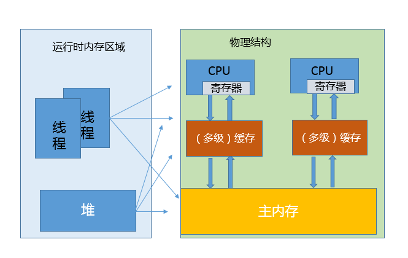

# Lesson23 | JMM 、 Happen-Before规则

## Java 内存模型 与 JVM 内存结构
	注意区分：JMM 是Java 内存模型，与JVM内存结构不是一个概念！

	JMM 特指JSR-133中所定义的JMM规范。
	
	JVM 内存结构，则是指的JVM内存区域中包含的新生代、老年代、永久代等。

## 简单理解JMM
	JMM 可以看作是深入理解 Java 并发编程、编译器和 JVM 内部机制的必要条件。
	
	JMM 使用内存屏障技术，解决了多核CPU场景下，多线程并发操作共享变量时的一致性问题。

---
## Java 内存模型中的 happen-before 是什么？
	Happen-before 关系，是 Java 内存模型中保证多线程操作可见性的机制，
	也是对早期语言规范中含糊的可见性概念的一个精确定义。

	它的具体表现形式，包括但远不止是我们直觉中的 synchronized、volatile、lock 操作顺序等方面，
	例如：
		1、线程内执行的每个操作，都保证 happen-before 后面的操作，
		这就保证了基本的程序顺序执行规则，这是开发者在书写程序时的基本约定。

		2、对于 volatile 变量，对它的写操作，保证 happen-before 在随后对该变量的读取操作。
		
		3、对于一个锁的解锁操作，保证 happen-before 于加锁操作。

		4、对象构建完成，保证 happen-before 于 finalizer 的开始动作。

		5、甚至是类似线程内部操作的完成，保证 happen-before 其他 Thread.join() 的线程等。

	这些 happen-before 关系是存在着传递性的，
	如果满足 a happen-before b 和 b happen-before c，那么 a happen-before c 也成立。	

## 为什么需要 JMM，它试图解决什么问题？
最初的 Java 语言规范仍然是存在着缺陷的，当时的目标是，

希望 Java 程序可以充分利用现代硬件的计算能力，同时保持“书写一次，到处执行”的能力。

但是，显然问题的复杂度被低估了，

随着 Java 被运行在越来越多的平台上，人们发现，过于泛泛的内存模型定义，存在很多模棱两可之处，

对 synchronized 或 volatile 等，类似指令重排序时的行为，并没有提供清晰规范。

	这里说的指令重排序，既可以是编译器优化行为，也可能是源自于现代处理器的乱序执行。

》》》
不能保证同一段程序在不同的处理器架构上表现一致，

例如有的处理器支持缓存一致性，有的不支持，各自都有自己的内存排序模型。

Java 迫切需要一个完善的 JMM，能够让普通 Java 开发者和编译器、JVM 工程师，能够清晰地达成共识。

JMM 为 Java 工程师隔离了不同处理器内存排序的区别，

这也是为什么通常不建议过早深入处理器体系结构，某种意义上来说，这样本就违背了 JMM 的初衷。

>换句话说，可以相对简单并准确地判断出，多线程程序什么样的执行序列是符合规范的。

	对于编译器、JVM 开发者，关注点可能是如何使用类似内存屏障（Memory-Barrier）之类技术，
	保证执行结果符合 JMM 的推断。
	
	对于 Java 应用开发者，则可能更加关注 volatile、synchronized 等语义，
	如何利用类似 happen-before 的规则，写出可靠的多线程应用。

JVM 内部的运行时数据区提供了数据存放的空间，但是真正程序执行，实际是要跑在具体的处理器内核上。

可以简单理解为，把本地变量等数据从内存加载到缓存、寄存器，然后运算结束写回主内存。

你可以从下面示意图，看这两种模型的对应。

	当多线程共享变量时，情况就复杂了。
	试想，如果处理器对某个共享变量进行了修改，可能只是体现在该内核的缓存里，这是个本地状态，
	而运行在其他内核上的线程，可能还是加载的旧状态，这很可能导致一致性的问题。

	从理论上来说，多线程共享引入了复杂的数据依赖性，不管编译器、处理器怎么做重排序，
	都必须尊重数据依赖性的要求，否则就打破了正确性！
	这就是 JMM 所要解决的问题。 
		--- 既保证多线程对共享变量的读写操作，又要保证数据一致性。

## JMM 是如何解决可见性等各种问题的？
	JMM 内部的实现通常是依赖于所谓的内存屏障，
	通过禁止某些重排序的方式，提供内存可见性保证，也就是实现了各种 happen-before 规则。
	与此同时，更多复杂度在于，需要尽量确保各种编译器、各种体系结构的处理器，都能够提供一致的行为。

## 类似 volatile，体现在具体用例中有什么效果？

对于一个 volatile 变量：

	对该变量的写操作之后，编译器会插入一个写屏障
	对该变量的读操作之前，编译器会插入一个读屏障

内存屏障能够在类似变量读、写操作之后，保证其他线程对 volatile 变量的修改对当前线程可见，

或者本地修改对其他线程提供可见性。

换句话说，线程写入，写屏障会通过类似强迫刷出处理器缓存的方式，让其他线程能够拿到最新数值。

也就是说 volatile 变量的可见性发生了增强，能够起到守护其上下文的作用。

	线程 A 对 volatile 变量的赋值，会强制将该变量自己和当时其他变量的状态都刷出缓存，为线程 B 提供可见性。
	当然，这也是以一定的性能开销作为代价的，但毕竟带来了更加简单的多线程行为。
	
	我们经常会说 volatile 比 synchronized 之类更加轻量，但轻量也仅仅是相对的，
	volatile 的读、写仍然要比普通的读写要开销更大，
	所以如果你是在性能高度敏感的场景，除非你确定需要它的语义，不然慎用。