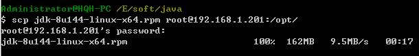
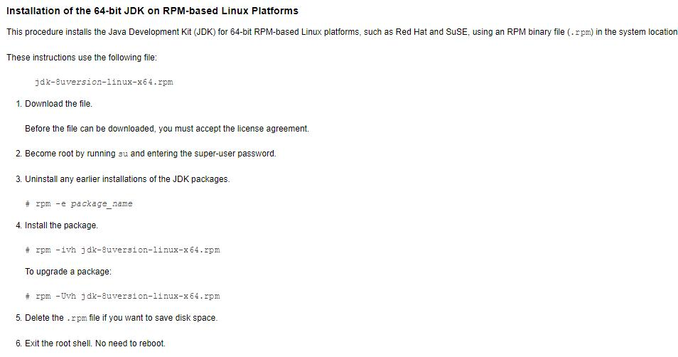
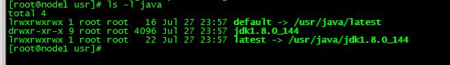
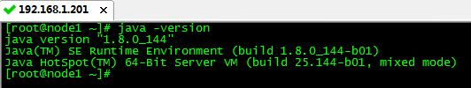

# JDK开发商：openjdk, sun jdk(oracle)

安装Oracle的JDK，推荐直接使用RPM包安装。
[Oracle官方下载地址](
http://www.oracle.com/technetwork/java/javase/downloads/jdk8-downloads-2133151.html)

### 1. 从window上下载，使用scp命令将windows上的JDK复制到centos上。

### 2. 登陆到linux，安装JDK。默认安装到 /usr目录。

### 3. 配置PATH环境变量

设置JAVA_HOME，并添加到PATH中

	[root@node1 ~]# vi /etc/profile.d/java.sh
	export JAVA_HOME="/usr/java/default"
	export PATH=$PATH:$JAVA_HOME/bin

重新读取环境变量

	[root@node1 ~]# . /etc/profile.d/java.sh 

### 4. 验证java是否安装成功

