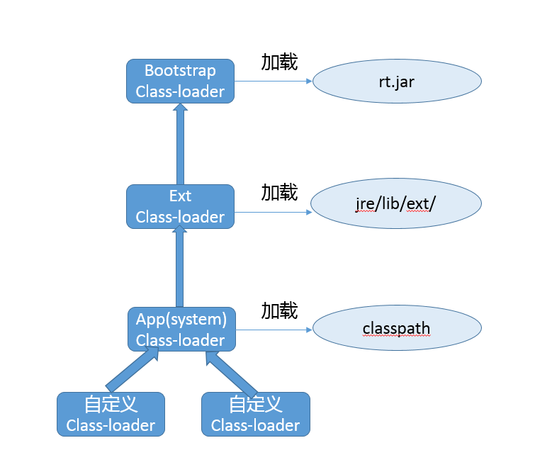

# Lesson 20 | 类加载流程、自定义类加载器

# [Java 虚拟机规范](https://docs.oracle.com/javase/specs/jvms/se8/html/jvms-5.html)

## 类加载流程
一般来说，我们把 Java 的类加载过程分为三个主要步骤：加载、链接、初始化

#### 1、加载
	首先是加载阶段（Loading），它是 Java 将字节码数据从不同的数据源读取到 JVM 中，
	并映射为 JVM 认可的数据结构（Class 对象），
	这里的数据源可能是各种各样的形态，如 jar 文件、class 文件，甚至是网络数据源等；
	如果输入数据不是 ClassFile 的结构，则会抛出 ClassFormatError。
	
	加载阶段是用户参与的阶段，我们可以自定义类加载器，去实现自己的类加载过程。

#### 2、链接
	第二阶段是链接（Linking），这是核心的步骤，
	简单说是把原始的类定义信息平滑地转化入 JVM 运行的过程中。
	这里可进一步细分为三个步骤：
		【验证（Verification）】
		这是虚拟机安全的重要保障，JVM 需要核验字节信息是符合 Java 虚拟机规范的，否则就被认为是 VerifyError，
		这样就防止了恶意信息或者不合规的信息危害 JVM 的运行，验证阶段有可能触发更多 class 的加载。

		【准备（Preparation）】
		创建类或接口中的静态变量，并初始化静态变量的初始值。
		但这里的“初始化”和下面的显式初始化阶段是有区别的，侧重点在于分配所需要的内存空间，不会去执行更进一步的 JVM 指令。

		【解析（Resolution）】
		在这一步会将常量池中的符号引用（symbolic reference）替换为直接引用。
		在Java 虚拟机规范中，详细介绍了类、接口、方法和字段等各个方面的解析。
	

#### 3、初始化
	最后是初始化阶段（initialization），这一步真正去执行类初始化的代码逻辑，
	包括静态字段赋值的动作，以及执行类定义中的静态初始化块内的逻辑，
	编译器在编译阶段就会把这部分逻辑整理好，
	父类型的初始化逻辑优先于当前类型的逻辑。

---
## 类加载器
首先，从架构角度，一起来看看 Java 8 以前各种类加载器的结构，下面是三种 Oracle JDK 内建的类加载器。

	【启动类加载器（Bootstrap Class-Loader）】
	加载 jre/lib 下面的 jar 文件，如 rt.jar。
	它是个超级公民，即使是在开启了 Security Manager 的时候，JDK 仍赋予了它加载的程序 AllPermission。

		# 指定新的 bootclasspath，替换 java.* 包的内部实现
		java -Xbootclasspath:<your_boot_classpath> your_App
		
		# a 意味着 append，将指定目录添加到 bootclasspath 后面
		java -Xbootclasspath/a:<your_dir> your_App
		
		# p 意味着 prepend，将指定目录添加到 bootclasspath 前面
		java -Xbootclasspath/p:<your_dir> your_App

	【扩展类加载器（Extension or Ext Class-Loader）】
	负责加载我们放到 jre/lib/ext/ 目录下面的 jar 包，这就是所谓的 extension 机制。
	该目录也可以通过设置 “java.ext.dirs”来覆盖。
	
	》》》 注意：如果想追加自己的目录到扩展类加载器，那么需要把原来的目录也一起设置到路径中。
		java -Djava.ext.dirs=your_ext_dir:original_ext_dir HelloWorld

	【应用类加载器（Application or App Class-Loader）】
	就是加载我们最熟悉的 classpath 的内容。
	这里有一个容易混淆的概念，系统（System）类加载器，通常来说，其默认就是 JDK 内建的应用类加载器，
	但是它同样是可能修改的，比如使用自定义类加载作为应用类加载器：
		java -Djava.system.class.loader=com.yourcorp.YourClassLoader HelloWorld

	如果我们指定了这个参数，JDK 内建的应用类加载器就会成为定制加载器的父亲，
	》》》 这种方式通常用在类似需要改变双亲委派模式的场景。

### 类加载器的三个基本特征
	【双亲委派模型】
	但不是所有类加载都遵守这个模型，有的时候，启动类加载器所加载的类型，是可能要加载用户代码的，
	比如 JDK 内部的 ServiceProvider/ServiceLoader机制，用户可以在标准 API 框架上，提供自己的实现，JDK 也需要提供些默认的参考实现。 
	例如，Java 中 JNDI、JDBC、文件系统、Cipher 等很多方面，都是利用的这种机制，
	这种情况就不会用双亲委派模型去加载，而是利用所谓的 “上下文加载器”。
	
	【可见性】
	子类加载器可以访问父加载器加载的类型，但是反过来是不允许的，
	不然，因为缺少必要的隔离，我们就没有办法利用类加载器去实现容器的逻辑。
	
	【单一性】
	由于父加载器的类型对于子加载器是可见的，所以父加载器中加载过的类型，就不会在子加载器中重复加载。
	但是注意，类加载器“邻居”间（同一层级的类加载器），同一类型仍然可以被加载多次，因为互相并不可见。
	比如，Tomcat下不同web应用的加载器，它们各自所加载的类是相互隔离不可见的。

#### 简单理解类加载器
	通过指定名称，找到其二进制实现，这里往往就是自定义类加载器会“定制”的部分，
	例如，在特定数据源根据名字获取字节码，或者修改或生成字节码。

	然后，创建 Class 对象，并完成类加载过程。
	二进制信息到 Class 对象的转换，通常就依赖defineClass，我们无需自己实现，它是 final 方法。
	有了 Class 对象，后续完成加载过程就顺理成章了。

#[defineClass](http://www.baeldung.com/java-classloaders)

##### 双亲委派模型
	简单说就是当类加载器（Class-Loader）试图加载某个类型的时候，
	除非父加载器找不到相应类型，否则尽量将这个任务代理给当前加载器的父加载器去做。
	使用委派模型的目的是避免重复加载 Java 类型。

##### 自定义类加载器的场景
	1、线程间实现类似进程内隔离，类加载器实际上用作不同的命名空间，以提供类似容器、模块化的效果。
	例如，两个模块依赖于某个类库的不同版本，如果分别被不同的容器加载，就可以互不干扰。
	这个方面的集大成者是Java EE、OSGI、JPMS等框架。
	
	2、应用需要从不同的数据源获取类定义信息，例如网络数据源，而不是本地文件系统。

	3、或者是需要自己操纵字节码，动态修改或者生成类型。

#[Java EE](http://www.oracle.com/technetwork/java/javaee/overview/index.html)
#[OSGI](https://en.wikipedia.org/wiki/OSGi)
#[JPMS](https://en.wikipedia.org/wiki/Java_Platform_Module_System)

---
## 什么是 jar hell？ 如何解决？

jar hell 指的是相同类名的class文件，出现在不同的jar包中。

	解决办法：
	1、通过依赖管理工具，比如Maven，手动排除掉冲突的jar；
	2、通过程序获取冲突的class文件所在的jar
		try {
			ClassLoader classLoader = Thread.currentThread().getContextClassLoader();
			String resourceName = "net/sf/cglib/proxy/MethodInterceptor.class";
			Enumeration<URL> urls = classLoader.getResources(resourceName);
			while(urls.hasMoreElements()){
				System.out.println(urls.nextElement());
			}
		} catch (IOException e) {
			e.printStackTrace();
		}
	3、自定义类加载，指定加载正确的jar包。

## Tomcat 的类加载为什么要打破双亲委派？
	Everything about Apache Tomcat aims to be as self-contained, intuitive, 
	and automatic as possible, in an effort to standardize the configuration and deployment of web applications for efficient administration, 
	while limiting access to different libraries for security and namespace reasons. 

	This is why rather than using the Java "classpath" environment variable,
	which is the traditional place to declare dependency repositories, 
	Tomcat's start scripts ignore this variable and generate their own classpaths when they create Tomcat's "system" classloader.
	
	In other words, if you've been going mad trying to declare additional repositories in your system's environment variables, 
	the reason you've been frustrated over and over is that Tomcat has been writing over your work every time it boots.
	
	To understand how Tomcat resolves classpath, take a look at this outline of the Tomcat 6 startup process:
	
	The JVM bootstrap loader loads the core Java libraries. 
	Incidentally, this is the one place where environment variables do matter, 
	as the JVM locates the core libraries using the JAVA_HOME variable.
	
	Startup.sh, calling Catalina.sh with the "start" parameter, overwrites the system classpath and loads bootstrap.jar and tomcat-juli.jar. 
	These resources are only visible to Tomcat.

	Class loaders are created for each deployed Context, 
	which load all classes and JAR files contained in each web application's WEB-INF/classes and WEB-INF/lib, respectively and in that order. 
	These resources are only visible to the web application that loads them.
	
	The Common class loader loads all classes and JAR files contained in $CATALINA_HOME/lib. 
	These resources are visible to all applications and to Tomcat.
 
	There you have it. 
	Rather than resolving one classpath configured in one attribute in the standard location for a Java application, 
	Tomcat resolves multiple classpaths configured using 4 or more attributes, 
	only one of which is configured in the standard location.
	

## 自定义类加载器
由于历史原因，系统采用了很早期的poi，而最新的poi和之前版本并不兼容,现在要系统要增加一个新功能，需要引入最新的jar文件,在不影响已有使用的基础上,我们如何处理该问题?
	
	思路是写一个类加载器，动态的加载所需的jar文件到一个单独的命名空间,
	由于jvm默认的类加载是采用父委托机制的，
	但在这里，类加载器的实现思路和一些web 容器的类加载机制是一致的(如tomcat jetty等) ，
	即优先加载自己指定路径下的jar文件，如果加载不到所需的类文件则委托给父加载器，
	所以我们需重写ClassLoader的loadClass方法。
	有一点比较重要,即默认java类所依赖的类是采用和该类相同的类加载器加载的。

#
	public class ParentLastClassLoader extends ClassLoader{
	   private String[] jarFiles; //jar文件路径
	   
	   private Hashtable classes = new Hashtable(); //将定义的类缓存在hashtable里面
	 
	   public ParentLastClassLoader(ClassLoader parent, String[] paths)
	   {
	       super(parent);
	       this.jarFiles = paths;
	   }
	 
	   @Override
	   public Class<?> findClass(String name) throws ClassNotFoundException
	   {
	       throw new ClassNotFoundException();
	   }
	 
	   @Override
	   protected synchronized Class<?> loadClass(String className, boolean resolve) throws ClassNotFoundException
	   {
	       try
	       {
	           byte classByte[];
	           Class result = null;
	           //先从缓存中查看是否已经加载该类
	           result = (Class) classes.get(className);
	           if (result != null) {
	               return result;
	           }
	          //如果没找到该类,则直接从jar文件里面加载
	           for(String jarFile: jarFiles){
	               try {
	                   JarFile jar = new JarFile(jarFile);
	                   JarEntry entry = jar.getJarEntry(className.replace(".","/") + ".class");
	                   InputStream is = jar.getInputStream(entry);
	                   ByteArrayOutputStream byteStream = new ByteArrayOutputStream();
	                   int nextValue = is.read();
	                   while (-1 != nextValue) {
	                       byteStream.write(nextValue);
	                       nextValue = is.read();
	                   }
	                   classByte = byteStream.toByteArray();
	                   if(classes.get(className) == null){
	                   result = defineClass(className, classByte, 0, classByte.length, null);
	                   classes.put(className, result);
	                   }
	               } catch (Exception e) {
	                   continue;
	               }
	           }
	           result = (Class) classes.get(className);
	           if (result != null) {
	               return result;
	           }
	           else{
	               throw new ClassNotFoundException("Not found "+ className);
	           }
	       }
	       catch( ClassNotFoundException e ){
	           return super.loadClass(className, resolve);
	       }
	   }
	}

---
## 知识扩展

#### 怎样优化类加载慢的问题？
由于字节码是平台无关抽象，而不是机器码，所以 Java 需要类加载和解释、编译，这些都导致 Java 启动变慢。

有没有什么通用办法，不需要代码和其他工作量，就可以降低类加载的开销呢？

	1、AOT技术，相当于直接编译成机器码，降低的其实主要是解释和编译开销。
	但是其目前还是个试验特性，支持的平台也有限，比如，JDK 9 仅支持 Linux x64。

	2、AppCDS（Application Class-Data Sharing），CDS 在 Java 5 中被引进，
	但仅限于 Bootstrap Class-loader，在 8u40 中实现了 AppCDS，支持其他的类加载器，
	在目前 2018 年初发布的 JDK 10 中已经开源。
