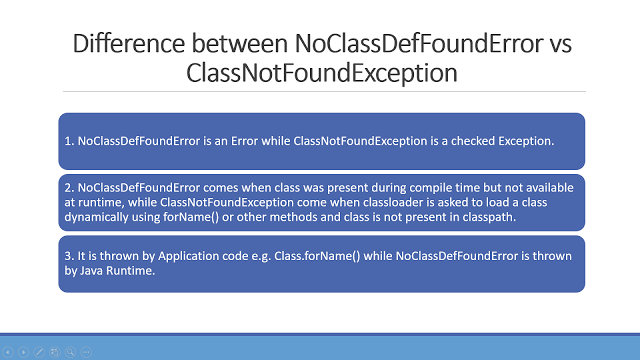
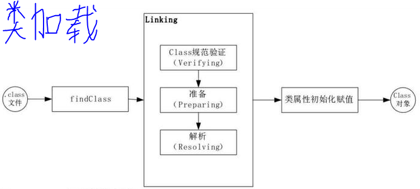

# Lession2 | Exception和Error有什么区别？
	考察Java对异常的处理机制
	1、异常的分类：Throwable、Error、Exception、RuntimeException
	2、处理异常的正确姿势

##### 异常处理机制的重要性
	随着编程语言和软件的诞生，异常情况就如影随形地纠缠着我们，只有正确处理好意外情况，才能保证程序的可靠性。

	Java 语言在设计之初就提供了相对完善的异常处理机制，因为这种机制大大降低了编写和维护可靠程序的门槛。
	如今，异常处理机制已经成为现代编程语言的标配。

##### 问：请对比 Exception 和 Error，另外，运行时异常与一般异常有什么区别？
	Exception 和 Error 都是继承了 Throwable 类，
	在 Java 中只有 Throwable 类型的实例才可以被抛出（throw）或者捕获（catch），它是异常处理机制的基本组成类型。

	Exception 和 Error 体现了 Java 平台设计者对不同异常情况的分类：
	
	> Error 是指在正常情况下，不大可能出现的情况，绝大部分的 Error 都会导致程序（比如 JVM 自身）处于非正常的、不可恢复状态。
	既然是非正常情况，所以不便于也不需要捕获，常见的比如 OutOfMemoryError 之类，都是 Error 的子类。
	
	> Exception 是程序正常运行中，可以预料的意外情况，可能并且应该被捕获，进行相应处理。
	Exception 又分为可检查（checked）异常和（unchecked）异常，
	可检查异常在源代码里必须显式地进行捕获处理，这是编译期检查的一部分。
	
	>RuntimeException不检查异常就是所谓的运行时异常，类似 NullPointerException、ArrayIndexOutOfBoundsException 之类，
	通常是可以编码避免的逻辑错误，具体根据需要来判断是否需要捕获，并不会在编译期强制要求。
	
---
##### 问：你了解哪些 Error、Exception 或者 RuntimeException？
	

---
##### 问：NoClassDefFoundError 和 ClassNotFoundException 有什么区别？

	> ClassNotFoundException extends ReflectiveOperationException 
		ReflectiveOperationException extends Exception 	
		
		运行时反射发生，是CheckedException 必须使用try catch捕获，或者抛出

		try {
			Class.forName("com.abc.NotExist");
		} catch (ClassNotFoundException e) {
			e.printStackTrace();
		}
	
	>>>>>>>>>>>>>>>>>>>

	> NoClassDefFoundError extends LinkageError
		LinkageError extends Error
		
	NoClassDefFoundError是Error，是unchecked，因此不需要使用try-catch捕获异常
	NoClassDefFoundError是链接错误，发生在链接阶段
	当解析引用的时候找不到对应的类，就会抛出java.lang.NoClassDefFoundError；

##### Java 的异常处理机制对性能的影响
	Java 的异常处理机制，这里有两个可能会相对昂贵的地方：

	1、try-catch 代码段会产生额外的性能开销，它往往会影响 JVM 对代码进行优化，
	所以建议仅捕获有必要的代码段，尽量不要一个大的 try 包住整段的代码；
	与此同时，利用异常控制代码流程，也不是一个好主意，远比我们通常意义上的条件语句（if/else、switch）要低效。
	
	2、Java 每实例化一个 Exception，都会对当时的栈进行快照，这是一个相对比较重的操作。
	如果发生得非常频繁，这个开销可就不能被忽略了。

##### 处理异常的最佳实践
	1、除非必要，否则不要捕获Throwable、Error类型的异常，不可恢复异常应交由JVM决定如何处理；
	2、尽量不要捕获类似 Exception 这样的通用异常，而是应该捕获特定异常；
	3、不要生吞异常，否则就是掩盖问题，会大大加大诊断问题的难度；
	4、让RuntimeException扩散到上层，在业务层面进行处理；
	5、发生异常时，一定要记录到日志文件中，最好把发生异常时的上下文记录下来；

##### Throw early, catch late 原则
	在发现问题的时候，第一时间抛出，能够更加清晰地反映问题。
	

> Throw early
> 
	public void readPreferences(String filename) {
	    Objects. requireNonNull(filename); // 尽早抛出异常
	    //...perform other operations... 
	    InputStream in = new FileInputStream(filename);
	     //...read the preferences file...
	}

> catch late
> 
	至于“catch late”，其实是我们经常苦恼的问题，捕获异常后，需要怎么处理呢？
	最差的处理方式，就是我前面提到的“生吞异常”，本质上其实是掩盖问题。
	如果实在不知道如何处理，可以选择保留原有异常的 cause 信息，直接再抛出或者构建新的异常抛出去。
	在更高层面，因为有了清晰的（业务）逻辑，往往会更清楚合适的处理方式是什么。

##### 异常日志记录的注意事项
	在保证诊断信息足够的同时，也要考虑避免包含敏感信息，因为那样可能导致潜在的安全问题。
	如果我们看 Java 的标准类库，你可能注意到类似 java.net.ConnectException，
	出错信息是类似“ Connection refused (Connection refused)”，
	而不包含具体的机器名、IP、端口等，一个重要考量就是信息安全。
	类似的情况在日志中也有，比如，用户数据一般是不可以输出到日志里面的。

##### CheckedException有什么缺点？
	业界有一种争论（甚至可以算是某种程度的共识）
	Java 语言的 Checked Exception 也许是个设计错误，反对者列举了几点：

	1、Checked Exception 的假设是我们捕获了异常，然后恢复程序。
	但是，其实我们大多数情况下，根本就不可能恢复。Checked Exception 的使用，已经大大偏离了最初的设计目的。

	2、Checked Exception 不兼容 functional 编程，如果你写过 Lambda/Stream 代码，相信深有体会。

##### 不同的编程范式下的异常处理
	对于异常处理编程，不同的编程范式也会影响到异常处理策略，
	比如，现在非常火热的反应式编程（Reactive Stream），
	因为其本身是异步、基于事件机制的，所以出现异常情况，决不能简单抛出去；
	另外，由于代码堆栈不再是同步调用那种垂直的结构，这里的异常处理和日志需要更加小心，
	我们看到的往往是特定 executor 的堆栈，而不是业务方法调用关系。
	对于这种情况，你有什么好的办法吗？
