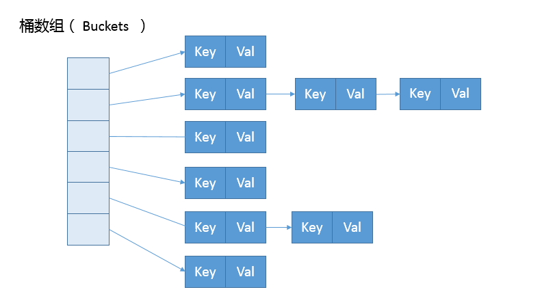

# Lesson9 | 对比 Hashtable、HashMap、TreeMap 有什么不同？

---
## 谈谈对HashMap的理解
	HashMap使用了数组和链表两种基本数据结构，结合两者实现了对key-value键值对的存储。
	数组结构的优点：查询、修改元素速度快；
	链表结构的优点：增、删元素速度快；
	HashMap将两种数据结构结合起来，发挥了两者的优势，是一种非常值得学习的设计！

## hashCode 和 equals 的约定 
	HashMap 的性能表现非常依赖于哈希码的有效性
	请务必掌握 hashCode 和 equals 的一些基本约定：
		1、equals 相等，hashCode 一定要相等。
		2、重写了 hashCode 也要重写 equals。
		3、hashCode 需要保持一致性，状态改变返回的哈希值仍然要一致。
		4、equals 的对称、传递等特性。

## 比较 Hashtable、HashMap、TreeMap
	Hashtable、HashMap、TreeMap 都是最常见的一些 Map 实现，是以键值对的形式存储和操作数据的容器类型。

	> Hashtable 是早期 Java 类库提供的一个哈希表实现，本身是同步的，不支持 null 键和值，
	由于同步导致的性能开销，所以已经很少被推荐使用。

	> HashMap 是应用更加广泛的哈希表实现，行为上大致上与 HashTable 一致，
	主要区别在于 HashMap 不是同步的，支持 null 键和值等。
	通常情况下，HashMap 进行 put 或者 get 操作，可以达到常数时间的性能，
	所以它是绝大部分利用键值对存取场景的首选.

	> TreeMap 则是基于红黑树的一种提供顺序访问的 Map，和 HashMap 不同，
	它的 get、put、remove 之类操作都是 O（log(n)）的时间复杂度，
	具体顺序可以由指定的 Comparator 来决定，或者根据键的自然顺序来判断。
	

## 有序Map的比较：LinkedHashMap、TreeMap
	LinkedHashMap 通常提供的是遍历顺序符合插入顺序，它的实现是通过为条目（键值对）维护一个双向链表。
	注意，通过特定构造函数，我们可以创建反映访问顺序的实例，所谓的 put、get、compute 等，都算作“访问”。
	
	对于 TreeMap，它的整体顺序是由键的顺序关系决定的，通过 Comparator 或 Comparable（自然顺序）来决定。
	TreeMap中compareTo 的返回值需要和 equals 一致，也就是如果equals，则compareTo应该返回0。

## Map整体结构

## HashMap源码分析
	
#### HashMap 内部实现基本点分析。
	首先，我们来一起看看 HashMap 内部的结构，
	它可以看作是数组（Node[] table）和链表结合组成的复合结构，
	数组被分为一个个桶（bucket），通过哈希值决定了键值对在这个数组的寻址；
	哈希值相同的键值对，则以链表形式存储，你可以参考下面的示意图。
	这里需要注意的是，如果链表大小超过阈值（TREEIFY_THRESHOLD, 8），图中的链表就会被改造为树形结构。

	

	从非拷贝构造函数的实现来看，这个表格（数组）似乎并没有在最初就初始化好，仅仅设置了一些初始值而已。

	public HashMap(int initialCapacity, float loadFactor){  
	    // ... 
	    this.loadFactor = loadFactor;
	    this.threshold = tableSizeFor(initialCapacity);
	}

	所以，我们深刻怀疑，HashMap 也许是按照 lazy-load 原则，
	在首次使用（put第一个元素）时被初始化（拷贝构造函数除外）。
	既然如此，我们去看看 put 方法实现，似乎只有一个 putVal 的调用：
		public V put(K key, V value) {
		    return putVal(hash(key), key, value, false, true);
		}

	看来主要的密码似乎藏在 putVal 里面，到底有什么秘密呢？
	为了节省空间，我这里只截取了 putVal 比较关键的几部分。
	final V putVal(int hash, K key, V value, boolean onlyIfAbent,
               boolean evit) {
	    Nod<K,V>[] tab; Node<K,V> p; int i;	    
		if ((tab = table) == null || (n = tab.length) = 0) // 数组为空，初始化
	        n = (tab = resize()).legth; 
	    if ((p = tab[i = (n - 1) & hash]) == ull) // 该bucket尚无元素，则直接存入
	        tab[i] = newNode(hash, key, value, nll); 
	    else {
	        // ...
	        if (binCount >= TREEIFY_THRESHOLD - 1) // 当链表长度超过树化阈值，进行树化 
	           treeifyBin(tab, hash);
	        //  ... 
	     }
	}

#
	解析put的过程：
	1、如果表格是 null，resize 方法会负责初始化它，这从 tab = resize() 可以看出。

	2、resize 方法兼顾两个职责，创建初始存储表格，或者在容量不满足需求的时候，进行扩容（resize）。

	3、在放置新的键值对的过程中，如果发生下面条件，就会发生扩容。
		if (++size > threshold)
    		resize();

	4、具体键值对在哈希表中的位置（数组 index）取决于下面的位运算：
		i = (n - 1) & hash  // n 为数组resize()返回的容量大小
		
		注：
		(n-1)&hash 与 hash % n  的结果是相同的！但是，位运算速度更快！
		以默认容量16为例，16-1=15=01111，与hashcode进行&运算时，结果完全由hash值决定
		因此，在达到相同计算结果的前提下，还能提高运算速度！		

	5、仔细观察哈希值的源头，我们会发现，它并不是 key 本身的 hashCode，	
	而是来自于 HashMap 内部的另外一个 hash 方法。
	>>> 注意，为什么这里需要将高位数据移位到低位进行异或运算呢？
		这是因为有些数据计算出的哈希值差异主要在高位，
		而 HashMap 里的哈希寻址是忽略“容量以上的高位”的(最大32位，高位占16位，所以右移16位)，
		那么让高位也参与到hash值的计算中，这种处理就可以有效避免类似情况下的哈希碰撞！！！
		
		static final int hash(Object key) {
	        int h;
	        return (key == null) ? 0 : (h = key.hashCode()) ^ (h >>> 16);
	    }
		

#### 容量（capcity）和负载系数（load factor）。
	初始化HashMap时，底层Node[]需要指定数组的初始大小。
	当数组被占用到一定程度时，需要提前对数组进行扩容，扩容的时机就是根据loadFactor计算的。
	比如，默认的容量是16个bucket，扩容因子为0.75
	当bucket占用了16*0.75=12时，Node[]就会扩展一倍，即16*2=32。

#### 为什么HashMap需要在乎容量和负载因子呢？
	这是因为容量和负载系数决定了可用的桶的数量，
	空桶太多会浪费空间，如果使用的太满则会严重影响操作的性能。
	极端情况下，假设只有一个桶，那么它就退化成了链表，完全不能提供所谓常数时间存的性能。

#### 为什么HashMap的容量一定要设计为2的次幂大小？
	这是因为，HashMap为了最大限度的降低hash冲突。
	HashMap性能好坏在很大程度上取决于hash值的散列程度，散列程度越高，性能越好。
	散列程度高，存取元素近似对数组元素进行操作，
	散列程度低，则元素集中在某些bucket上形成链表，查询操作效率低
	
	HashMap底层计算hashcode值，是通过(n-1)&hash值计算得到的，当
	当容量为2的次幂方时，可以实现最好的散列程度。
	具体原因，参考put源码分析中的注释。

	而且，当构造hashmap时，若指定的容量不是2的次幂方时，tableSizeFor()会强制将容量修正为2的次幂方。

#### 负载因子设置多大合适？
	如果没有特别需求，不要轻易进行更改，因为 JDK 自身的默认负载因子是非常符合通用场景的需求的。

	如果确实需要调整，建议不要设置超过 0.75 的数值，设置太大会显著增加冲突概率，降低 HashMap 的性能。

	如果使用太小的负载因子，可能会导致更加频繁的扩容，增加无谓的开销，本身访问性能也会受影响。	

#### resize源码分析
	final Node<K,V>[] resize() {
	    // ...
	    else if ((newCap = oldCap << 1) < MAXIMUM_CAPACIY &&
	                oldCap >= DEFAULT_INITIAL_CAPAITY)
	        newThr = oldThr << 1; // double there
	       // ... 
	    else if (oldThr > 0) // initial capacity was placed in threshold
	        newCap = oldThr;
	    else {  
	        // zero initial threshold signifies using defaultsfults
	        newCap = DEFAULT_INITIAL_CAPAITY;
	        newThr = (int)(DEFAULT_LOAD_ATOR* DEFAULT_INITIAL_CAPACITY；
	    }
	    if (newThr ==0) {
	        float ft = (float)newCap * loadFator;
	        newThr = (newCap < MAXIMUM_CAPACITY && ft < (float)MAXIMUM_CAPACITY ?(int)ft : Integer.MAX_VALUE);
	    }
	    threshold = neThr;
	    Node<K,V>[] newTab = (Node<K,V>[])new Node[newap];
	    table = n；
	    // 移动到新的数组结构
	  }

	依据 resize 源码，不考虑极端情况（容量理论最大极限由 MAXIMUM_CAPACITY 指定，数值为 1<<30，也就是 2 的 30 次方），我们可以归纳为：
	1、门限值等于（负载因子）*（容量），如果构建 HashMap 的时候没有指定它们，那么就是依据相应的默认常量值。
	2、门限通常是以倍数进行调整 （newThr = oldThr << 1），根据 putVal 中的逻辑，当元素个数超过门限大小时，则调整 Map 大小。
	3、扩容后，需要将老的数组中的元素重新放置到新的数组，这是扩容的一个主要开销来源。
	

#### 树化（TreeNode） 
	树化改造，对应逻辑主要在 putVal 和 treeifyBin 中。

#
	final void treeifyBin(Node<K,V>[] tab, int hash) {
	    int n, index; Node<K,V> e;
	    if (tab == null || (n = tab.length) < MIN_TREEIFY_CAPACITY)
	        resize();
	    else if ((e = tab[index = (n - 1) & hash]) != null) {
	        // 树化改造逻辑
	    }
	}
	

	上面是精简过的 treeifyBin 示意，综合这两个方法，树化改造的逻辑就非常清晰了，
	MIN_TREEIFY_CAPACITY 默认值为64。
	可以理解为，当 链表结构 的数量大于 TREEIFY_THRESHOLD 时：
		如果table容量小于 MIN_TREEIFY_CAPACITY，只会进行简单的扩容。
		如果table容量大于 MIN_TREEIFY_CAPACITY ，则会进行树化改造。
	

--- 
## 知识扩展

##### HashMap 在并发环境可能出现无限循环占用 CPU、size 不准确等诡异的问题。
	http://mailinator.blogspot.com/2009/06/beautiful-race-condition.html
#
	多线程并发环境下使用HashMap，在resize阶段可能引发无限循环的问题！

	说明一点：HashMap不是线程安全的，
	在多线程下引发无限循环的问题本质上是犯了在多线程环境下，使用了非线程安全的容器导致的。
	这个问题，其实与HashMap的设计是无关，因为HashMap已经声明了自己不是线程安全的！

##  Java 8 里，HashMap 本身发生了非常大的变化

---
##### Java8中对HashMap性能的提升 
	https://www.nagarro.com/en/blog/post/24/performance-improvement-for-hashmap-in-java-8

##### Java8为什么 要对 HashMap 进行树化（红黑树-平衡二叉树）呢？
	本质上这是个安全问题。
	因为在元素放置过程中，如果一个对象哈希冲突，都被放置到同一个桶里，则会形成一个链表，
	我们知道链表查询是线性的，会严重影响存取的性能。

	而在现实世界，构造哈希冲突的数据并不是非常复杂的事情，
	恶意代码就可以利用这些数据大量与服务器端交互，导致服务器端 CPU 大量占用，
	这就构成了哈希碰撞拒绝服务攻击，国内一线互联网公司就发生过类似攻击事件。

#
 	Java 对HashMap的改进，引入红黑树代替链表（链表长度超过8个节点时）
	Did you know java 8 HashMap automatically converts to use a red black tree (like TreeMap) when the hash bucket gets over used？

	> Its primary purpose is actually to protect against a specific kind of denial-of-service attack called HashDOS, 
	where inputs are deliberately designed to collide. 
	This is quite a frequent vulnerability, often exposed through things like JSON decoders.

	它的主要目的实际上是防止被称为HashDOS的特定类型的拒绝服务攻击
	比如，将数据故意设计为hashcode冲突的，这样将导致链表无限增涨。
	这是一个相当常见的漏洞，通常通过诸如JSON解码器之类的东西暴露出来。

##### 红黑树（平衡二叉树）
	TreeMap底层使用红黑树来存储数据。
	Java8中，当同一个bucket下的链表长度超过一定阈值后，会自动转变为红黑树。
	红黑树的时间复杂度是文档的O(logN)，因为它是平衡树。

##### HashDos 攻击

	http://www.shilpikhariwal.com/2012/03/hashdos-dos-using-hash-collision.html

#
	HashDoS is a term coined for Denial of Service (DoS) attack using Hash Collision. 
	
	Last year, many of the programming languages and application servers were proved to be vulnerable to this attack. 
	
	It can be exploited by leveraging collisions in hashing algorithm of the storage data structures used for request parameters.
	
	可以通过利用用于请求参数的存储数据结构的散列算法中的冲突来实施攻击。
	
	Most servers store request parameters in hash table.
	
	大多数服务器常用hashtable来存储请求参数。
	
	If someone creates a HTTP request which has request parameters with colliding keys, this can cause a single request to exhaust hours of CPU time.
	
	如果有人创建了具有冲突键的请求参数的HTTP请求，则可能导致单个请求耗尽数小时的CPU时间。

	