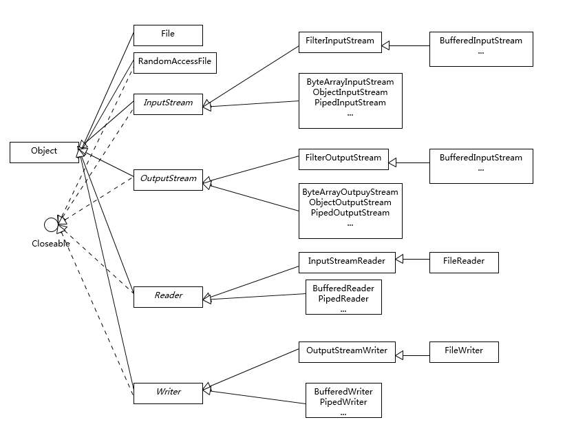
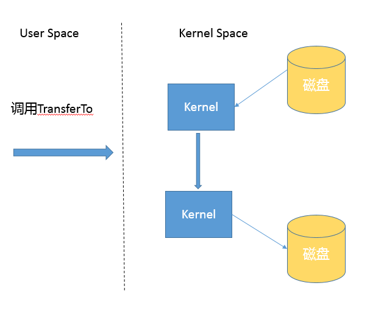

# Lesson 11 | 理解BIO, NIO, NIO2 的区别
	IO 一直是软件开发中的核心部分之一，伴随着海量数据增长和分布式系统的发展，IO 扩展能力愈发重要。
	Java 平台 IO 机制经过不断完善，虽然在某些方面仍有不足，但已经在实践中证明了其构建高扩展性应用的能力。

## Java 提供了哪些 IO 方式？ NIO 如何实现多路复用？
Java IO 方式有很多种，基于不同的 IO 抽象模型和交互方式，可以进行简单区分。
	
	【blocking IO】
	首先，传统的 java.io 包，它基于流模型实现，
	提供了我们最熟知的一些 IO 功能，比如 File 抽象、输入输出流等。
	交互方式是同步、阻塞的方式，也就是说，在读取输入流或者写入输出流时，
	在读、写动作完成之前，线程会一直阻塞在那里，它们之间的调用是可靠的线性顺序。

	java.io 包的好处是代码比较简单、直观，缺点则是 IO 效率和扩展性存在局限性，容易成为应用性能的瓶颈。

	很多时候，人们也把 java.net 下面提供的部分网络 API，
	比如 Socket、ServerSocket、HttpURLConnection 也归类到同步阻塞 IO 类库，
	因为网络通信同样是 IO 行为。

	[NIO]
	第二，在 Java  1.4 中引入了 NIO 框架（java.nio 包），
	提供了 Channel、Selector、Buffer 等新的抽象，
	可以构建多路复用的、同步非阻塞 IO 程序，同时提供了更接近操作系统底层的高性能数据操作方式。
	
	[NIO2]
	第三，在 Java 7 中，NIO 有了进一步的改进，也就是 NIO 2，
	引入了异步非阻塞 IO 方式，也有很多人叫它 AIO（Asynchronous IO）。
	异步 IO 操作基于事件和回调机制，可以简单理解为，应用操作直接返回，
	而不会阻塞在那里，当后台处理完成，操作系统会通知相应线程进行后续工作。

## 同步、异步 & 阻塞、非阻塞

	> 区分同步或异步（synchronous/asynchronous）。
	简单来说，同步是一种可靠的有序运行机制，当我们进行同步操作时，后续的任务是等待当前调用返回，才会进行下一步；
	而异步则相反，其他任务不需要等待当前调用返回，通常依靠事件、回调等机制来实现任务间次序关系。

	> 区分阻塞与非阻塞（blocking/non-blocking）。
	在进行阻塞操作时，当前线程会处于阻塞状态，无法从事其他任务，
	只有当条件就绪才能继续，比如 ServerSocket 新连接建立完毕，或数据读取、写入操作完成；
	而非阻塞则是不管 IO 操作是否结束，直接返回，相应操作在后台继续处理。

##　理解IO操作中的关键概念
	IO 不仅仅是对文件的操作，网络编程中，比如 Socket 通信，都是典型的 IO 操作目标。
	
	而 Reader/Writer 则是用于操作字符，增加了字符编解码等功能，适用于类似从文件中读取或者写入文本信息。
	本质上计算机操作的都是字节，不管是网络通信还是文件读取，Reader/Writer 相当于构建了应用逻辑和原始数据之间的桥梁。
	
	BufferedOutputStream 等带缓冲区的实现，可以避免频繁的磁盘读写，进而提高 IO 处理效率。	
	这种设计利用了缓冲区，将批量数据进行一次操作，但在使用中千万别忘了 flush。

	参考下面这张类图，很多 IO 工具类都实现了 Closeable 接口，因为需要进行资源的释放。
	比如，打开 FileInputStream，它就会获取相应的文件描述符（FileDescriptor），需要利用 try-with-resources、 try-finally 等机制保证 FileInputStream 被明确关闭，进而相应文件描述符也会失效，否则将导致资源无法被释放。
	
	

## NIO 的主要组成部分
	Buffer，高效的数据容器，除了布尔类型，所有原始数据类型都有相应的 Buffer 实现。

	Channel，类似在 Linux 之类操作系统上看到的文件描述符，是 NIO 中被用来支持批量式 IO 操作的一种抽象。
	File 或者 Socket，通常被认为是比较高层次的抽象，而 Channel 则是更加操作系统底层的一种抽象，
	这也使得 NIO 得以充分利用现代操作系统底层机制，获得特定场景的性能优化，
	例如，DMA（Direct Memory Access）等。
	不同层次的抽象是相互关联的，我们可以通过 Socket 获取 Channel，反之亦然。
	
	Selector，是 NIO 实现多路复用的基础，它提供了一种高效的机制，
	可以检测到注册在 Selector 上的多个 Channel 中，是否有 Channel 处于就绪状态，
	进而实现了单线程对多 Channel 的高效管理。
	Selector 同样是基于底层操作系统机制，不同模式、不同版本都存在区别，
	例如，在最新的代码库里，相关实现如下：
		Linux 上依赖于 epoll
		http://hg.openjdk.java.net/jdk/jdk/file/d8327f838b88/src/java.base/linux/classes/sun/nio/ch/EPollSelectorImpl.java

	Chartset，提供 Unicode 字符串定义，NIO 也提供了相应的编解码器等，
	例如，通过下面的方式进行字符串到 ByteBuffer 的转换：
		Charset.defaultCharset().encode("Hello world!"));

## Java 有几种文件拷贝方式？哪一种最高效？
	利用 java.io 类库，直接为源文件构建一个 FileInputStream 读取，
	然后再为目标文件构建一个 FileOutputStream，完成写入工作。

	public static void copyFileByStream(File source, File dest) throws
        IOException {
	    try (InputStream is = new FileInputStream(source);
	         OutputStream os = new FileOutputStream(dest);){
	        byte[] buffer = new byte[1024];
	        int length;
	        while ((length = is.read(buffer)) > 0) {
	            os.write(buffer, 0, length);
	        }
	    }
	 }

#
	或者，利用 java.nio 类库提供的 transferTo 或 transferFrom 方法实现。
	
	public static void copyFileByChannel(File source, File dest) throws
        IOException {
	    try (FileChannel sourceChannel = new FileInputStream(source)
	            .getChannel();
	         FileChannel targetChannel = new FileOutputStream(dest).getChannel
	                 ();){
	        for (long count = sourceChannel.size() ;count>0 ;) {
	            long transferred = sourceChannel.transferTo(
	                    sourceChannel.position(), count, targetChannel);            sourceChannel.position(sourceChannel.position() + transferred);
	            count -= transferred;
	        }
	    }
	 }
	
#
	当然，Java 标准类库本身已经提供了几种 Files.copy 的实现。

	对于 Copy 的效率，这个其实与操作系统和配置等情况相关，
	总体上来说，NIO transferTo/From 的方式可能更快，
	因为它更能利用现代操作系统底层机制，避免不必要拷贝和上下文切换。

## NIO 引入的多路复用机制
	public class NIOServer extends Thread {
	    public void run() {
			// 创建 Selector 和 Channel
	        try (Selector selector = Selector.open();
	             ServerSocketChannel serverSocket = ServerSocketChannel.open();) {
	            serverSocket.bind(new InetSocketAddress(InetAddress.getLocalHost(), 8888));
	            serverSocket.configureBlocking(false);
	            // 注册到 Selector，并说明关注点
	            serverSocket.register(selector, SelectionKey.OP_ACCEPT);
	            while (true) {
	                selector.select();// 阻塞等待就绪的 Channel，这是关键点之一
	                Set<SelectionKey> selectedKeys = selector.selectedKeys();
	                Iterator<SelectionKey> iter = selectedKeys.iterator();
	                while (iter.hasNext()) {
	                    SelectionKey key = iter.next();
	                   // 生产系统中一般会额外进行就绪状态检查
	                    sayHelloWorld((ServerSocketChannel) key.channel());
	                    iter.remove();
	                }
	            }
	        } catch (IOException e) {
	            e.printStackTrace();
	        }
	    }
	    private void sayHelloWorld(ServerSocketChannel server) throws IOException {
	        try (SocketChannel client = server.accept();) {          
				client.write(Charset.defaultCharset().encode("Hello world!"));
	        }
	    }
	   // 省略 main
	}
	
		
	分析主要步骤：
	1、首先，通过 Selector.open() 创建一个 Selector，作为类似调度员的角色。
	2、然后，创建一个 ServerSocketChannel，并且向 Selector 注册，
	通过指定 SelectionKey.OP_ACCEPT，告诉调度员，它关注的是新的连接请求。
	注意，为什么我们要明确配置非阻塞模式呢？
		这是因为阻塞模式下，注册操作是不允许的，会抛出 IllegalBlockingModeException 异常。
	3、Selector 阻塞在 select 操作，当有 Channel 发生接入请求，就会被唤醒。
	4、在 sayHelloWorld 方法中，通过 SocketChannel 和 Buffer 进行数据操作，在本例中是发送了一段字符串。
	
	NIO 利用了单线程轮询事件的机制，通过高效地定位就绪的 Channel，来决定做什么，
	仅仅 select 阶段是阻塞的，可以有效避免大量客户端连接时，频繁线程切换带来的问题，
	应用的扩展能力有了非常大的提高。
	下面这张图对这种实现思路进行了形象地说明。

### 问：NIO 多路复用的局限性是什么呢？
	对于多路复用IO，当有的IO请求在数据拷贝阶段，由于资源类型过份庞大导致线程长期阻塞，影响其它channel的处理，最后造成性能瓶颈的情况。
	
	数据量大，拷贝耗时，处理的线程就一直被占用着，因此导致线程池中可处理任务的线程数减少。

## NIO2
	在 Java 7 引入的 NIO 2 中，又增添了一种额外的异步 IO 模式，
	利用事件和回调，处理 Accept、Read 等操作。 
	AIO 实现看起来是类似这样子：
		AsynchronousServerSocketChannel serverSock =          AsynchronousServerSocketChannel.open().bind(sockAddr);
		serverSock.accept(serverSock, new CompletionHandler<>() { // 为异步操作指定 CompletionHandler 回调函数
		    @Override
		    public void completed(AsynchronousSocketChannel sockChannel, AsynchronousServerSocketChannel serverSock) {
		        serverSock.accept(serverSock, this);
		        // 另外一个 write（sock，CompletionHandler{}）
		        sayHelloWorld(sockChannel, Charset.defaultCharset().encode("Hello World!"));
		    }
		  // 省略其他路径处理方法...
		});
	
	基本抽象很相似，
	AsynchronousServerSocketChannel 对应于上面例子中的 ServerSocketChannel；
	AsynchronousSocketChannel 则对应 SocketChannel。

	业务逻辑的关键在于，通过指定 CompletionHandler 回调接口，
	在 accept/read/write 等关键节点，通过事件机制调用，这是非常不同的一种编程思路。

---

# 知识扩展

## 1. 不同的 copy 方式，底层机制有什么区别？(文件拷贝底层实现机制分析)
	首先，你需要理解用户态空间（User Space）和内核态空间（Kernel Space），
	这是操作系统层面的基本概念，操作系统内核、硬件驱动等运行在内核态空间，
	具有相对高的特权；而用户态空间，则是给普通应用和服务使用。
	参考：
		https://en.wikipedia.org/wiki/User_space
	
	当我们使用输入输出流进行读写时，实际上是进行了多次上下文切换，
	比如应用读取数据时，
		先在内核态将数据从磁盘读取到内核缓存，
		再切换到用户态将数据从内核缓存读取到用户缓存。
	所以，这种方式会带来一定的额外开销，可能会降低 IO 效率。

	
	
#
	而基于 NIO transferTo 的实现方式，在 Linux 和 Unix 上，则会使用到零拷贝技术，
	数据传输并不需要用户态参与，省去了上下文切换的开销和不必要的内存拷贝，进而可能提高应用拷贝性能。
	注意，transferTo 不仅仅是可以用在文件拷贝中，与其类似的，
	例如读取磁盘文件，然后进行 Socket 发送，同样可以享受这种机制带来的性能和扩展性提高。

	transferTo 的传输过程是：
		

## 2.Java IO/NIO 源码结构

## 3. NIO Buffer 的基本操作
	Buffer 是 NIO 操作数据的基本工具，
	Java 为每种原始数据类型都提供了相应的 Buffer 实现（布尔除外），
	所以掌握和使用 Buffer 是十分必要的，
	尤其是涉及 Direct  Buffer 等使用，因为其在垃圾收集等方面的特殊性，更要重点掌握。

	Buffer 有几个基本属性：
		1、capcity，它反映这个 Buffer 到底有多大，也就是数组的长度。
		2、position，要操作的数据起始位置。
		3、limit，相当于操作的限额。在读取或者写入时，limit 的意义很明显是不一样的。
		比如，读取操作时，很可能将 limit 设置到所容纳数据的上限；
			而在写入时，则会设置容量或容量以下的可写限度。
		4、mark，记录上一次 postion 的位置，默认是 0，算是一个便利性的考虑，往往不是必须的。
	
	position <= mark <= limit <= capacity

	前面三个是我们日常使用最频繁的，我简单梳理下 Buffer 的基本操作：
		1、我们创建了一个 ByteBuffer，准备放入数据，capcity 当然就是缓冲区大小，而 position 就是 0，limit 默认就是 capcity 的大小。
		2、当我们写入几个字节的数据时，position 就会跟着水涨船高，但是它不可能超过 limit 的大小。
		3、如果我们想把前面写入的数据读出来，需要调用 flip 方法，将 position 设置为 0，limit 设置为以前的 position 那里。
		4、如果还想从头再读一遍，可以调用 rewind，让 limit 不变，position 再次设置为 0。

## 4.Direct Buffer 和垃圾收集
	Direct Buffer：
		如果我们看 Buffer 的方法定义，你会发现它定义了 isDirect() 方法，返回当前 Buffer 是否是 Direct 类型。
		这是因为 Java 提供了堆内和堆外（Direct）Buffer，我们可以以它的 allocate 或者 allocateDirect 方法直接创建。
	
	MappedByteBuffer：
		它将文件按照指定大小直接映射为内存区域，
		当程序访问这个内存区域时将直接操作这块儿文件数据，
		省去了将数据从内核空间向用户空间传输的损耗。
		可以使用FileChannel.map创建 MappedByteBuffer，它本质上也是种 Direct Buffer。

	在实际使用中，Java 会尽量对 Direct Buffer 仅做本地 IO 操作，
	对于很多大数据量的 IO 密集操作，可能会带来非常大的性能优势，因为：
		Direct Buffer 生命周期内内存地址都不会再发生更改，很多 IO 操作会很高效。
		减少了堆内对象存储的可能额外维护工作，所以访问效率可能有所提高。

	但是请注意，Direct Buffer 创建和销毁过程中，都会比一般的堆内 Buffer 增加部分开销，
	所以通常都建议用于长期使用、数据较大的场景。

	使用 Direct Buffer，我们需要清楚它对内存和 JVM 参数的影响。
	首先，因为它不在堆上，所以 Xmx 之类参数，其实并不能影响 Direct Buffer 等堆外成员所使用的内存额度，
	我们可以使用下面参数设置大小：
		-XX:MaxDirectMemorySize=512M

	从参数设置和内存问题排查角度来看，这意味着我们在计算 Java 可以使用的内存大小的时候，
	不能只考虑堆的需要，还有 Direct Buffer 等一系列堆外因素。
	如果出现内存不足，堆外内存占用也是一种可能性。

	另外，大多数垃圾收集过程中，都不会主动收集 Direct Buffer，它的垃圾收集过程，就是基于Cleaner（一个内部实现）和幻象引用（PhantomReference）机制，
	其本身不是 public 类型，内部实现了一个 Deallocator 负责销毁的逻辑。
	对它的销毁往往要拖到 full GC 的时候，所以使用不当很容易导致 OutOfMemoryError。

	对于 Direct Buffer 的回收，建议：
		1、在应用程序中，显式地调用 System.gc() 来强制触发。
		2、另外一种思路是，在大量使用 Direct Buffer 的部分框架中，框架会自己在程序中调用释放方法，
			Netty 就是这么做的，有兴趣可以参考其实现（PlatformDependent0）。
		3、重复使用 Direct Buffer。