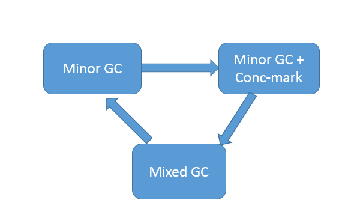
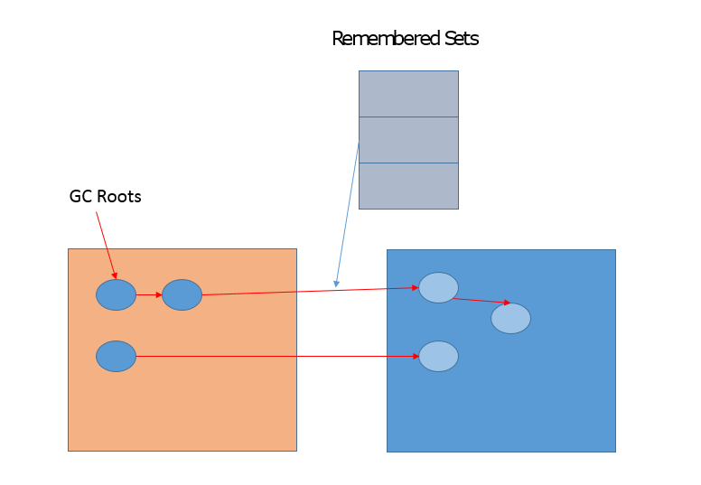

# G1 你值得拥有

## G1特征
	G1对大堆非常友好，其运行机制也需要一定内存消耗
	有时候，稍微多给堆一些空间，比进行苛刻的调优更加实用！

	G1调优相对简单、直接，因为可以直接设置暂停时间等目标
	其内部引入了各种智能的自适应机制，这一切努力都是为了提高日常开发时的效率。

## G1 - region
从内存区域的角度，G1 同样存在着年代的概念，
但是与我前面介绍的内存结构很不一样，其内部是类似棋盘状的一个个 region 组成，

请参考下面的示意图。

	region 的大小是一致的，数值是在 1M 到 32M 字节之间的一个 2 的幂值数，
	
	JVM 会尽量划分 2048 个左右、同等大小的 region，这点可以从源码heapRegionBounds.hpp中看到。
	当然这个数字既可以手动调整，G1 也会根据堆大小自动进行调整。
	
	在 G1 实现中，年代是个逻辑概念，具体体现在，
	一部分 region 是作为 Eden，一部分作为 Survivor，
	除了意料之中的 Old region，G1 会将超过 region 50% 大小的对象归类为 Humongous 对象，
	并放置在相应的 region 中（Humongous在应用中，通常是 byte 或 char 数组）。
	逻辑上，Humongous region 算是老年代的一部分，
	因为复制这样的大对象是很昂贵的操作，并不适合新生代 GC 的复制算法。

#### 思考下 region 设计有什么副作用？
	例如，region 大小和大对象很难保证一致，这会导致空间的浪费。

	不知道你有没有注意到，示意图中有的区域是 Humongous 颜色，但没有用名称标记，
	这是为了表示，特别大的对象是可能占用超过一个 region 的。
	并且，region 太小不合适，会令你在分配大对象时更难找到连续空间，这是一个长久存在的情况
	。
	
	解决默认region太小的问题，可以直接设置较大的 region 大小，参数如下：
		-XX:G1HeapRegionSize=<N, 例如 16>M

## G1采用的算法
	从 GC 算法的角度，G1 选择的是复合算法，可以简化理解为：

	【新生代】
		在新生代，G1 采用的仍然是并行的复制算法，所以同样会发生 Stop-The-World 的暂停。
	
		G1的Minor GC 仍然存在，虽然具体过程会有区别，会涉及 Remembered Set 等相关处理。

	【老年代】
		在老年代，大部分情况下都是并发标记，而整理（Compact）则是和新生代 GC 时捎带进行，
		并且不是整体性的整理，而是“增量”进行的。

		老年代回收，则是依靠 Mixed GC。
		并发标记结束后，JVM 就有足够的信息进行垃圾收集，
		Mixed GC 不仅同时会清理 Eden、Survivor 区域，而且还会清理部分 Old 区域。
		可以通过设置下面的参数，指定触发阈值，并且设定最多被包含在一次 Mixed GC 中的 region 比例。
			–XX:G1MixedGCLiveThresholdPercent
			–XX:G1OldCSetRegionThresholdPercent
	
从 G1 内部运行的角度，下面的示意图描述了 G1 正常运行时的状态流转变化，当然，在发生逃逸失败等情况下，就会触发 Full GC。

## Remembered Sets

G1 的很多开销都是源自 Remembered Set，例如，它通常约占用 Heap 大小的 20% 或更高，这可是非常可观的比例。

并且，我们进行对象复制的时候，因为需要扫描和更改 Card Table 的信息，这个速度影响了复制的速度，进而影响暂停时间。

	CardTable是Remembered Sets的一种实现
	G1 相关概念非常多，有一个重点就是 Remembered Set，用于记录和维护 region 之间对象的引用关系。

	为什么需要这么做呢？
	试想，新生代 GC 是复制算法，对象从 Eden 或者 Survivor 到 to 区域的“移动”，其实是“复制”，
	本质上是一个新的对象(新对象有新的地址，因此要维护新的地址与原来的引用关系)，
	在这个过程中，需要必须保证老年代到新生代的跨区引用仍然有效。
	下面的示意图说明了相关设计。

---
## 知识扩展

##### G1 对Humongous对象采用激进的回收方式
	上面提到了 Humongous 对象的分配和回收，这是很多内存问题的来源，
	Humongous region 作为老年代的一部分，通常认为它会在并发标记结束后才进行回收，
	但是在新版 G1 中，Humongous 对象回收采取了更加激进的策略。
	
	我们知道 G1 记录了老年代 region 间对象引用，Humongous 对象数量有限，
	所以能够快速的知道是否有老年代对象引用它。

	如果没有，能够阻止它被回收的唯一可能，就是新生代是否有对象引用了它，
	但这个信息是可以在 Young GC 时就知道的，
	所以完全可以在 Young GC 中就进行 Humongous 对象的回收，
	不用像其他老年代对象那样，等待并发标记结束。

##### G1 对字符串常量的排重
	在 8u20 以后字符串排重的特性，在垃圾收集过程中，G1 会把新创建的字符串对象放入队列中，
	然后在 Young GC 之后，并发地（不会 STW）将内部数据一致的字符串进行排重，
	也就是将其引用同一个数组（char 数组，JDK 9 以后是 byte 数组）。
	你可以使用下面参数激活：
		-XX:+UseStringDeduplication

	注意，这种排重虽然可以节省不少内存空间，但这种并发操作会占用一些 CPU 资源，
	也会导致 Young GC 稍微变慢。

##### G1 对类卸载的改进
	一个类只有当加载它的自定义类加载器被回收后，才能被卸载。
	元数据区替换了永久代之后有所改善，但还是可能出现问题。

	G1 的类型卸载有什么改进吗？
	很多资料中都谈到，G1 只有在发生 Full GC 时才进行类型卸载，但这显然不是我们想要的。
	你可以加上下面的参数查看类型卸载：
		-XX:+TraceClassUnloading

	幸好现代的 G1 已经不是如此了，8u40 以后，G1 增加并默认开启下面的选项：
		-XX:+ClassUnloadingWithConcurrentMark
	
	也就是说，在并发标记阶段结束后，JVM 即进行类型卸载。

##### G1 对老年代并发标记触发时机的动态调整
	我们知道老年代对象回收，基本要等待并发标记结束。
	这意味着，如果并发标记结束不及时，导致堆已满，但老年代空间还没完成回收，就会触发 Full GC，
	所以触发并发标记的时机很重要。
	早期的 G1 调优中，通常会设置下面参数，但是很难给出一个普适的数值，往往要根据实际运行结果调整：
		-XX:InitiatingHeapOccupancyPercent

	在 JDK 9 之后的 G1 实现中，这种调整需求会少很多，因为 JVM 只会将该参数作为初始值，
	会在运行时进行采样，获取统计数据，然后据此动态调整并发标记启动时机。
	对应的 JVM 参数如下，默认已经开启：
		-XX:+G1UseAdaptiveIHOP

##### G1 对FullGC时多线程并发执行的支持
	在现有的资料中，大多指出 G1 的 Full GC 是最差劲的单线程串行 GC。
	其实，如果采用的是最新的 JDK，你会发现 Full GC 也是并行进行的了，
	在通用场景中的表现还优于 Parallel GC 的 Full GC 实现。

---
## 通用实践经验

#### Young GC 非常耗时，我们应该怎么做呢？
如果发现 Young GC 非常耗时，这很可能就是因为新生代太大了，我们可以考虑减小新生代的最小比例。

	-XX:G1NewSizePercent

降低其最大值同样对降低 Young GC 延迟有帮助。

	-XX:G1MaxNewSizePercent

如果我们直接为 G1 设置较小的延迟目标值，也会起到减小新生代的效果，虽然会影响吞吐量。

#### 如果是 Mixed GC 延迟较长，我们应该怎么做呢？
	部分 Old region 会被包含进 Mixed GC，减少一次处理的 region 个数，就是个直接的选择。
	
	1、减少被清理的Region个数
	控制一次Mixed GC中的Region的最大比例，使用参数：
		G1OldCSetRegionThresholdPercent

	2、还可以利用下面参数提高 Mixed GC 的个数，Mixed GC 数量增多，意味着每次被包含的 region 减少。
		-XX:G1MixedGCCountTarget // 当前默认值是 8