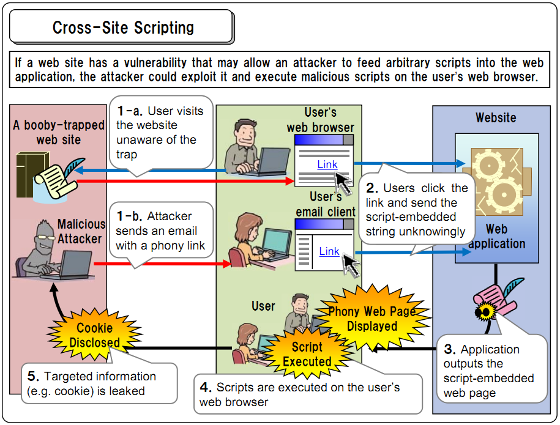

# XSS - 跨站脚本攻击
####XSS的危害：
用户的cookie被盗，导致其它人利用cookie冒充用户身份进入到网站进行非法操作。

## XSS攻击的原理解释
跨站脚本（Cross site script，简称xss）是一种“HTML注入”，由于攻击的脚本多数时候是跨域的，所以称之为“跨域脚本”。

>跨域：
>js脚本盗取用户的cookie，然后通过http发送到其它的域名下。
>
>比如，用户当前访问的域名是ABC.com，而该网站存在XSS脚本注入攻击，用户的cookie被发送到另一个域名XYZ.COM?c=document.cookie 

我们常常听到“注入”（Injection），如SQL注入，那么到底“注入”是什么？

注入本质上就是把输入的数据变成可执行的程序语句。SQL注入是如此，XSS也如此，只不过**XSS一般注入的是恶意的脚本代码，这些脚本代码可以用来获取合法用户的数据，如Cookie信息**。

##XSS从攻击原理上，分为三类：

####1：反射型XSS

将用户输入“反射”回浏览器，即将用户的输入变成HTML传输回客户端。如：

          Response.Write(“”)
就是一个典型的反射型XSS。

####2：存储性XSS

存储性XSS本质上也是一种反射型XSS，但是它把攻击脚本放置在服务器端，一旦被注入，可被多人多次利用。

如，发表博文，就可以引入存储性的XSS。

####3：DOM BASED XSS

如果用户的输入被用于修改原有HTML的DOM内容，就会引入这一类攻击。 

最典型的是输入的内容用于作为某个节点的innerHTML，如果不对输入作验证，则会被注入攻击代码。 

如下的一段脚本注入后，就会获取用户的Cookie

    <script language=”javascript”>
          var cockieInfo =window.cockie;
          //send cockieInfo to luminji
    </javascript>

## 如何应对XSS攻击

####1、输入检查：服务器端对提交的内容进行合法性检查

在服务器段限制输入格式,输入类型，输入长度以及输入字符

要注意避免使用一些有潜在危险的html标签，这些标签很容易嵌入一些恶意网页代码。如

	 <iframe><script><frameset><embed><object>< style>
等。

注意，不要仅仅在客户端使用js代码加以验证。因为客户端的js脚本可以被绕过。

####2、输出转义：响应浏览器数据时，对html标签进行转义处理。
将输入的内容通过HttpUtility.HtmlEncode处理，这样就不能直接看出输出的内容。

