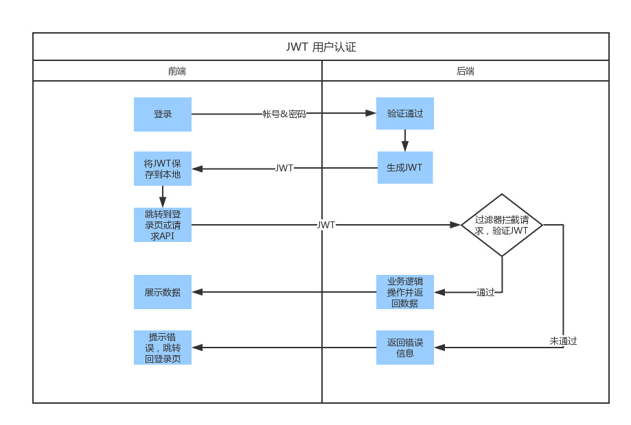

# 基于JWT的Token认证机制实现
JSON Web Token（JWT）是一个非常轻巧的规范。这个规范允许我们使用JWT在用户和服务器之间传递安全可靠的信息。

	https://www.jianshu.com/p/af8360b83a9f
	https://blog.csdn.net/kevin_lcq/article/details/74846723
	https://www.cnblogs.com/xiekeli/p/5607107.html
	https://www.jianshu.com/p/b952c08aed09
 

## JWT 的优点
Token机制相对于Cookie机制又有什么好处呢？

##### 更适用于移动应用
当你的客户端是一个原生平台（iOS, Android，Windows 8等）时，Cookie是不被支持的（你需要通过Cookie容器进行处理），这时采用Token认证机制就会简单得多。

##### CSRF
因为不再依赖于Cookie，所以你就不需要考虑对CSRF（跨站请求伪造）的防范。

##### 支持跨域访问: 
Cookie是不允许垮域访问的，这一点对Token机制是不存在的，前提是传输的用户认证信息通过HTTP头传输.

##### 无状态(也称：服务端可扩展性) / 单点登录SSO
Token机制在服务端不需要存储session信息，因为Token 自身包含了登录用户的相关信息。
	
	注意，1、不能在token中存放敏感信息。2、仅存放少量数据，比如用户ID等。

##### 更适用CDN
可以通过内容分发网络请求你服务端的所有资料（如：javascript，HTML,图片等），而你的服务端只要提供API即可.

##### 性能
一次网络往返时间（通过数据库查询session信息）总比做一次HMACSHA256计算 的Token验证和解析要费时得多.

##### 基于标准化
你的API可以采用标准化的 JSON Web Token (JWT). 这个标准已经存在多个后端库（.NET, Ruby, Java,Python, PHP）和多家公司的支持（如：Firebase,Google, Microsoft）.

---
## JWT 用户身份认证
1、 当用户登录成功后（为防止明文传输密码，登录使用https），服务端才签发jwt Token，返回给客户端；

2、 服务器生成JWT.在JWT中，不应该在负载里面加入任何敏感的数据。

3、 前端在每次请求时将JWT放入HTTP Header中的Authorization位。(解决XSS和XSRF问题)

4、 服务器从header中取出jwt Token，检查JWT是否存在，如存在验证JWT的有效性。例如，检查签名是否正确；检查Token是否过期；检查Token的接收方是否是自己（可选）。

5、 服务器对合法的请求，可以重新设置jwt Token给客户端，以增加token的有效期。

---
# JWT的组成
一个JWT实际上就是一个字符串，它由三部分组成，头部、载荷与签名。

### 头部（Header）
头部用于描述关于该JWT的最基本的信息，例如其类型以及签名所用的算法等。

在头部指明了签名算法是HS256算法。

	{
		"typ": "JWT",
		"alg": "HS256"
	}

### 载荷（Payload）
	iss: 该JWT的签发者，可选；
	sub: 该JWT所面向的用户，可选；
	aud: 接收该JWT的一方，可选；
	exp(expires): 什么时候过期，这里是一个Unix时间戳，可选；
	iat(issued at): 在什么时候签发的(UNIX时间)，可选；
	nbf (Not Before)：如果当前时间在nbf里的时间之前，则Token不被接受，可选；

#
	{ "iss": "Online JWT Builder", 
	  "iat": 1416797419, 
	  "exp": 1448333419, 
	  "aud": "www.example.com", 
	  "sub": "jrocket@example.com", 
	  "GivenName": "Johnny", 
	  "Surname": "Rocket", 
	  "Email": "jrocket@example.com", 
	  "Role": [ "Manager", "Project Administrator" ] 
	}

### 签名（Signature）

---

Base64是一种基于64个可打印字符来表示二进制数据的表示方法。由于2的6次方等于64，所以每6个比特为一个单元，对应某个可打印字符。三个字节有24个比特，对应于4个Base64单元，即3个字节需要用4个可打印字符来表示。JDK 中提供了非常方便的 BASE64Encoder 和 BASE64Decoder，用它们可以非常方便的完成基于 BASE64 的编码和解码