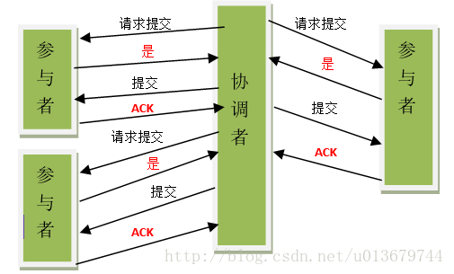
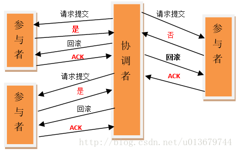

##分布式事务的概念
通常把一个数据库内部的事务处理，如对多个表的操作，作为本地事务看待。

数据库的事务处理对象是本地事务，而分布式事务处理的对象是全局事务。 

所谓全局事务，是指分布式事务处理环境中，多个数据库可能需要共同完成一个工作，这个工作即是一个全局事务，例如，一个事务中可能更新几个不同的数据库。

对数据库的操作发生在系统的各处但必须全部被提交或回滚。此时一个数据库对自己内部所做操作的提交不仅依赖本身操作是否成功，还要依赖与全局事务相关的其它数据库的操作是否成功，如果任一数据库的任一操作失败，则参与此事务的所有数据库所做的所有操作都必须回滚。 

一般情况下，某一数据库无法知道其它数据库在做什么。因此，在一个 DTP 环境中，交易中间件是必需的，由它通知和协调相关数据库的提交或回滚。而一个数据库只将其自己所做的操作（可恢复）影射到全局事务中。

二阶提交协议和三阶提交协议就是根据这一思想衍生出来的。可以说二阶段提交其实就是实现XA分布式事务的关键(确切地说：两阶段提交主要保证了分布式事务的原子性：即所有结点要么全做要么全不做)

## 2PC、3PC的基本概念
在分布式系统中，各个节点之间在物理上相互独立，通过网络进行沟通和协调。由于存在事务机制，可以保证每个独立节点上的数据操作可以满足ACID。但是，相互独立的节点之间无法准确的知道其他节点中的事务执行情况。所以从理论上讲，两台机器理论上无法达到一致的状态。

如果想让分布式部署的多台机器中的数据保持一致性，那么就要保证在所有节点的数据写操作，要不全部都执行，要么全部的都不执行。

但是，一台机器在执行本地事务的时候无法知道其他机器中的本地事务的执行结果。所以他也就不知道本次事务到底应该commit还是 roolback。

所以，常规的解决办法就是引入一个“协调者”的组件来统一调度所有分布式节点的执行。使用2PC,3PC可以实现分布式的强一致性和分布式事务。

---
## 2PC
所谓的两个阶段是指：第一阶段：准备阶段(投票阶段)和第二阶段：提交阶段（执行阶段）。

其过程为：
##### 第一阶段：准备阶段
事务协调者(事务管理器)给每个参与者(资源管理器)发送Prepare消息，每个参与者要么直接返回失败(如权限验证失败)，要么在本地执行事务，写本地的redo和undo日志，但不提交，然后向协调者反馈YES,NO。

	1、协调者节点向所有参与者节点询问是否可以执行提交操作(vote)，并开始等待各参与者节点的响应。
	
	2、参与者节点执行询问发起为止的所有事务操作，并将Undo信息和Redo信息写入日志。（注意：若成功这里其实每个参与者已经执行了事务操作）
	
	3、各参与者节点响应协调者节点发起的询问。如果参与者节点的事务操作实际执行成功，则它返回一个”同意”消息；如果参与者节点的事务操作实际执行失败，则它返回一个”中止”消息。

##### 第二阶段：提交阶段
如果协调者收到了参与者的失败消息或者超时，直接给每个参与者发送回滚(Rollback)消息；否则，发送提交(Commit)消息；参与者根据协调者的指令执行提交或者回滚操作，释放所有事务处理过程中使用的锁资源。

#####注意：在2PC中，若协调者等待超时，则进行回滚操作。

#####》》》执行事务提交

#####》》》执行事务回滚

##2PC的缺点
#####参与者同步阻塞问题
执行过程中，所有参与节点都是事务阻塞型的。当参与者占有公共资源时，其他第三方节点访问公共资源不得不处于阻塞状态，各个参与者在等待协调者发出提交或中断请求时，会一直阻塞，而协调者的发出时间要依赖于所有参与者的响应时间，如果协调者宕机了（单点），那么参与者就一直阻塞在这，而且无法达成一致。

#####协调者存在单点问题
由于协调者的重要性，一旦协调者发生故障。参与者会一直阻塞下去。尤其在第二阶段，协调者发生故障，那么所有的参与者还都处于锁定事务资源的状态中，而无法继续完成事务操作。（如果是协调者挂掉，可以重新选举一个协调者，但是无法解决因为协调者宕机导致的参与者处于阻塞状态的问题）。

#####数据不一致问题
出现分区，或者网络故障。在二阶段提交的阶段二中，当协调者向参与者发送commit请求之后，发生了局部网络异常或者在发送commit请求过程中协调者发生了故障，这回导致只有一部分参与者接受到了commit请求。而在这部分参与者接到commit请求之后就会执行commit操作。但是其他部分未接到commit请求的机器则无法执行事务提交。于是整个分布式系统便出现了数据部一致性的现象。

#####二阶段无法解决的问题
协调者（在第二阶段）发出commit消息之后宕机，而唯一接收到这条消息的参与者同时也宕机了。那么即使协调者通过选举协议产生了新的协调者，这条事务的状态也是不确定的，没人知道事务是否被已经提交。

----

# 3PC
相对于2PC，3PC主要解决参与者阻塞的问题。

一旦参与者无法及时收到来自协调者的信息，参与者将会默认执行commit，不会一直持有事务资源并处于阻塞状态。

#### CanCommit阶段
CanCommit阶段其实和2PC的准备阶段很像。协调者向参与者发送commit请求，参与者如果可以提交就返回Yes响应，否则返回No响应。

	事务询问： 协调者向参与者发送CanCommit请求。询问是否可以执行事务提交操作。然后开始等待参与者的响应。

	响应反馈： 参与者接到CanCommit请求之后，正常情况下，如果其自身认为可以顺利执行事务，则返回Yes响应，并进入预备状态。否则反馈No

#### PreCommit阶段
协调者根据参与者的反应情况来决定是否可以进行事务的PreCommit操作。

第一种情况：假如协调者从所有的参与者获得的反馈都是Yes响应，那么就会执行事务的预执行。

	1.发送预提交请求 协调者向参与者发送PreCommit请求，并进入Prepared阶段。
	2.事务预提交 参与者接收到PreCommit请求后，会执行事务操作，并将undo和redo信息记录到事务日志中。
	3.响应反馈 如果参与者成功的执行了事务操作，则返回ACK响应，同时开始等待最终指令。

第二种情况：假如有任何一个参与者向协调者发送了No响应，或者等待超时之后，协调者都没有接到参与者的响应，那么就执行事务的中断。

	1.发送中断请求 协调者向所有参与者发送abort请求。
	2.中断事务 参与者收到来自协调者的abort请求之后（或超时之后，仍未收到协调者的请求），执行事务的中断。

#### doCommit阶段
该阶段进行真正的事务提交，也可以分为以下两种情况。

第一种情况：执行提交

	1.发送提交请求 协调接收到参与者发送的ACK响应，那么他将从预提交状态进入到提交状态。并向所有参与者发送doCommit请求。
	
	2.事务提交 参与者接收到doCommit请求之后，执行正式的事务提交。并在完成事务提交之后释放所有事务资源。
	
	3.响应反馈 事务提交完之后，向协调者发送Ack响应。
	
	4.完成事务 协调者接收到所有参与者的ack响应之后，完成事务。

第二种情况：中断事务 

协调者没有接收到参与者发送的ACK响应（可能是接受者发送的不是ACK响应，也可能响应超时），那么就会执行中断事务。

	1.发送中断请求 协调者向所有参与者发送abort请求
	
	2.事务回滚 参与者接收到abort请求之后，利用其在阶段二记录的undo信息来执行事务的回滚操作，并在完成回滚之后释放所有的事务资源。
	
	3.反馈结果 参与者完成事务回滚之后，向协调者发送ACK消息
	
	4.中断事务 协调者接收到参与者反馈的ACK消息之后，执行事务的中断。

注意：
在doCommit阶段，如果参与者无法及时接收到来自协调者的doCommit或者rebort请求时，会在等待超时之后，继续进行事务的提交。

###协调者在超时时间内，没有接受到参与者的响应，则执行abort操作；
###参与者在超时时间内，没有接收到协调者的响应，默认执行commit操作；
引入超时提交的依据：
其实这个应该是基于概率来决定的，当进入第三阶段时，说明参与者在第二阶段已经收到了PreCommit请求，那么协调者产生PreCommit请求的前提条件是他在第二阶段开始之前，收到所有参与者的CanCommit响应都是Yes。（一旦参与者收到了PreCommit，意味他知道大家其实都同意修改了）所以，一句话概括就是，当进入第三阶段时，由于网络超时等原因，虽然参与者没有收到commit或者abort响应，但是他有理由相信：成功提交的几率很大。

### 3PC无法解决的问题
数据不一致的问题仍然存在。

由于网络原因，协调者发送的abort响应没有及时被参与者接收到，那么参与者在等待超时之后执行了commit操作。这样就和其他接到abort命令并执行回滚的参与者之间存在数据不一致的情况。