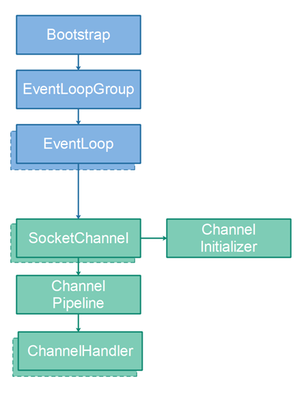
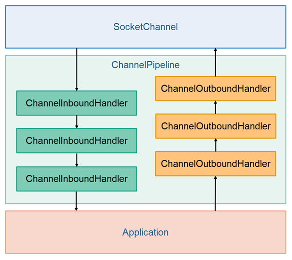
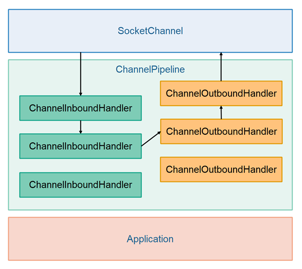

# 协议
    协议，指的是客户端与服务端进行通信时，双方对传输数据的格式进行的一种约定。
    比如:
        HTTP协议，浏览器发送HTTP请求包含请求头、请求体，服务端向浏览器返回结果时包含响应头，响应体。
        自定义协议：客户端与服务端约定好传输数据的格式，双方按预定格式进行数据的解析。
    
# Netty
    https://github.com/netty/netty/wiki/User-guide-for-4.x
    
    底层基于JAVA NIO，在NIO基础之上进行了扩展的一个高性能Web服务器框架。
    
    线程模型
        单线程
        多线程
        主从线程（BossGroup, WorkerGroup）
    
    IO模型
        同步阻塞 blocking model
        同步非阻塞 nonblock model
    
    数据格式
        支持多种序列化方式 jdk serializable, hession, protobuf, thift, msgPack, kyro...
        
# Netty Advantages
    In general, Netty makes it a lot easier to build scalable, 
	robust networked applications compared to implemeting the same using standard Java. 
    与标准NIO框架相比，Netty提供了更简单的编程接口来构建可伸缩、健壮的网络应用程序。
    Netty also contains some OS specific optimizations, like using EPOLL on Linux etc.        
    Netty同时也进行一些与底层操作系统交互层面的优化，比如在Linux服务器上使用epoll进行事件通知。
    
    event-driven
    non-blocking
    

# Netty支持的服务
    TCP/UDP Server
        Netty提供基于事件驱动的异步网络IO编程模型，可以高效的处理网络socket连接和数据的读写。
    
    Http/Https Server
        Netty提供了对HTTP协议的支持，因此可以作为Web服务器。
        
    WebSocket Server
        Netty支持websocket数据通信
        

# Netty4.x
    <dependency>
        <groupId>io.netty</groupId>
        <artifactId>netty-all</artifactId>
        <version>4.1.25.Final</version>
    </dependency>

# Netty Overview    
     

## Bootstrap -> Netty启动器
  The Bootstrap classes in Netty take care of bootstrapping Netty. The bootstrapping process includes starting threads, opening sockets etc. 
  
## EventLoopGroup -> 事件循环组
    A Netty EventLoopGroup is a group of EventLoop's . 
    Multiple EventLoop's can be grouped together. 
    This way the EventLoop shares some resources like threads etc.
    通过线程池中的一组线程来对发生的IO事件进行处理。
    
    bossGroup : accepts an incoming connection
    workerGroup : handles the traffic of the accepted connection once the boss accepts the connection and registers the accepted connection to the worker. 
    
## EventLoop -> 事件循环
    A Netty EventLoop is a loop that keeps looking for new events, 
    e.g. incoming data from network sockets (from SocketChannel) instances). 
    When an event occurs, the event is passed on to the appropriate event handler, for instance a ChannelHandler.
    事件轮询机制，检查操作系统底层发生了哪些事件，然后将事件交给预设好的EventHandler处理
   
## SocketChannel -> 代表一个TCP连接
    A Netty SocketChannel represents a TCP connection to another computer over a network. 
    Whether you are using Netty as client or server, all data exchanged with other computers on the network 
    are passed through a SocketChannel instance representing the TCP connection between the computers.

    A SocektChannel is managed by an EventLoop, and always only by that same EventLoop. 
    Since an EventLoop is always executed by the same thread, 
    a SocketChannel instance is also only accessed by the same thread. 
    Therefore you don't have to worry about synchronization when reading from a SocketChannel.

## ChannelInitializer  -> Channel的初始化器
    A Netty ChannelInitializer is a special ChannelHandler which is attached to the ChannelPipeline of a SocketChannel when the SocketChannel is created. 
    The ChannelInitializer is then called so it can initialize the SocketChannel.
    
    After initializing the SocketChannel the ChannelInitializer removes itself from the ChannelPipeline.

## ChannelPipeline  -> Channel的处理管道
    Each Netty SocketChannel has a ChannelPipeline. 
    The ChannelPipeline contains a list of ChannelHandler instances. 
    When the EventLoop reads data from a SocketChannel the data is passed to the first ChannelHandler in the ChannelPipeline. 
    The first ChannelHandler processes the data and can choose to forward it to the next ChannelHandler in the ChannelPipeline, 
    which then also processes the data and can choose to forward it to the next ChannelHandler in the ChannelPipeline etc.

    When writing data out to a SocketChannel the written data is also passed through the ChannelPipeline before finally being written to the SocketChannel.

## ChannelHandler        
    A Netty ChannelHandler handles the data that is received from a Netty SocketChannel. 
    A ChannelHandler can also handle data that is being written out to a SocketChannel. 
    
------------------------------------------------

# Netty ChannelPipeline 按数据IN/OUT对channelHandler进行分类
    ChannelInboundHandler   处理接收到的数据
        按添加顺序，依次调用InboundHandler
        
    ChannelOutboundHandler  处理响应的数据
        按添加顺序，依次调用OutboundHandler
    
    
    When data is received from the SocketChannel is is passed to the first ChannelInboundHandler in the ChannelPipeline. 
    This ChannelInboundHandler processes the data, and then the data is passed on to the next ChannelInboundHandler in the ChannelPipeline.
    
    
    Even though the illustration shows the ChannelInboundHandler and ChannelOutboundHandler instances as separate lists, 
    they are actually located in the same list (pipeline). 
    
    Thus, if a ChannelInboundHandler decides to write something back to the SocketChannel, 
    the data passes through all ChannelOutboundHandler instances which located earlier in the ChannelPipeline 
        than the ChannelInboundHandler who writing the data. 

    
    
## Codecs
    Netty has the concept of codecs (encoders + decoders). 
    A Netty codec converts bytes to message objects (Java objects), or message objects to bytes. 
    For instance, a codec might convert the raw bytes of an incoming HTTP request to an HTTP object, 
    or convert an HTTP response object back to raw bytes.

    A Netty codec object is really just one (or two) ChannelHandler implementations. 
    A codec typically consists of a ChannelInboundHandler implementation which converts request bytes into objects, 
    and a ChannelOutboundHandler which converts response objects into bytes.

    Netty comes with codecs for several different protocols, like HTTP, WebSockets, SSL / TLS etc. 
    In order to use those protocols with Netty, 
    you have to add the corresponding protocol codec ChannelInboundHandler and ChannelOutboundHandler to the ChannelPipeline of the SocketChannel 
    you want to use the protocol with. 
    
    
--------------------------------------------------------------------------    
    
# Why native epoll support is introduced in Netty?
    I believe Java's NIO library will use epoll on Linux machines. What are all the advantages of using Epoll instead of NIO on Linux machines ?
    
    Answer:
        Netty's epoll transport uses epoll edge-triggered while java's nio library uses level-triggered. 
        Beside this the epoll transport expose configuration options that are not present with java's nio like TCP_CORK, SO_REUSEPORT and more.

### Epoll
    https://en.wikipedia.org/wiki/Epoll
    
    epoll is a Linux kernel system call for a scalable I/O event notification mechanism, first introduced in version 2.5.44 of the Linux kernel mainline. 
    
    > Its function is to monitor multiple file descriptors to see if I/O is possible on any of them. 
    监控多个文件描述符上是否有I/O事件发生
    
    It is meant to replace the older POSIX select(2) and poll(2) system calls, to achieve better performance in more demanding applications, 
    where the number of watched file descriptors is large (unlike the older system calls, which operate in O(n) time, epoll operates in O(1) time[2]).
    epoll可以监控更多的文件描述符，而且速度比select,poll更快
            
### Triggering modes
    epoll provides both edge-triggered and level-triggered modes. 
    
    In edge-triggered mode, a call to epoll_wait will return only when a new event is enqueued with the epoll object, 
    while in level-triggered mode, epoll_wait will return as long as the condition holds.

    For instance, if a pipe registered with epoll has received data, a call to epoll_wait will return, signaling the presence of data to be read. 
    Suppose the reader only consumed part of data from the buffer. 
    > In level-triggered mode, further calls to epoll_wait will return immediately, as long as the pipe's buffer contains data to be read. 
    > In edge-triggered mode, however, epoll_wait will return only once new data is written to the pipe.
  
  
        
    