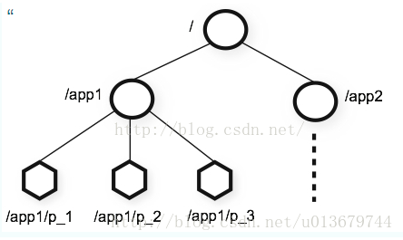
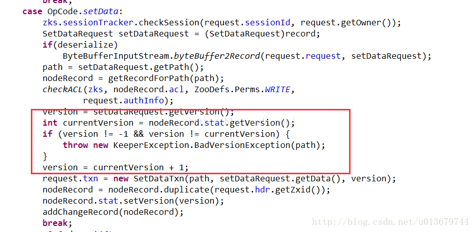
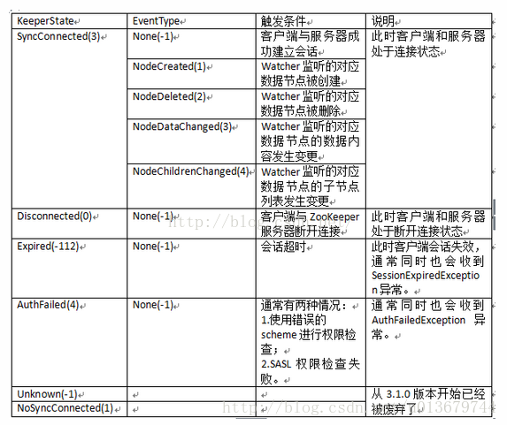

# zookeeper是什么？
	1、高可用（至少3个节点组成的集群）；
	2、高性能（基于内存），只要过半节点写入成功，就会响应客户端（即：非强一致性）；
		集群内部节点的数据同步以类似 2pc 两阶段提交的方式，通过最终一致性确保集群中的数据一致。

Zookeeper是一个具有高可用、高性能和具有分布式数据一致性的分布式数据管理及协调框架，是基于对ZAB算法的实现，基于这样的特性，使ZK成为解决分布式一致性问题的利器，同时Zookeeper提供了丰富的节点类型和Watcher监听机制，通过这两个特点，可以非常方便的构建一系列分布式系统中都会涉及的核心功能： 如：数据发布/订阅，负载均衡，命名服务，分布式协调/通知，集群管理，Master选举，分布式锁，分布式队列等。

#### 高可用 - 集群模式，超过一半的节点存活就可以对外提供服务

#### 高性能 - 数据都加载到内存中，非强一致性

#### 分布式一致性 - ZAB协议 （原子消息广播 + 崩溃恢复机制）

#### 数据管理 - 丰富的节点类型和watcher机制 

#### 协调框架 - 丰富的节点类型和watcher机制 

---
# Zookeeper基本概述
Zookeeper致力于提供一个高性能、高可用，且具有严格的顺序访问控制能力（主要是写操作的严格顺序性）的分布式协调服务。可用于大型的分布式系统中。

##### Zookeeper可以保证如下的分布式一致性要求：

###### 顺序一致性
从同一个客户端发起的事务请求，最终将会严格按照其发起顺序被应用到ZooKeeper中。

###### 原子性
所有事务请求的结果在集群中所有机器上的应用情况是一致的，也就是说要么整个集群所有集群都成功应用了某一个事务，要么都没有应用，一定不会出现集群中部分机器应用了该事务，而另外一部分没有应用的情况。

###### 单一视图
无论客户端连接的是哪个ZooKeeper服务器，其看到的服务端数据模型都是一致的。

###### 可靠性
一旦服务端成功地应用了一个事务，并完成对客户端的响应，那么该事务所引起的服务端状态变更将会被一直保留下来，除非有另一个事务又对其进行了变更。

###### 实时性
通常人们看到实时性的第一反应是，一旦一个事务被成功应用，那么客户端能够立即从服务端上读取到这个事务变更后的最新数据状态。这里需要注意的是，ZooKeeper仅仅保证在一定的时间段内，客户端最终一定能够从服务端上读取到最新的数据状态。

##集群角色
在ZooKeeper中，有三种角色：

	Leader
	Follower
	Observer

一个ZooKeeper集群同一时刻只会有一个Leader，其他都是Follower或Observer。2181端口。

Zookeeper集群中的任何一台机器都可以响应客户端的读操作，且全量数据都存在于内存中，因此Zookeeper更适合以读操作为主的应用场景。

#####注意，当不是leader的服务器收到客户端事务操作，会将其转发到Leader，让Leader进行处理。

ZooKeeper集群的所有机器通过一个Leader选举过程来选定一台被称为『Leader』的机器，Leader服务器为客户端提供读和写服务。Follower和Observer都能提供读服务，不能提供写服务。

两者唯一的区别在于，Observer机器不参与Leader选举过程，也不参与写操作的『过半写成功』策略，因此Observer可以在不影响写性能的情况下提升集群的读性能。

Zookeeper集群的数量为奇数个（注意：这里并不是说偶数个就不行，而是：比如：5台和6台集群的容灾能力是一样的，所以我们可以少用一台达到相同的目的）。

##会话session
Session是指客户端会话，在ZooKeeper中，一个客户端连接是指客户端和ZooKeeper服务器之间的TCP长连接。ZooKeeper对外的服务端口默认是2181，客户端启动时，首先会与服务器建立一个TCP连接，从第一次连接建立开始，客户端会话的生命周期也开始了，通过这个连接，客户端能够通过心跳检测和服务器保持有效的会话，也能够向ZooKeeper服务器发送请求并接受响应，同时还能通过该连接接收来自服务器的Watch事件通知。

Session的SessionTimeout值用来设置一个客户端会话的超时时间。当由于服务器压力太大、网络故障或是客户端主动断开连接等各种原因导致客户端连接断开时，只要在SessionTimeout规定的时间内能够重新连接上集群中任意一台服务器，那么之前创建的会话仍然有效。

## Zookeeper数据模型
zookeeper采用层次化的目录结构，命名符合常规文件系统规范； 每个目录在zookeeper中叫做znode,并且其有一个唯一的路径标识； Znode可以包含数据和子znode（ephemeral（临时）类型的节点不能有子znode）； Znode中的数据可以有多个版本，比如某一个znode下存有多个数据版本，那么查询这个路径下的数据需带上版本； 客户端应用可以在znode上设置监视器（Watcher） 。

ZNode可以保存数据，同时还可以挂载子节点，因此构成了一个层次化的树形命名空间。Znode的节点路径标识方式和Unix文件系统路径非常相似，用一系列（\）进行分割。

##节点特性
	持久化、临时节点、有序节点
	同级节点具有唯一性
	临时节点不能存在子节点	

ZooKeeper 节点是有生命周期的，这取决于节点的类型。在 ZooKeeper 中，节点类型可以分为持久节点（PERSISTENT ）、临时节点（EPHEMERAL），以及顺序节点（SEQUENTIAL ），具体在节点创建过程中，一般是组合使用，可以生成以下 4 种节点类型。

##### 持久节点（PERSISTENT）

所谓持久节点，是指在节点创建后，就一直存在，直到有删除操作来主动清除这个节点——不会因为创建该节点的客户端会话失效而消失。

##### 持久顺序节点（PERSISTENT_SEQUENTIAL）

在ZK中，每个父节点会为他的第一级子节点维护一份时序，会记录每个子节点创建的先后顺序。基于这个特性，在创建子节点的时候（注意：在此节点下的子节点是由顺序的），可以设置这个属性，那么在创建节点过程中，ZK会自动为给定节点名加上一个数字后缀，作为新的节点名。这个数字后缀的上限是整型的最大值。

##### 临时节点（EPHEMERAL）

和持久节点不同的是，临时节点的生命周期和客户端会话绑定。也就是说，如果客户端会话失效，那么这个节点就会自动被清除掉。注意，这里提到的是会话失效，而非连接断开。另外，在临时节点下面不能创建子节点，注意是更具Session会话的失效时间来设定的。

##### 临时顺序节点（EPHEMERAL_SEQUENTIAL）

临时顺序节点的特性和临时节点一致，同时是在临时节点的基础上，添加了顺序的特性。

在Zookeeper维护数据节点的同时，每个节点除了存储数据内容之外，还存储了数据节点本身一些状态信息，可通过get来获得。

ZooKeeper中每个znode的Stat结构体由下述字段构成：

    czxid：创建节点的事务的zxid
    mzxid：对znode最近修改的zxid
    ctime：以距离时间原点(epoch)的毫秒数表示的znode创建时间
    mtime：以距离时间原点(epoch)的毫秒数表示的znode最近修改时间
    version：znode数据的修改次数/版本号
    cversion：znode子节点修改次数/版本号
    aversion：znode的ACL修改次数/版本号
    ephemeralOwner：如果znode是临时节点，则指示节点所有者的会话ID；如果不是临时节点，则为零。
    dataLength：znode数据长度。
    numChildren：znode子节点个数。

## 版本--保证分布式数据原子操作
Zookeeper会为每个Znode维护一个叫作Stat的数据结构，存在三个版本信息：

    version：znode数据的修改次数
    cversion：znode子节点修改次数
    aversion：znode的ACL修改次数

version是表示对数据节点数据内容的变更次数，强调的是变更次数，因此就算数据内容的值没有发生变化，version的值也会递增。

在介绍version时，我们可以简单的了解在数据库技术中，通常提到的“悲观锁”和“乐观锁”：

#####悲观锁：
具有严格的独占和排他特性，能偶有效的避免不同事务在同一数据并发更新而造成的数据一致性问题。实现原理就是：假设A事务正在对数据进行处理，那么在整个处理过程中，都会将数据处于锁定的状态，在这期间，其他事务将无法对这个数据进行更新操作，直到事务A完成对該数据的处理，释放对应的锁。一份数据只会分配一把钥匙，如数据库的表锁或者行锁(for update).

#####乐观锁：
具体实现是，表中有一个版本字段，第一次读的时候，获取到这个字段。处理完业务逻辑开始更新的时候，需要再次查看该字段的值是否和第一次的一样。如果一样更新，反之拒绝。乐观锁就是假定多个事务在处理过程中不会影响彼此，悲观锁正好相反，因此乐观锁在事务处理的绝大部分时间里不需要进行加锁处理。乐观锁非常适用于在数据竞争不大，事务冲突较少的应用场景中。最经典的应用就是：JDK中的CAS处理。

从上边的逻辑，我们可以看到，当对数据节点状态进行改变时，首先要进行数据节点版本检查，如果首先获得当前请求的版本，然后再从数据积累获取当前服务器上该数据的最新版本，如果version=-1，则客户端不要求使用乐观锁，可以忽略此版本检查，如果不是-1，就进行检查，匹配才进行数据变更，否则抛出异常。

## Watcher机制
Watcher机制:目的是为ZK客户端操作提供一种类似于异步获得数据的操作。

zk提供了分布式数据的发布订阅功能，一个典型的发布订阅系统定义了一种一对多的订阅关系，能够让多个订阅者同时监听某一个主题对象，当这个主题对象自身状态变化时，会通知所有订阅者，使它们能够做出相应的处理。zk，引入了watcher机制来实现这种分布式的通知功能。

zk允许客户端向服务端注册一个watcher监听，当服务端的一些指定事件触发这个watcher，那么就会向指定客户端发送一个事件通知。

Zookeeper的Watcher机制主要包括客户端线程、客户端WatchManager和Zookeeper服务器三部分。

在具体的流程上，客户端向Zookeeper服务器注册Watcher事件监听的同时，会将Watcher对象存储在 客户端WatchManager中。当Zookeeper服务器触发Watcher事件后，会向客户端发送通知，客户端线程从WatchManager中取出对应的Watcher对象执行回调逻辑。

##### watcher机制特点：
1.一次性触发  
数据发生改变时，一个watcher event会被发送到client，但是client只会收到一次这样的信息。

2.watcher event异步发送   
watcher 的通知事件从server发送到client是异步的，这就存在一个问题，不同的客户端和服务器之间通过socket进行通信，由于网络延迟或其他因素导致客户端在不通的时刻监听到事件，由于Zookeeper本身提供了ordering guarantee，即客户端监听事件后，才会感知它所监视znode发生了变化。

3.数据监视   
Zookeeper有数据监视和子数据监视   getdata() and exists() 设置数据监视，getchildren()设置了子节点监视

其监听的事件有：

NodeDataChanged事件：此处的变更包括数据节点内容和数据的版本号DateVersion。因此，对于Zookeeper来说，无论数据内容是否更改，还是会触发这个事件的通知，一旦客户端调用了数据更新接口，且更新成功，就会更新dataversion值。

---
## Zookeeper数据与存储
当节点崩溃后或重新初始化时，是怎么恢复到宕机之前的数据呢？这就需要Zookeeper的数据存储实现。

### 事务日志
事务日志记录了对Zookeeper的操作，命名为log.ZXID,后缀是一个事务ID。

事务日志的写入是采用了磁盘预分配的策略。因为事务日志的写入性能直接决定看Zookeeper服务器对事务请求的响应，也就是说事务写入可被看做是一个磁盘IO过程，所以为了提高性能，避免磁盘寻址seek所带来的性能下降，所以zk在创建事务日志的时候就会进行文件空间“预分配”，即：在文件创建之初就想操作系统预分配一个很大的磁盘块，默认是64M，而一旦已分配的文件空间不足4KB时，那么将会再次进行预分配，再申请64M空间。

### 数据快照
数据快照是Zookeeper数据存储中非常核心的运行机制，数据快照用来记录Zookeeper服务器上某一时刻的全量内存数据内容，并将其写入指定的磁盘文件中。也是使用ZXID来作为文件 后缀名，并没有采用磁盘预分配的策略，因此数据快照文件在一定程度上反映了当前zookeeper的全量数据大小。

Zookeeper快照文件也可以指定特定磁盘目录，通过dataDir属性来配置。若指定dataDir为/home/admin/zkData/zk_data，则在运行过程中会在该目录下创建version-2的目录，该目录确定了当前Zookeeper使用的快照数据格式版本号。

针对客户端的每一次事务操作，Zookeeper都会将他们记录到事务日志中，同时也会将数据变更应用到内存数据库中，Zookeeper在进行若干次（snapCount）事务日志记录后，将内存数据库的全量数据Dump到本地文件中，这就是数据快照。

过半随机策略：每进行一次事务记录后，Zookeeper都会检测当前是否需要进行数据快照。理论上进行snapCount次事务操作就会开始数据快照，但是考虑到数据快照对于Zookeeper所在机器的整体性能的影响，**需要避免Zookeeper集群中所有机器在同一时刻进行数据快照**。因此zk采用“过半随机”的策略，来判断是否需要进行数据快照。

