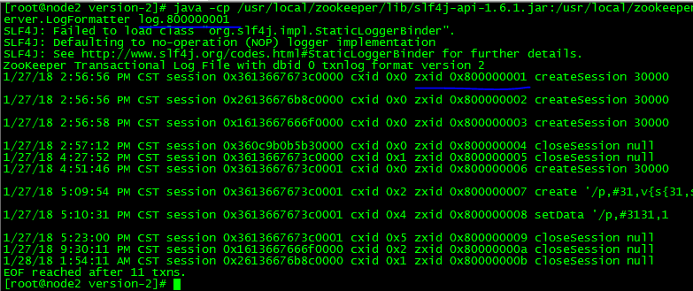

## ZOOKEEPER的数据存储：内存数据 + 磁盘数据

##1、内存数据
zookeeper的数据都是加载到内容中处理的。

zookeeper会定时将数据刷新到磁盘上保存。

#####内存数据的相关源码：
	org.apache.zookeeper.server.DataTree
	private final ConcurrentHashMap<String, DataNode> nodes = new ConcurrentHashMap();

---

##2、磁盘数据

####dataDir 		
存储内存数据的快照。
快照：存储某一时刻全量的内存数据到磁盘。

####dataLogDir 	
存储事务日志。

####version-2	
version-2表示的是zookeeper保存事务快照数据所使用的格式版本。

####事务日志的格式
log.min_zxid
比如，log.800000001 ，其中800000001 是该事务日志文件中最小的那个zxid。

查看日志的内容

	java -cp /usr/local/zookeeper/lib/slf4j-api-1.6.1.jar:/usr/local/zookeeper/zookeeper-3.4.10.jar org.apache.zookeeper.server.LogFormatter  log.100000001 

### zookeeper的3类日志
>zookeeper.out ---
zookeeper运行过程中产生的日志

>快照日志 --- 
存储某一时刻的全量内容

>事务日志 ---
事务操作的日志记录

#####zookeeper高效运行的优化：
将快照日志和事务日志挂载到不同的磁盘上进行存储，以提高事务日志的写性能（每个写操作都要写事务日志）。