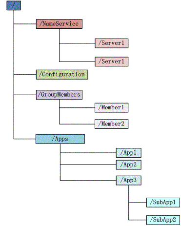
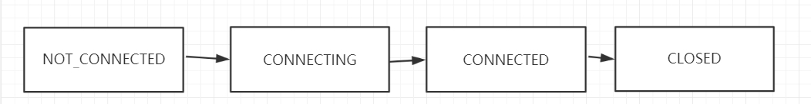

## 1、数据模型
zookeeper的数据模型和文件系统类似，每一个节点称为：znode， 是zookeeper中的最小数据单元。

每一个znode上都可以保存数据和挂载子节点，从而构成一个层次化的树形结构。

##2、节点特性

###### 1、 唯一性 
每个子目录项(如 NameService)都被称作为 znode，这个 znode 是被它所在的路径唯一标识，如 Server1 这个 znode 的标识为 /NameService/Server1

###### 2、 层级结构
znode 可以有子节点目录，并且每个 znode 可以存储数据，注意 EPHEMERAL 类型的目录节点不能有子节点目录

###### 3、 多版本
znode 是有版本的，该版本可以理解为基于乐观锁的思想，每次更新值时都附带一个版本号，如果版本号不正确，则会更新失败。

###### 4、 顺序编号
znode 的目录名可以自动编号，如 App1 已经存在，再创建的话，将会自动命名为 App2

---
##4种不同类型节点
基于不同类型节点的特性，可以实现很多分布式环境下的关键功能。比如分布式锁，Leader选举等。

#####持久化节点
节点创建后会一直存在zookeeper服务器上，直到主动删除。

#####持久化有序节点
每个节点都会为它的一级子节点维护一个顺序。

#####临时节点
znode节点默认是持久化存储的，除非显示删除，否则一直存在。

znode节点可以是临时节点，一旦创建这个znode节点的客户端与服务器失去联系，这个znode节点将自动删除。

临时节点的生命周期和客户端的会话保持一致。当客户端会话失效，该节点自动清理。

zookeeper的客户端和服务器通信采用长连接的方式，每个客户端和服务器通过心跳来保持连接，这个连接状态成为session。

如果znode是临时节点，这个session失效，znode也就随之被删除。

基于这个特性可以实现服务上下线的动态监听。

#####临时有序节点
在临时节点上多了一个顺序性特性。

##3、客户端与zkServer的会话状态

心跳保持-一般由客户端向服务器端发起。

如果在超时时间范围内，仍然没有收到心跳包，则表示客户端已经断开连接。

##4、Watcher 机制 - 监控znode节点状态的变化

znode可以被监控，监控的对象包括这个目录节点中存储的数据修改，以及子节点目录的变化等。

一旦被监控的节点发生修改，就可以通知设置了监控的客户端，这个是zookeeper的核心特性。

zookeeper提供了分布式数据发布/订阅功能，zookeeper允许客户端向服务器注册一个watcher监听。

当服务器端的节点触发指定事件的时候会触发watcher，服务端会向客户端发送一个事件通知。

####watcher的特性：
通知是一次性，一旦触发一次通知后，该watcher就失效！

######watcher的底层实现原理:
通过NIO/NETTY与zookeeper进行通信，传输数据使用jute进行序列化。

##5、ACL - 权限控制
zookeeper提供控制节点访问权限的功能，用于有效的保证zookeeper中数据的安全性。避免误操作而导致系统出现重大事故。

	CREATE / READ / WRITE / DELETE / ADMIN
