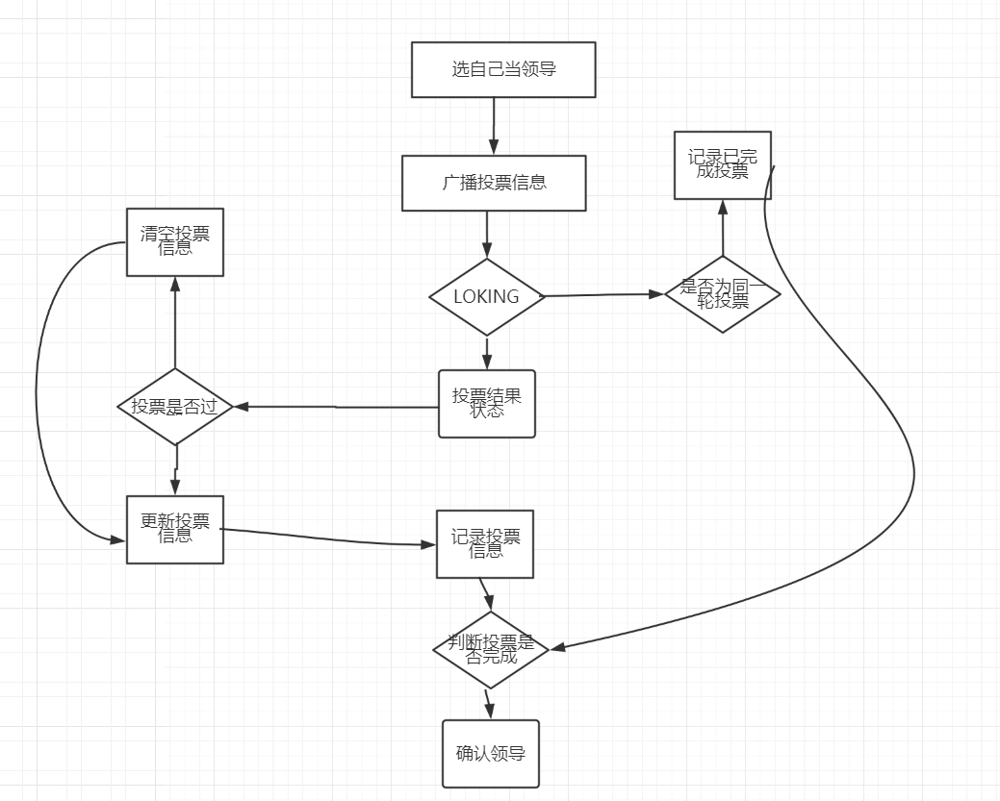

# zookeeper内部的Leader选举算法
三种选举算法：

	LeaderElection
	AuthFastLeaderElection
	FastLeaderElection

源码地址：https://github.com/apache/zookeeper.git

相关源码：
QuorumPeer.class   startLeaderElection()

###FastLeaderElection - zookeeper内部实现leader选举的算法

leader选举相关的几个要素：

	serverid : 在配置server集群的时候，给定服务器的标识id（myid）
	zxid  : 	服务器在运行时产生的数据ID， zxid的值越大，表示数据越新
	Epoch: 	选举的轮数
	server的状态：Looking、 Following、Observering、Leading

####第一次初始化启动的时候： LOOKING
1. 所有在集群中的server都会推荐自己为leader，然后把（myid、zxid、epoch）作为广播信息，广播给集群中的其他server, 然后等待其他服务器返回。

2. 每个服务器都会接收来自集群中的其他服务器的投票。集群中的每个服务器在接受到投票后，开始判断投票的有效性。
a) 判断逻辑时钟(Epoch) ，如果Epoch大于自己当前的Epoch，说明自己保存的Epoch是过期。更新Epoch，同时clear其他服务器发送过来的选举数据。判断是否需要更新当前自己的选举情况
b) 如果Epoch小于目前的Epoch，说明对方的epoch过期了，也就意味着对方服务器的选举轮数是过期的。这个时候，只需要将自己的信息发送给对方。
c) 。。。

3. 流程图
