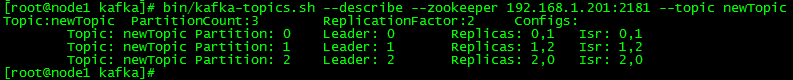

### create a new topic with a replication factor of two， and patition of 3:

创建topic：3个分区，每个分区有2个数据副本

	bin/kafka-topics.sh --create --zookeeper 192.168.1.201:2181 --replication-factor 2 --partitions 3 --topic newTopic

	output: Created topic "newTopic".

### how can we know which broker is doing what
显示每个broker的角色以及它的职责

	bin/kafka-topics.sh --describe --zookeeper 192.168.1.201:2181 --topic newTopic

### consumer从awesomeTopic拉取消息（没有消息则阻塞等待）
	bin/kafka-console-consumer.sh --bootstrap-server 192.168.1.201:9092 --topic newTopic --from-beginning

### producer向awesomeTopic发送消息
	bin/kafka-console-producer.sh --broker-list 192.168.1.201:9092 --topic newTopic

### 查看newTopic的某个partition上存储的数据，以编号为0的partition为例
	[root@node2 kafka]# ls data/kafka-logs/newTopic-0
	00000000000000000000.log		消息日志
	00000000000000000000.index  	消息日志的索引文件

### 查看partition log日志中的内容（生产者提交的消息）
	bin/kafka-run-class.sh kafka.tools.DumpLogSegments --files data/kafka-logs/newTopic-2/00000000000000000000.log  --print-data-log

	Dumping data/kafka-logs/newTopic-2/00000000000000000000.log
	Starting offset: 0
	baseOffset: 0 lastOffset: 0 baseSequence: -1 lastSequence: -1 producerId: -1 producerEpoch: -1 partitionLeaderEpoch: 0 isTransactional: false position: 0 CreateTime: 1518449891481 isvalid: true size: 82 magic: 2 compresscodec: NONE crc: 1689885912
	baseOffset: 1 lastOffset: 1 baseSequence: -1 lastSequence: -1 producerId: -1 producerEpoch: -1 partitionLeaderEpoch: 0 isTransactional: false position: 82 CreateTime: 1518449948110 isvalid: true size: 69 magic: 2 compresscodec: NONE crc: 1820733030