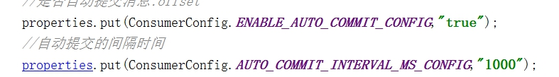

# 生产者 Producer
Kafka生产端发布消息的几种方式

#### > 同步模式：发送消息 + 同步等待响应
	
#### > 异步模式：发送消息 + 异步回调接口

#### ProducerConfig 配置
	org.apache.kafka.clients.producer.ProducerConfig

---

# 消费者 Consumer
Kafka消费端对消息确认的几种方式 --- consumer提交消费消息的offset偏移量

#### > 自动提交 - consumer接收到消息就算消费成功

####> 手动提交/批量提交 - consumer处理消息成功（业务逻辑操作完成）后再向broker发送确认

	1、手动异步提交
	consumer.commitASync() //手动异步ack

	2、手动同步提交
	consumer.commitSync() //手动同步ack

